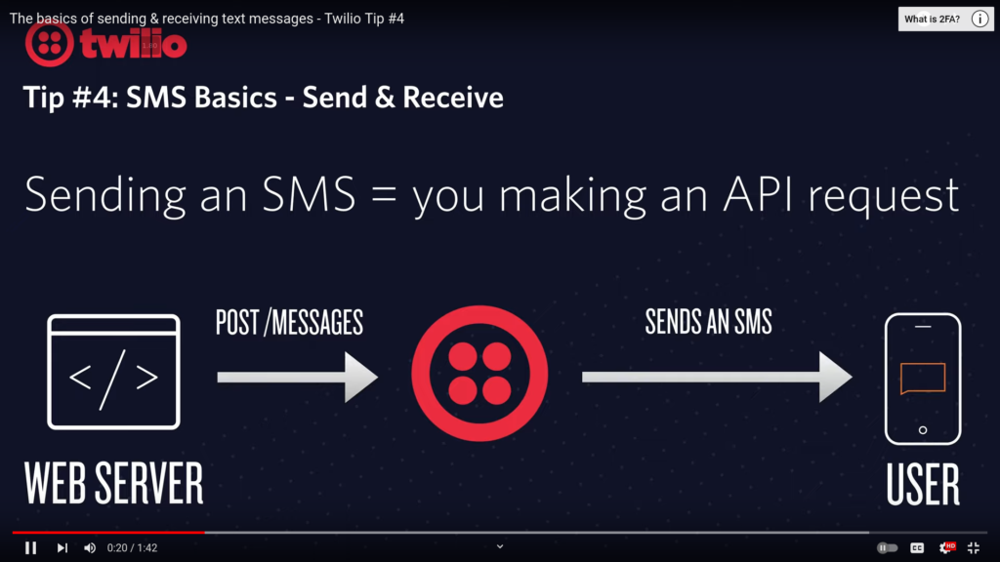

4234243 \[\] - Send test images, but I'm pretty sure these are hosted on Twilio and then shown to you as a link URL.

The Goal is to mock an SMS request from a phone and then reply but that reply will just output into a terminal as a simple text file or whatever file format SMS messages are received.

This will remarkably remove cost overhead for sending messages via testing.

Alright, how did I do it?

I can't yet figure that out because I can't even do it right now.

Looking at this [doc](https://www.twilio.com/docs/messaging/guides/webhook-request).

...

So it's listening for the webhook to come in. Notice [receive-texts](https://github.com/MonteLogic/contractor-trucking-app-rewrite/blob/d9fff035f71e57cd0c8b99d34c4fd12415a7a0b9/src/pages/api/receive-texts.ts).

...

What I should've done was wrote an article on how to do it and explain it in-depth.

...

I guess my .env within my LocalURL is busted. So I have to rejigger that.

...

I edited it to add localhost:3000

...

```
yes
- wait compiling /api/receive-texts (client and server)...
- event compiled successfully in 647 ms (1032 modules)
AC3fc484454e6a7fb3735615c5b7ebf1a0
AC3fc484454e6a7fb3735615c5b7ebf1a0
{
  ToCountry: 'US',
  ToState: 'CA',
  SmsMessageSid: 'SMXXXXXXXXXXXXXXXXXXXXXXXXXXXXXXXX',
  NumMedia: '0',
  ToCity: 'Los Angeles',
  FromZip: '94107',
  SmsSid: 'SMXXXXXXXXXXXXXXXXXXXXXXXXXXXXXXXX',
  FromState: 'CA',
  SmsStatus: 'received',
  FromCity: 'San Francisco',
  Body: 'Hello from Twilio!',
  FromCountry: 'US',
  To: '+1415XXXXXXX',
  ToZip: '90012',
  NumSegments: '1',
  MessageSid: 'SMXXXXXXXXXXXXXXXXXXXXXXXXXXXXXXXX',
  AccountSid: 'ACXXXXXXXXXXXXXXXXXXXXXXXXXXXXXXXX',
  From: '+1415XXXXXXX',
  ApiVersion: '2010-04-01'
}
Received message from: +1415XXXXXXX
Message body: Hello from Twilio!
Media URL: undefined
WorkTime saved successfully: {
  id: 'clms4bmrx0000g9kfnh52bw3x',
  dateSent: '2023-09-20T19:09:31.117Z',
  dateTimeOfGasBuying: '2023-05-30T12:34:56Z',
  amtOfGasPurchased: '10 gallons',
  gasTankAfterFilling: 'Full',
  dateAddedToCB: 2023-09-20T19:09:31.534Z,
  From: '+1415XXXXXXX',
  Body: 'Hello from Twilio!',
  MediaUrl: 'null',
  img: '',
  TruckID: null
}
Failed to send automated response: RestException [Error]: Authenticate
    at success (/home/monte/Downloads/contractor-trucking-app-rewrite/node_modules/twilio/lib/base/Version.js:79:23)
    at process.processTicksAndRejections (node:internal/process/task_queues:95:5) {
  status: 401,
  code: 20003,
  moreInfo: 'https://www.twilio.com/docs/errors/20003',
  details: undefined
}
```

Now that I saved it in IncomingText, I need to figure out how to console.log the response which Twilio is going to send to the SMS device which sent the message.



What sending looks in response to a message received, currently in CB:

```
      // Example: Send an automated response back to the sender
      client.messages
        .create({
          body: "Thank you for your message. We received your media!",
          from: "+99999999",
          to: From,
        })
```

So I figured that out, now I need to get OCR working. There needs to be **a Chatbot like functionality** to it.

...

I need to segment the response text because I'm going to put lots of logic in it.

Trying to figure out how images are sent with Twilio also how they are received.

This [link code](https://www.twilio.com/docs/serverless/functions-assets/quickstart/send-sms-and-mms#linkcode) from Twilio is decent.

Note, when the images are received via Twilio they are hosted on cdn.Twilio.com\* servers.

These [docs](https://www.twilio.com/docs/sms/tutorials/how-to-receive-and-download-images-incoming-mms/node?code-sample=code-express-router&code-language=Node.js&code-sdk-version=default) are even better for learning about receiving MMS messages.

The goal is to test receive mms messages so I can test the 'chatbot' functionality.

This [file](https://github.com/TwilioDevEd/receive-mms-node/blob/master/test/fixtures/IncomingMMS.js) is what I was looking for.

I think I figured out how to send the mock messages, now what I need to figure out, is really good OCR for receipts.
