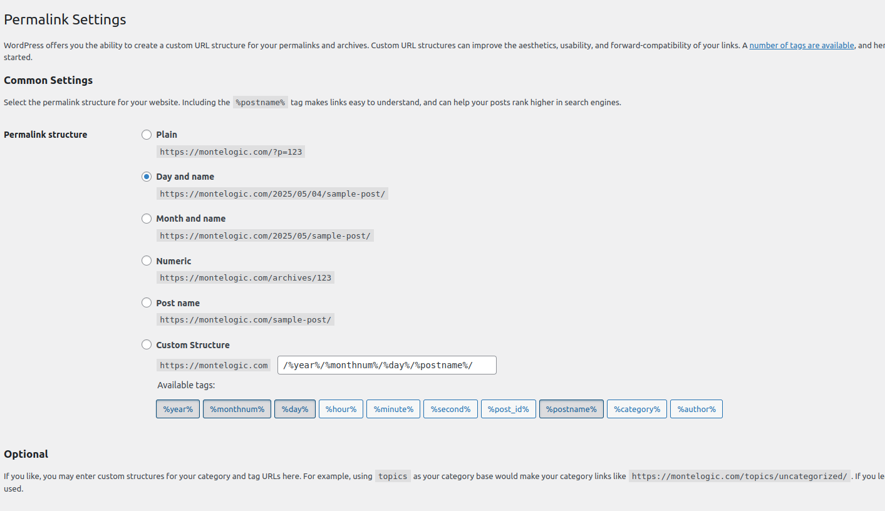

# MoL-blog-weba-wn-1

## Start: Thu Mar 20 2025 21:00:03 CDT

I like this component-sets idea for the .mdx.

```md
---
title: 'Advanced MDX with Custom Component Sets'
date: '2024-03-20'
description: 'This post demonstrates using multiple component sets for rich content'
author: 'Your Name'
tags: ['mdx', 'components', 'advanced']
componentSets: ['post-a', 'advanced-charts']
---
```

## Start: Mon Mar 24 2025 15:31:47 CDT

I am currently trying to compose, 'ui/address-bar.tsx' into smaller components.

The problem is if I don't have the .env vars for Stripe, it may trigger a false negative.

So the TaskBar needs to have the Stripe logic isolated and if the .env is not there than take out that part without triggering a false negative.

Okay, got that finished in the #5 issue, which is kind of going over scope.

... Okay so no remark plugins, see (here)[https://github.com/hashicorp/next-mdx-remote/issues/375].

## Start: Sun Mar 30 2025 10:27:47 CST

Currently, I don't know where exactly I was at with my last session, what was my last commit, what was I doing etc?

So, I think a good way to get around this is to have a filter feature on the blog, then I can just use the arrow toggle to see which one was the last updated and which one was first published first, etc.

## Start: Tue Apr 01 2025 11:19:55 CDT

Currently focusing on code bounties.

But what I would really like to do is do a 1rm tracker and put it on MoLogicTraining.

... I have a job interview at 2pm today.

### ...

Tried to register Scaleway but didn't have accounts setup correctly.

## Start: Wed Apr 02 2025 05:06:40 CDT

So when I get around to it, I will get the funds in for scaleway then I'll start my own proposal.

## Sun Apr 27 2025 17:49:09 CDT

I kind of already have a 'tags' page the way the blog page is setup.

## Sun May 04 2025 10:31:44 CDT

**_Goal_**, get the Work Notes thing to show like a tag.

I kind of already have a 'tags' page the way the blog page is setup.

Okay, so how does the blog page work

--
Aside:
Hopefully,
http://localhost:3000/blog/tag/work-notes
--

This
app/blog/[slug]/page.tsx

is just showing the blog post, there should be a different scheme.

We could make it general view.

Notice, category isn't the first recommended URL path.



I want to have as good SEO as possible, I'll just use the metadata to convey categories and other data.

...

We should have a JSON file with all of the tags.

And the tags would be rendered accordingly.

...

Then,
this

```ts
<TabGroupBlog
  path="/blog"
  items={[
    {
      text: 'Home',
    },
    {
      text: 'Work Notes 1',
      slug: 'work-notes',
    },
  ]}
/>
```

There should be code which programmatically searches the schema file and fills out the parameters of TabGroupBlog.

## Start: Mon May 05 2025 14:55:10 CDT

Okay, currently we can view .md files in the categorized folder but what we should be able to do is run a CMD line command and have a sort of json file be generated which will have all of the paths of every .md file.

Apparently the npm package glob works fine.

## Start: Tue May 06 2025 15:28:11 CDT

Please sign in to view blog posts or check back later for public content.

All of the public posts aren't showing it maybe because no posts are showing period.

My goal is to get the blog good so I can document my Expensify process so I can do it good.

### Get posts to show which are public

So we have to get posts to show which are public on the '/' page.

## Start: Wed May 07 2025 15:36:16 CDT

Why is it not showing the posts?

It's good for '/blog'

I think I'm going to make home something different.

## Start: Sat May 10 2025 20:34:44 CDT

I think it would be a good idea to have recommended extensions for a repo, you clone it and then you would have all of the recommended extensions for your systems.

## Start: Mon May 12 2025 14:46:33 CDT - Device: 2nd Thinkpad

Took way to long to fix styling on this blog due to not switching to dark theme in the root, layout.tsx.

Wanted to make the text white.


