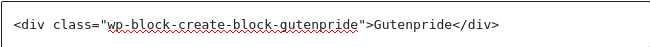
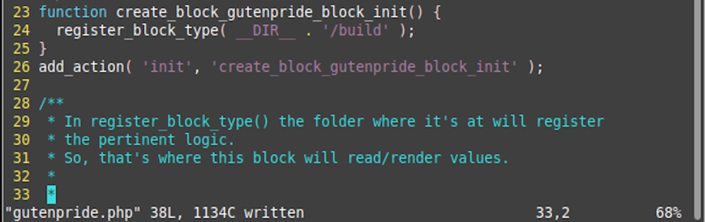

**New Day:** Fri 09 Sep 2022 10:14:52 AM CDT

You need to run npm run start while developing or make changes and then run npm run build.

Starting this project off I wish these advancements in WordPress would have come 2 years prior as I way more knowledgeable on React then than I am now. However, I have no problem renewing my skillset.

**New Day:** Sat 10 Sep 2022 01:48:35 AM CDT

Reading the function line "`export default function save({attributes})`" it appears that the attributes param is baked into the system.

...

How do I set attributes?

Attributes live in block.json

**New Day:** Sun 11 Sep 2022 12:52:22 AM CDT

I got theeeeeeeee eeee time to show but I thnkk that it gets updated and the React process doesn't like the way the string gets updated so it just shows it once and if it gets edited it breaks.

So, I should only fire this event once in it's lifetime. I was thinking about making an attribute called ifTimeAdded and set it to 0 and the when the function fires it sets it to 1. Then there's a check to see if ifTimeAdded is 1 and if it is don't add it again.

Although this sounds feasible it also sounds crude. So I found on GitHub I can use the store state to track such events.

[Related GitHub Issue.](https://github.com/WordPress/gutenberg/issues/17632)

**New Day:** Mon 12 Sep 2022 02:21:20 AM CDT

After working on the broken block and trying to fit it, the gutenberg block setup is made so errors are sent to console. Viewing the [official docs](https://developer.wordpress.org/block-editor/how-to-guides/javascript/troubleshooting/), this is how you debug Gutenberg blocks.

Debugging Gutenberg Blocks Resources:

[Source 1 - Docs](https://developer.wordpress.org/block-editor/how-to-guides/javascript/troubleshooting/)

[Source 2](https://notlaura.com/log-gutenberg-blocks-attributes-to-console/)

[Source 3 - stackoverflow Thread](https://stackoverflow.com/questions/61638746/how-to-debug-blocks-in-gutenberg-wordpress)

I am currently getting the error of, "Block validation: Expected token of type `EndTag`".

The only source I've found which can fire an event on block create:

[Block Creation Event Issue](https://github.com/WordPress/gutenberg/issues/41679)

The above solution should work if I can get the clientId, which is another problem.

**New Day:** Tue 13 Sep 2022 02:47:56 AM CDT

It appears after tying the solutions in this [GitHub issue](https://github.com/WordPress/gutenberg/issues/41679) to not much avail, it appears I am going to have to get busy with the useEffect hook.

"Attributes are available as props to your block’s edit and save functions."

So it looks like I'm going to have to use ... to output the props.

[Source](https://awhitepixel.com/blog/wordpress-gutenberg-create-custom-block-part-4-attributes/)

**New Day:** Wed 14 Sep 2022 03:38:37 AM CDT

I was told that I have to use filters. So I'm looking through the docs for exactly that.

[Source](https://javascriptforwp.com/extending-wordpress-blocks/)

However, I need to more effective with Selectors.

So selectors are apart of the data store per [official documentation](https://developer.wordpress.org/block-editor/reference-guides/packages/packages-data/). Or [this source](https://getwithgutenberg.com/2019/05/selecting-and-dispatching-with-the-data-store/).

But I don't think the selector field of the block.json [attribute](https://developer.wordpress.org/block-editor/reference-guides/block-api/block-attributes/) schema is related to it.

[Another source](https://developer.wordpress.org/block-editor/reference-guides/data/data-core-block-editor/#selectors)

So in order to make this work idiomatically I really need to study the data of the store.

**New Day:** Sat 17 Sep 2022 04:13:49 AM CDT

I tried to make this functionality with a static block and it didn't really work out. So, Ryan Welcher helped me on a Twitch stream to refactor it to a dynamic block.

The touches above are satisfactory for now. However, on the template.php I write in p tags, I would rather that be done only on Edit.js

**Concluding for now:** Mon Sep 19 2022 11:20:54 GMT-0500 (Central Daylight Time)
