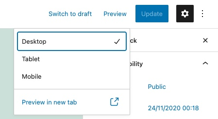
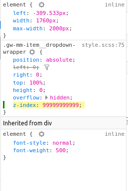

Gotta work on the menu and then make the menu like my own, my own plugin. So we went on to worry about that technique. That's working the menu tab it like the z index. Not avoid to make the z index, not in filters. I also have to change the slash and every single one need to that.

And then after that, I think I'm going to do that. I don't think we're going to focus on this sticky header for a while, because that's gonna be on near lot near a lot of parts due to the fact that it's involved with Amazon. So I need to big stuff done.

So like the filter by colors. Okay, I've all in this order, I have to get the menu done first and then after that, you need to get the colors done. And then actually not, I need to get the added card and so it's not purple. And then you get the, no, actually, no.

I actually need to get the colors done. First pull to my closet first and then focus on the colors because that's it's gonna take a while, and then that's and then work on the homepage, and yeah.

toDo:

Menu toDo:

- Fix MOBILE ISSUES
- Fix z-index on the filter as it interferes with the mega menu plugin.
- Change the mega menu so it's a local link to the website and not a full URL https://matlack-rebuild.local/for easier import/export.
    - Hopefully I can make a function for this task so I can save time.
- When in certain modes such as tablet mode it [looks scrunched](https://montelogic.com/wp-content/uploads/2022/10/scrunched-view-1024x449.png) and rules should be applied to avoid this.

WooCommerce Filters toDo:

- Fix the filters so it doesn't show every product but rather the ones pertinent to the page. There are already plugins that do this. - Task 3

Styling toDo:

- Get it so the 'Add To Cart' button isn't purple.

Speed Optimization:

- Convert images which are on the archives page to .webp

Fix Mobile Issues:

Okay, so they finally, they fixed the mobile menu so it's not bad.

Task 1:

Now that that's done I'm gonna move the 'arrow logic' to the left.

Say it's like, the the menu node doesn't have a sub menu, then you can have the entire top node occupied with logic which will open up a sub-menu. Even if the top node text has a link equipped to it the sub menu could have a link to it within the submenu or after the submenu has been unfurled.

Task 2:

After we accomplish Task 1, I would like for it to be full screen. Similar to how Full Screen is shown on Block Based Themes from their default creation.

I would also like the scroll bar to focus more on the mobile menu and not the dimensions of the content behind it.

**Notes on Task 1:**

I know that it's going to have to be logic that is ran based on dimensions. I'm not sure if that means making two menus, but I hope it doesn't. Using the preview feature is helpful for developing this type of functionality.



However, it's not emulating a mobile device as well as Firefox can. Getwid at it's current form isn't being emulated as well as the default menu block is on FSE.

...

I've added code to a forked repo of getwid-menu and then sent a Pull Request.

I am not looking at how to expand submenu click. I've found that it's relying on a jQuery function. Hopefully it's not CopyPasta jQuery.

This is the HTML of the button which dictated to unfurling of the submenu.

```
<button class="gw-mm-item__toggle is-opened">
<span class="dashicons dashicons-arrow-down"></span>
</button>
```

This is the jQuery:

```
function attachToggleActionToButtons(menus) {
  menus.each((index, menu) => {
  $(menu).on('click', '.gw-mm__toggle', function (event) {
  toggleMobileMenu($(this), $(menu));
});

$(menu).on('click', '.gw-mm-item__toggle', function (event) {
  let dropdown = 
  $(this).closest('.gw-mm-item').find('.gw-mm-item__dropdown-wrapper');					toggleMobileMenu($(this), $(dropdown));
});
});
}

function toggleMobileMenu(toggle_button, menu) {
  toggle_button.toggleClass('is-opened');
  menu.toggleClass('is-opened');
}
```

I added more documention to the first function of the code block above, view [here](https://gist.github.com/MonteLogic/d409f667838fff1e2311e0bf1eb94aa8).

**Done for the day:** Sun Oct 02 2022 21:24:35 GMT-0500 (Central Daylight Time)

I changed the toggle value and now it's like wider. So that's what I want it to happen. But I still think I can add a conditional function to add precision to this function.

This is what it looks like now.

[Updated file](https://gist.github.com/MonteLogic/50222bda88edc0b8efd8941b6b965ea4#file-frontend-js-L85)

At the moment it's doing what I wanted to do and I'm under a deadline so I'm just gonna keep on with the next task because the shift to left watch is working.

OK, right now I'm focusing on increasing the Z index -- of the menu -- because it's like poking out of the menu and it doesn't look good.

See here.

It doesn't appear to be doing it on mobile though, which is dope.

It appears to be a simple fix, fix the following z-index rule from 1 to a very high number.



Okay, so task 2 is done!

**Task 3:** Fix WooCommerce product attribute filter.

This task is related to the category page.

What I'm trying to do is precisely control the files which the product filter block is in.

I am hearing that there was a big update to Gutenberg which lets us updates the product category page in a way we haven't been able to. I would like to locate that updated version to see the code added.

This is an interesting development because product categories are just post types.

I was looking around the FSE for the link to customize templates and I couldn't find it. Then I learned I had to install the Gutenberg plugin.

Okay, here's whats going on.

\`Okay, so right now what I'm doing is I'm changing the like, look at the look changing the functionality, the price filter then would add those changes to a different one because whenever I'm on the category page and it is just categories here. It's like, it's like the filter doesn't pop up.

So I think that it's not even registering it. So I think that in the background like it's gonna say It's gonna it the logic would run. What runs is if there's no product on the dom from its point of view don't show up but but there is, but in order to to test out the system, we'll look around for that piece of logic.

And then I'm gonna cancel that log it. And then I'm going to try to change this around or try to finagle this around to, like, for the category page to work.\`

I also gotta make it so it's not as wide but that might be as simple as putting the products on the category page into a column.

...

The filters blocks ONLY works on the All Products block.

... Why is this?

This [if statement](https://github.com/woocommerce/woocommerce-blocks/blob/c8ca6abc7d883904bc21ac217d8f45227d3972fc/assets/js/blocks/attribute-filter/block.tsx#L471) will return null if there aren't filterable products within the 'vicinity'.

The variable hasFilterableProducts relies on the const getSettingWithCoercion to work. I think(?) getSettingWithCorecion helps with retrieving values with has\_filterable\_products. The has\_filterable\_products is in php files, with the file AllProducts.php.

**End for the day**: Mon Oct 03 2022 21:21:12 GMT-0500 (Central Daylight Time)

Continued on '[Documenting: Making Attribute Filter work on Category Page](https://montelogic.com/?p=1297)'
