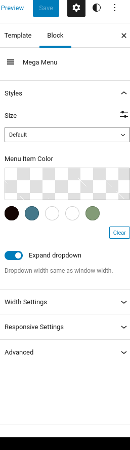

Okay, I would like to have a project where I enter a WordPress URL and then an automated tool turns it into a fully functioning website. However, the part I've noticed with the FSE is the mega menu and just menus in general.

It appears that you can't REALLY start from scratch, you have to import some menu logic. This can be good for a user who wants to start something new and doesn't want to dick around with adding the menu logic like it was in the legacy era.

However, the problem is that custom menu functionality is harder to acquire. This mega menu plugin by MotoPress has caught mainly due to the fact that it is open sourced which makes adding the logic to the tool I have in mind MUCH easier.

However, I first need to acclimate myself to the new plugin system and styling methods.

With that said, let's start.

I feel like this part should be the other way around. So you move the notch the other way around.

I am trying to implement a sticky header however, just copying and pasting CSS rules from CodePen.io doesn't seem to be working. So I'm looking through various themes with the functionality that I'm looking for.

[Source 1](https://kemet.io/docs/sticky-and-overlay-header-block-in-kemet-gutenberg-theme/)

Okay, time to reverse engineer those themes to figure out those sticky headers.

We are going to be starting off with [Kemet theme](https://kemet.io/docs/sticky-and-overlay-header-block-in-kemet-gutenberg-theme/).

.. I wonder if plugins can ship with HTML templates for the FSE.

I'm searching through the code base for "Enable Sticky Header".

This Kemet theme has a GitHub repo. This is immensely valuable cause we can do a sort of Archaeology on this.

Okay, so... I ran into a wall of React code so I have to figure that out. But .... it's going to take a lot of study so I'm going to be going through the release notes of Kemet till I can properly reverse-engineer it.

So I'm going to being adding documenting Kemet in depth to see what's going on.

[See here.](https://montelogic.com/?p=923)

**Concluding for now:** Wed Sep 21 2022 15:21:24 GMT-0500 (Central Daylight Time)
