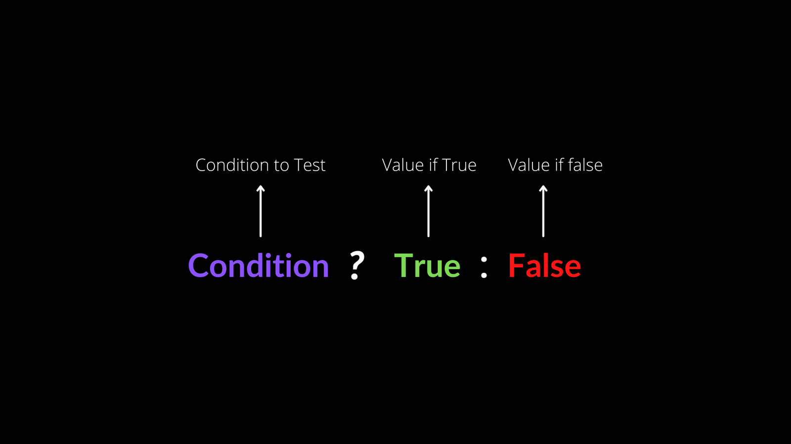
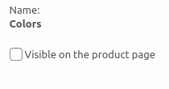

This [video](https://www.youtube.com/watch?v=Ys0uPYjUo3s&t=416s&ab_channel=JamieMarsland) is useful for editing the category page.

Okay, so I found out that hasFilterableProducts.

The has\_filterable\_products is in php files, with the file AllProducts.php.

If I want similar logic to occur on the Categories I need to to has\_filterable\_product to ProductCategories.php in a way that AllProducts.php is.

I realized getSettingWithCoercion is related to the filters and not showing of products and I should be more focused on [all-products](http://assets/js/blocks/products/all-products) block.

...

I think the function isn't firing for has filter products within their. I set registry, so I'm going up the functions which are being fired and seeing which order they are in.

I'm looking at the render, get\_block\_type\_attributes functions.

There's also classes which use the constant/var 'has\_filterable\_products'.

Okay I added an initialize function with the registry logic and it worked. The code used.

```
protected function initialize() {
  // echo 1028;
  $this->asset_data_registry->add( 'has_filterable_products', true, true );
}
```

Right now, the filters by color is accurate. However, the product category list isn't being reduced. So I need to add logic to it which will reduce it.

Before I move on I would like to make a note to in the future I should or this forum should find the reason why enqueue\_data isn't firing on ProductCategories.php but is on AllProducts.php.

Moving on to fixing up the product-category filter features.

How does the filtering process even work for components that perform the reduction logic correctly?

I think it has something to do with JavaScript as it is after the DOM has loaded.

OK, the problem is it doesn't "detect", it just puts it on the screen and what it does detect is all products. So it's going to take a lot of work for it to. Be like categories. Or rather more working than expected.

OK, so let's just like have like the filter. By price. Like next to filter by price, be like a dash. It'll say there are. X amount of products on this page. They should have that. They're trying to figure out figure out if I could do that on the category page.

Right now, it just views it as a template and then imagines it's on the same page as the 'All Products' or Legacy block(?).

I remember when I made the blunder of thinking that it worked just out of the box, I was shocked at how easy I 'implemented' the feature. Looking now, I should realize these features NEVER come easy you have to hustle them out.

It looks like the answers are in [block.tsx](http://assets/js/blocks/price-filter/block.tsx).

Okay, it appears to be reliant upon URL retrieval for showing products such as /?min\_price=54.

Filter by price may not even by viewable by the block filter by price, it may just set the URL parameters and other blocks change the querying of products.

So to do what I want to do, the price block has to hear info from the category block maybe with use of Context(?).

I wonder how the filter is saving the URL because when I enter something into the address bar and then refresh the page the page is taken back to where it was before I changed it.

Also, the Filter by Colors block appears to be looking at the 'All Products' block. I may have to see how there getting the number there and then finagle a way to use it on the price filter.

Colors filter is actually attribute-filter.

```
<Label
name={ decodeEntities( term.name ) }
// Okay, so the line below is what shows the count of each arrtibute.						
// showCounts is a boolean, if it evaluates false then the component is going to output the count variable. 
count={ blockAttributes.showCounts ? count : null }
/>
```

showCounts is an attribute registered in the block.json of attribute-filter.

line 211 of [block.tsx](http://assets/js/blocks/attribute-filter/block.tsx)

```
.map( ( term ) => {
  console.log(term);
```

What does this mean?

```
// attributeTerms is declared here
const { results: attributeTerms, isLoading: attributeTermsLoading } =
useCollection( {
namespace: '/wc/store/v1',
resourceName: 'products/attributes/terms',
resourceValues: [ attributeObject?.id || 0 ],
shouldSelect: blockAttributes.attributeId > 0,
} );
```

It looks like object destructing. - [Source](https://rmolinamir.github.io/typescript-cheatsheet/)

```
  const scientist: { firstName: string, experience: number } = { firstName: 'Robert', experience: 9000 };
  const { firstName, experience } = scientist;

  console.log(firstName, experience);
```

This [sandbox](https://www.typescriptlang.org/play) will prove useful.

This is what like they do because it's gonna take a lot of lines to do it otherwise. So like this like short hand formation. So like what this constant the second line is doing, is it's going to scientist and it's going to .firstName, which is a string and then it's going to scientist.firstName, and then it's assigns that as a firstName shorthand.

The results var eventually ends up looking like

```
results: store.getCollection< T >( ...args ),
```

So apparently getCollection is a selector which collects items from the state.

The blocks that I'm working with is SUPER under documented. So I'm going have to do some GitHub archive work to figure out what's going on.

So I'll be looking through these commits:

[attribute-filter/block.js commits](https://github.com/woocommerce/woocommerce-blocks/commits/ebc3662efede52f4d4fe4fb0bbddfb3b4ed5be75/assets/js/blocks/attribute-filter/block.js?browsing_rename_history=true&new_path=assets/js/blocks/attribute-filter/block.tsx&original_branch=trunk)

Because it's so much related to state and it looks like use collections, making a query to the state, making a query to anything. I don't know. I think that I should look at the all products and see how if it's being sent to the state through a query call.

It looks like useCollection is querying the products.

I'm looking through it and apparently there's two files named use collection. One is a TS version and one is a JavaScript version

This is useful. [Source](https://github.com/woocommerce/woocommerce-blocks/blob/00a1174aebefae2b37178a3ded68cc6c8d56bbf4/assets/js/data/schema/README.md#selectors)

I make a query call for all these, all the nine on my screen, make a query for it, and then like reduce all of them by that. So to make a query and then just try to query out as much as I can of this category or product a category such product-category/foo-items.

So, focused on making an API call.

I am going to search for 'wc/store/v1' to find the API calls.

Found, useStoreProducts...

I just remembered that the Redux store is immutable, so I might have hard time making these API calls unless they use the allotted ways.

Looking at the Product Category block you can't even go to the next list of products your limited by the amount of rows you've selected.

I made a call to a query object which returned all of the products on the screen. I'm going to have to take that can use that as a second filter against the AllProudcts filter which is being outputted by the price-filter.

The query call to console log the products which are on the screen look as such on [block.tsx](http://assets/js/blocks/attribute-filter/block.tsx).

```
const { products, totalProducts, productsLoading } = useStoreProducts( queryState );
console.log(products);
```

In the code blocks directly above this sentence, I wonder what the totalProducts param is doing.

Now that I managed to get the products directly on the screen. I'm going to try to get all the products. But that's going to be after I logged information into the attribute filter viz. outputted it.

Apparently, totalProducts is an integer of how many products a site contains.

What if we just replaced attribute terms with the products that are on the screen.

Side note: I feel like the attribute-filter block is over engineered AF!

I guess this is what returning an object in TypeScript looks like:

```
return {
	formattedValue: formatSlug( term.slug ),
	value: term.slug,
	name: decodeEntities( term.name ),
	label: (
		<Label
			name={ decodeEntities( term.name ) }
		// Okay, so the line below is what shows the count of each arrtibute.
	  // showCounts is a boolean, if it evaluates false then the component 
		// is going to output the count variable. 
			count={ blockAttributes.showCounts ? count : null }
			/>
					),
					textLabel: blockAttributes.showCounts
						? `${ decodeEntities( term.name ) } (${ count })`
						: decodeEntities( term.name ),
};
```

I am going to make a copy checkbox below the checkbox with identical data but relates to products on the screen. So it's gonna be like a clone that's gonna be smaller, it's gonna be low be below.

[Progress so far](https://drive.google.com/file/d/12r-bIMBvLX0TbhPEgth1Kqxj7-NRSotF/view?usp=sharing)

To the checkbox field. Look at the display options. Parameter, the display options variable and how it's being used. And then like, reverse engineering, like the crap out of that to realize what pieces are in it and then re-engineer it to take my custom ones.

This is the error I am getting right now:

```
Type '{ className: string; options: DisplayOption[] | undefined; customOptions: DisplayOption[] | undefined; onChange: (value: string) => void; isLoading: false; isDisabled: false; }' is not assignable to type 'CheckboxListProps' with 'exactOptionalPropertyTypes: true'. Consider adding 'undefined' to the types of the target's properties.
  Types of property 'options' are incompatible.
    Type 'DisplayOption[] | undefined' is not assignable to type 'CheckboxListOptions[]'.
      Type 'undefined' is not assignable to type 'CheckboxListOptions[]'.ts(2375)
```

I got rid of the TypeScript error by adding a |.

I need to make a list of every single option that's out in this being passed as props -- to the one that works -- and make a make a coherent list of it.

To know exactly what to emulate.

```
options={ displayedOptions }
```

The goal is to replace displayed options with customDisplayedOptions and then pipe in my own custom metadata -- which is derived -- from the products which are directly on the screen.

Okay, have to figure out this line:

```
const [ displayedOptions, setDisplayedOptions ] = useState<DisplayOption[]>
(
blockAttributes.isPreview && ! blockAttributes.attributeId
? previewOptions
: []);
```

So it looks like it a inline destructured array. The <DisplayOption> tag appears to be a type guidance thing for what is being outputted by useState. Which is the output of ternary function.

Which the logic of a ternary function is explained in this photograph:



So, if the condition " `blockAttributes.isPreview && ! blockAttributes.attributeId` " which means if blockAttributes.isPreview exists AND blockAttributes.attributeId does NOT exist, if that statement is true then "previewOptions" if it's false then "\[\]" which means return nothing.

Looking at it I would think both the isPreview and attributeId would both be tied to each other and there would be no need for the (!). So is preview and attributeId aren't coming from a identical source.

This is the [video](https://www.youtube.com/watch?v=O6P86uwfdR0&t=287s&ab_channel=WebDevSimplified) I am watching to learn more about useState.

Okay, I am now focusing on **setDisplayedOptions**. It takes in a parameter of **newOptions** which is the same as attributeTerms but is operated on by the map function.

View the difference between newOptions and attributeTerms, [here](https://drive.google.com/file/d/1q-xPyjkoLsse1otyzUfubuPLoTiNdRRE/view?usp=sharing).

It looks like the **attributeTerms** object is less filtered. While **newOptions** appears to next and filter data.

I'm looking at the useEffect hook, I'm finding it takes two parameters. The first parameter appears to be a function, the second an array. When the state of the values of the array of the 2nd function change then the function of the first param fires. An empty array for the 2nd param is analogous to an onMount hook.

I guess the 2nd array is called an array of dependencies.

Now that I got that figured out time to look at **useCallback**.

I defined use callback as a hook which only recreates the function of the const when the value of one of the array of dependencies changes. useMemo and useCallback are similar but the difference is useCallback sets the starting const variable as a function. The [tutorial](https://www.youtube.com/watch?v=_AyFP5s69N4&ab_channel=WebDevSimplified) is saying useCallback is most useful for creating a function in a speedy way or for "referential equality".

Okay, what I am going to do is make another block component which is going to modify the processes of attribute-filter.

I know that there are processes for third-party development on the checkout block so I'm [reading](https://developer.woocommerce.com/2022/07/07/exposing-payment-options-in-the-checkout-block/) through that and then hopefully apply some of the lessons to the attribute-filter.

Okay, so I'm looking into the Store API to create a function which uses the ID of a product then returns the color of it.

This appears to do what I want but it's in php.

```
	public function test_get_items() {
		$request = new \WP_REST_Request( 'GET', '/wc/store/v1/products/attributes/' . $this->attributes[0]['attribute_id'] . '/terms' );
```

This [file](http://src/StoreApi/docs/product-attributes.md) on the repo explains what I want to do but I'm going to have to switch to a fetch or a different form of an API call to replace the curl.

useEffect hook seems to work well for API calls so I'm going to try that.

I am using the fetch feature from this [video](https://www.youtube.com/watch?v=0ZJgIjIuY7U&t=541s&ab_channel=WebDevSimplified). The [gist](https://gist.github.com/MonteLogic/c7703888a6673c77f90d3db47e877895) I use on my sandbox.

Now I have to link up the API of the store.

Okay, so this works:

```
useEffect(() => {
  fetch(`https://local-rebuild.local/wp-json/wc/store/v1/products/attributes/`)
  .then((response) => response.json())
  .then((json) => console.log(json));
});
```

Notice, if the attribute isn't visible on the checkout page then it won't be successfully retrieved with the API methods mentioned prior.

This box must be ticked or else it won't be viewable by API.



I can't seem to figure out how to get the attributes for a product that's not showing. So I'm gonna like do how they do it with the filters on the blocks in which they use to look at attributes that are private, or not showing on the product site.

...

I just need to retrieve the id's of all products with a certain attribute.

\`

Somehow like whenever you look at all products through like the all products block, it can tell like if a product has a certain attribute in like you can go through like a secret way that I don't know yet, like it. Like esoteric way rather. Not secret. Not secret. Esoteric, you know it can go through this.

Esoteric way of, I'm like, getting like the value that I think filter by attribute might not be be able to even look at. So it's gonna be the all products block. So it's gonna like show every single one because I know that it reduces because if I uncheck black it goes back but if you check it, then it goes there.

So I have to figure out that stuff.

\`

I'm working on the all-products block and it appears that the majority of business logic is in the edit.js.

...

I'm looking for the API call which makes the call to find all products for the all products block.

This looks promising:

```
blockMap = getBlockMap( 'woocommerce/all-products' );
```

or this may be it:

```
renderFrontend( {
	selector: '.wp-block-woocommerce-all-products',
	Block: AllProductsFrontend,
	getProps,
} );
```

...

I've found out that the ProductListContainer component is what's showing the products.

More specifically, this [file](http://assets/js/base/components/product-list/product-list.tsx), is what is queuing the information for the component data. So I have to dig through that [file](http://assets/js/base/components/product-list/product-list.tsx) and files related to it to find that way of how the information is taken from the products even through they are not visible on the product page.

**Logging out:** Sun Oct 16 2022 18:40:14 GMT-0500 (Central Daylight Time)

Ok, let's dig into the [file](http://assets/js/base/components/product-list/product-list.tsx).

What is in [product-list.tsx](http://assets/js/base/components/product-list/product-list.tsx)?

\+ The variable totalProducts which appears to be the initial database call and appears to be created in another [file](http://assets/js/base/context/hooks/use-store-products.ts).

\+ The useStoreProducts hook which appears to instantiate variables and bring them into the product-list scope.

+

+

Right now, I am looking for the first database call which starts the process.

It appears that for an object the Firefox dev tools will rework it in alphabetical order rather than how it originally came out. But if you 'Copy Object' it'll show you what the Object looks like in its original form.

I opened the network tab and now I have a lot more leads.

I have to figure out how get all products with a certain attribute. I know how to get the attribute counts but having them return a list of products would be reaaaaly dope.

I'm looking at the collection hooks now.

Focusing on this line of code:

```
{ listProducts.map( ( product = {}, i: number ) => (
```

Looking at the listProducts variable.

It appears the business logic is occurring within the listProducts variable.

I am looking at [attributes-query.ts](http://assets/js/utils/attributes-query.ts).

...  

```
const { products, totalProducts, productsLoading } =
    useStoreProducts( queryState );
    // if this is coming out to 2 on natural that means that you can just rely on the store state to get back 
    // information on what attribute is in the current program state.
    console.log(products);
```

```
const [ productAttributes, setProductAttributes ] = useQueryStateByKey(
		'attributes',
		[]
	);
	// I still don't know how it's being filtered if they can't see the products attributes. 
	console.log(productAttributes);
```

...

The ONLY way I can do this is if I make the attributes visible and then maybe someone can come along and doing the state changing way which I'm JUST NOT UNDERSTANDING!

The reason being if I make a API request then it'll show the attributes and the color but if those attributes are not visible then it won't work.

So tomorrow I am going to do that and then use the different current states I have which show the filter and then reduce, it's going to be bulky but it should work.

That's just for the attribute filter, I should be able to do what I want to do with the price filter JUUUUUST fine.

**Done for the day:** Tue Oct 18 2022 18:48:50 GMT-0500 (Central Daylight Time)

I am going to create the price filter first and then the attribute filter.

Before I do that, I'm going to give it one last try to see if I can find out how they're queuing the products.

Okay, I tried it so I gave up and I emailed a bunch of people for answers. I wouldn't have to have done that if the documentation wasn't so woefully inadequate.

Changed my mind, still trying to figure it out. Now I am looking at the products attribute block and see how it's bringing in those ids.

I think it's like making an API call in the back and then it's just saving that to like the website then I guess it won't be using an API call caused it's saved into the page(?).

So I guess it's being saved as an attribute of the block....

So getting the count IS EAST! But getting the exact details of that term count isn't quite so.

So I blocked this URL then it wouldn't let the terms populate on the editing side.

```
https://example-site.local/wp-json/wp/v2/block-renderer/woocommerce/products-by-attribute
```

  
I theorize that whenever you go into all products, block. It's gonna queue all products with that V2 API and then it's going to save as attributes and then whenever you load it later then the filter can look at the attributes of the all products block and then modify it.

So I guess I gotta figure out how to console.log attributes of blocks.

..

More specifically the All Products block.

Moreover, decipher how the attributes are saved in detail.

**Done for the day**: Wed Oct 19 2022 13:35:05 GMT-0500 (Central Daylight Time)

......

Okay, I have to figure out how to console.log the attributes of a block.

I'm trying to figure out how to even get a console log from the attribute-filter.

But I figured out that ProductsByAttribute class extends AbstractProductGrid.

I found out that running 'wp.data.select( 'core/block-editor' ).getSelectedBlock().attributes;' in the console when the attribute block is selected doesn't work so I gotta look again at how that API is saved.

**Done for the day**: Thu Oct 20 2022 18:25:37 GMT-0500 (Central Daylight Time)

I am looking for that v2 API call in one of the editor component [files](http://assets/js/editor-components/product-attribute-term-control/index.js).

Okay, so the button which initiates the API call is on line 70 of [edit-mode.tsx](http://assets/js/blocks/products-by-attribute/edit-mode.tsx).

Okay, in the onDone function there is a method which sets setIsEditing to not isEditing. So I think that there's function elsewhere in the project which are waiting for it to be set not isEditing so the API call can commence.

....

I think there saying the following data attributes can echo out the attributes category.

```
[{"id":50,"attr_slug":"ex_colors"}]
```

I still can't figure out how the products are echoed out. So I think I might just save the attributes on the backend to a json file and then just queue them on the frontend to make up for the lack of me being able to know how to do it right. But hey, it is what it is.

.....

So I've been over thinking of the ones right time. So what is actually happening is the API call if you call it and like say for the color green, but it doesn't have it visible. It's gonna show you a product with a green attribute but that doesn't mean that if you go into the response body and look at properties of the object which was returned it's going to have the attribute green.

In the [docs](https://github.com/woocommerce/woocommerce-blocks/blob/trunk/src/StoreApi/docs/products.md#list-products) the endpoint looks as such:

```
/products?attributes[0][attribute]=pa_color&attributes[0][slug]=red
```

..

I think they slot it out for pagination.

The first \[0\] for the endpoint directly above I'm seeing it function only as a placeholder. I am going to check the pagination call and see how the API call has changed.

...

Okay, so I don't really understand the process of the V2 edit function. That's on the edit side. I think I'm gonna have to, like, look it up and then see where it comes from. Because I know, it's really comes from the WooCommerce side. So, I got to figure that out. Research the authentication within the logic of the consumer secret and getting the proper authenticated keys to run it.

For the show products by attribute at the end today, it's an HTML file, or like saved into HTML file in, not calling an API call like it is with the All Products filter.

toDo:

Make a button and the button so like they see yours take away the first note and then I'm making buttons that click in and like a quick way to. And then click again. Click away the third one. Then just make that simple like. One and then add it as a widget and see how that works.

...

When the attributes page is up it doesn't even show the filters. So you have to go in and add code which says to always show on Product Attributes filter.

...

The add to cart button has a data attribute which shows the id, I might be able to run the query and then delete it based on that data field.

data-product\_id="9999"

Side Note: Side note: what this app could do is if there is attribute of blue color already selected then it will have no color filter field because then all the blue products would go away and there would be no products. So there could be other attributes such as size or make etc. But not the discriminating characteristic that brings the products there in the first place.

Okay, I have to figure out how to remove element from the DOM but in React it's much different, they're saying that I have to remove it from the render and then re -render it.

[Source 1](https://codingbeautydev.com/blog/react-remove-element-onclick/)

[Source 2](https://stackoverflow.com/questions/39819290/remove-dom-in-react-js)

But that'll be a job for tomorrow.

**Done for the day:** Fri Oct 21 2022 16:40:51 GMT-0500 (Central Daylight Time)

Okay, I am trying to figure out the intricacies of ReactDOM.

The all products filter system is using React [filtering](https://codingbeautydev.com/blog/react-remove-element-onclick/). However, the product attributes page is not even shown onto the page as React.

I'm looking at the attribute filter and I figured it'll be harder to set it up where it manipulates the DOM because I plan on using pagination.

So I have to rewrite the API on the attributes page to use the V1 API rather than the V2 API. So I have to take it away from Being saved as HTML in a post vs. to where it can be manipulated by React such as in the All Products block.

I wonder if the all products block was originally created in V2 and then moved to V1. If that's the case, I wonder what the migration process looked like.

So make the same exact copy of the Attributes block but instead have it be rendered in React and not saved to the post (ITMS). So, when I right click on the copy below I can view the elements in the React components view of Firefox dev tool.

Okay, so for the ones that appear to not to rendering React components where you can edit them in component view appear to be using import ServerSideRender from '@wordpress/server-side-render'.

I'll be reviewing an article describing the rendering process, but that'll be for [part 3](https://montelogic.com/?p=1433).
