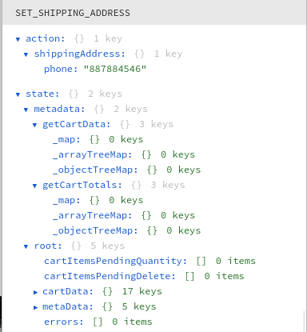

For the checkout process I am trying to figure out where the shipping information is held locally.

"Sets shipping address locally, as opposed to updateCustomerData which sends it to the server."

I can't figure out how to preserve the Redux log to see the event occurirng when the button is pressed so I guess I'm just going to have to go off documentation.

What and where is the checkout data store?

"set the payment processing response in the checkout data store"

I think the description of code above is referring to this [line of code](https://github.com/woocommerce/woocommerce-blocks/blob/4af2c0916a936369be8a4f0044683b90b3af4f0d/assets/js/data/checkout/thunks.ts#L41).

...

I think the following function operates on the CheckoutAddress interface.

```
export const useCheckoutAddress = (): CheckoutAddress => 
```

So I guess I gotta find where else in the project they are operating on the same interface. So I can find out how the phone field is being stored in local state.

There's like a secret place where that's like in the store like the information is at and they get sent, I don't know where that's at

I'm having a hard time viewing that "place" cause I can't the Redux state log to persist.

Okay, so I think that phone to value2 is adequately stored just like the original phone value is. But I have to go into the store API of the checkout and then add that and then see else how see else how it's being piped into like a PHP field like a PHP value which is then shown into the back end as a value received.

And then, once I figure all that stuff out, I have to reverse engineer that process, viz. add the field that I want.

I am also going to have to figure out the [nonce tokens](https://github.com/woocommerce/woocommerce-blocks/blob/trunk/src/StoreApi/docs/checkout.md) as well.

Okay, so using the checkout API is not as simple as straightforward as the products actually beats API. So I'm going to need a nonce. Also it returns data required for this checkout.

Including the order made from the current cart and customer billing and shipping addresses which might be in what I'm looking for like on the server. But I still haven't found. But I may be able to test the API in getting the information that's available. Using the get check out to see what's being sent.

If phone2 field is there as well. I also might be able to like, yeah, have a easier way figuring out the nonce tokens using like console locks.

...

Working on the php files and WooCommerce Blocks and I have noticed that get\_item\_response as a function is declared multiple times. So how do you differentiate from the different functions name get\_item\_response?

...

It appears the final push is out of [OrderController.php](http://src/StoreApi/Utilities/OrderController.php). Within this file create\_order\_from\_cart() which creates the object WC\_Order which in turn makes the order.

...

I think I need to look through every detail of the order create logic where the new object WC\_Order is made.

**Done for the day:** Mon Oct 31 2022 22:51:25 GMT-0500 (Central Daylight Time)

I am reading through Legacy.php and it says.

```
 * Attempt to process a payment for the checkout API if no payment methods support the
 * woocommerce_rest_checkout_process_payment_with_context action.
```

So I am guessing that 'woocommerce\_rest\_checkout\_process\_payment\_with\_context' is an analog of payment processing using \_POST method.

I am looking at this action for hooking into the REST process.

```
add_action( 'woocommerce_rest_checkout_process_payment_with_context', array( $this, 'process_legacy_payment' ), 999, 2 );
```

...

The orders for some reason they don't happen immediately whenever you press the submit button. They like happen like soon before, so I think that like. The API process for creating where it like starts prematurely in relation to the amount of time it takes to make a legacy order seems premature.

...

I am trying to figure out how I can use the 'woocommerce\_store\_api\_checkout\_update\_order\_from\_request' hook or listen to it rather.

Yoooo, I just found the gists for [woogists](https://gist.github.com/woogists) they're dope.

This [gist](https://gist.github.com/MonteLogic/cb4cb1abc8132a7d3e75a95a588528e9) works to make sure a address has a house number in it for WooCommerce blocks checkout.

Okay, so I think I figured it out. I figured out how to add values into the $order object of WooCommerce blocks which can be shown later on the admin side. I just have to clean it up, refine it and connect it to the checkout form.

I added this line after '`do_action( 'woocommerce_store_api_checkout_update_order_meta', $this->order )`' in create\_or\_update\_draft\_order().

```
update_post_meta( $this->order->id, 'Yeetness Report', "yeet From That 326" );
```

There's still a lot of details I need to hash out and why it works the way it does.

...

I'm analyzing the hook use customer data. And. Seeing how that sends information to the server. In looking at that through a copious process, so I understand what's going on on the back end and I'm just guessing it my way through.

In the hook useCustomerData the variable customerData is key and is retrieved in such a way:

```
import { CART_STORE_KEY as storeKey } from '@woocommerce/block-data';
	const { customerData, isInitialized } = useSelect( ( select ) => {
		const store = select( storeKey );
		return {
			customerData: store.getCustomerData(),
}
```

Analyzing useDispatch and useSelect:

[WordPress docs](https://make.wordpress.org/core/2019/06/10/introducing-usedispatch-and-useselect/)

[Later post](https://unfoldingneurons.com/2019/fantastic-hooks-and-where-to-use-them)

I guess this is a look at the wp.data store at large. The custom hooks mentioned are just a way to access the store.

toDo:

\[\_\] Explain why update\_post\_meta works at that specfic line.

\[\_\] Wire up one of the parameters of update\_post\_meta to take in a custom input of update\_post\_meta.

The way that checkout-processor.js sends information to php is through an API. PHP does the final processing.

I am trying to figure out the intersection of custom React Hooks and React Context which form to create the checkout process.

I am looking at the logs of Redux Devtools and trying to figure out how to make the state persist so I can see what's going on. I may use redux-persist in the future but I would have to set it up and then get rid of it when I push to trunk.

These two methods are the best for logging objects to the console:

```
console.log(JSON.stringify(response))
console.dir(response);
```

Okay, I have noticed the schema of customField1 is being lost from [step 8](https://developer.woocommerce.com/2022/10/06/how-the-checkout-block-processes-an-order/) to 9.

Okay so I request the schema with custom\_field and the response it is taken away.

Request:

```
{
    "billing_address": {
        "first_name": "Monte",
        "last_name": "Logic",
        "company": "",
        "address_1": "55 blue way",
        "address_2": "",
        "city": "Blueville",
        "state": "IL",
        "postcode": "62804",
        "country": "US",
        "email": "example@gmail.com",
        "phone": "",
        "phone2": "yeet10"
    },
    "customer_note": "This is a customer note from 223.",
    "create_account": false,
    "payment_method": "cheque",
    "payment_data": [
        {
            "key": "wc-cheque-new-payment-method",
            "value": false
        }
    ],
    "extensions": {},
    "custom_field_1": "Entry from custom_field_1",
    "shipping_address": {
        "first_name": "Monte",
        "last_name": "Logic",
        "company": "",
        "address_1": "55 blue way",
        "address_2": "",
        "city": "Blueville",
        "state": "IL",
        "postcode": "62804",
        "country": "US",
        "phone": ""
    }
}
```

Response:

```

{
    "order_id": 7211,
    "status": "on-hold",
    "order_key": "wc_order_3zPWwhHaWx0Rj",
    "customer_note": "This is a customer note from 223.",
    "customer_id": 0,
    "billing_address": {
        "first_name": "Monte",
        "last_name": "Logic",
        "company": "",
        "address_1": "55 blue way",
        "address_2": "",
        "city": "Blueville",
        "state": "IL",
        "postcode": "62804",
        "country": "US",
        "email": "example@gmail.com",
        "phone": "yeet8",
        "phone2": "yeet10"
    },
    "shipping_address": {
        "first_name": "Monte",
        "last_name": "Logic",
        "company": "",
        "address_1": "55 blue way",
        "address_2": "",
        "city": "Blueville",
        "state": "IL",
        "postcode": "62804",
        "country": "US",
        "email": "example@gmail.com",
        "phone": "yeet8",
        "phone2": "yeet10"
    },
    "payment_method": "cheque",
    "payment_result": {
        "payment_status": "success",
        "payment_details": [
            {
                "key": "result",
                "value": "success"
            },
            {
                "key": "redirect",
                "value": "https:\/\/matlack-rebuild.local\/checkout-2\/order-received\/7211\/?key=wc_order_3zPWwhHaWx0Rj"
            }
        ],
        "redirect_url": "https:\/\/matlack-rebuild.local\/checkout-2\/order-received\/7211\/?key=wc_order_3zPWwhHaWx0Rj"
    },
    "extensions": {}
}
```

So I gotta figure out a way to keep the custom\_field\_1 because it's how the input is brought into the processing payment side with php.

**Done for the day:** Sat Nov 05 2022 23:57:56 GMT-0500 (Central Daylight Time)

It seems that happens is of response of a the API. It's sent API requests Sends the information and then a $order response comes back. So I don't know how that $order gets set.

The order\_id, the customer\_id, status and order\_key are new as well. So I need to see where that is added. And how some values are kept.

pseudo flow:

```
get_checkout_response() ➜ get_item_response($item) {
$this->get_checkout_response($item->order);
}
```

If you would like to know more about the $order look into OrderController.php

The $order variable is instantiated here:

```
private function create_or_update_draft_order( \WP_REST_Request $request ) {
// The $order variable is declared HERE.
}

```

...

How does php send back a response it was sent to ? 

[Source 1](https://developer.wordpress.org/reference/classes/wp_rest_request/)

[Official WP Docs](https://developer.wordpress.org/reference/classes/wp_rest_request/)

Okay, so I guess objects have methods.

Okay, I figured it out, I bridged the gap.

Okay, so I have to use add\_meta\_data on the $order object.

My goal now is to pipe data from the form into checkout-processor.js. I have local pickup setup where it's custom value on the second phone number. Let's see if I can pass that into checkout-processor.js.

But it's being added to the store.

So I have to figure out the Redux structure and how to update the information of it.

Side Note: I learned that node.js JavaScript isn't like php where you can save files not refresh the page and still have the backend refer to the updates.

Code flow for reading a value via Redux:

```
// Okay so this is on the component of <PhoneNumber /> which 
// shows it's value. Which would be in the file of
//  assets/js/blocks/checkout/inner-blocks/checkout-shipping-address-block/block.tsx

value={shippingAddress.phone} 

➜ ➜ ➜ 
// In the same file as mentioned directly above this is // how the variable is instantiated; 
// with a inline de-structured object.
// which takes out the variable shippingAddress 
// from the method useCheckoutAddress()

const {shippingAddress} = useCheckoutAddress(); 

➜ ➜ ➜ 
// Once you view the file where useCheckoutAddress()   // you'll see that it is using the function 
// useCustomerData() to get the information.

export const useCheckoutAddress = (): CheckoutAddress   => { 
  const {shippingAddress} = useCustomerData(); 
}

➜ ➜ ➜ 
// The file where function variable useCustomerData is 
// assets/js/base/context/hooks/use-customer-data.ts

export const useCustomerData = (): CustomerDataType => { const {customerData } = 
  useSelect((select) => {
    const store = select(storeKey) 
  };  
  return { customerData: store.getCustomerData()}; 
}); return {shippingAddress: customerData.shippingAddress};


➜ ➜ ➜ 
// Notice the variable CartState in getCustomerData. CartState is an interface which
// you use to designate default values. 
// relative file path: assets/js/data/cart/selectors.ts
export const getCustomerData = (state: CartState) : {
  shippingAddress: ShippingAddress; } => {
  return {
    shippingAddress: state.cartData.shippingAddress};
  };
}
}
```

Code flow for updating value via Redux:

```
Code flow for updating value via Redux: 
setShippingPhone( value );
```

Code flow for updating value via Redux:



How is this action triggering the reducer?

Step 1:

The following import of setShippingPhone is brought in a de-structured object of useCheckoutAddress().

```

// File path:
//  assets/js/blocks/checkout/inner-blocks/checkout-shipping-address-block/block.tsx
const {	setShippingPhone	} = useCheckoutAddress();
```

Step 2:

```
// File path:
//  assets/js/blocks/checkout/inner-blocks/checkout-shipping-address-block/block.tsx
➜ ➜ ➜ 
// This is linked up to the field component of <PhoneNumber />
// Which updates with onChange(value)
setShippingPhone( value );

```

Step 3:

The setShippingPhone method is described in the interface CheckoutAddress

```
// File path: 
// assets/js/base/context/hooks/use-checkout-address.ts
interface CheckoutAddress {
	setShippingPhone: ( value: string ) => void;
}
```

Step 4:

Then a custom hook is used for exposing address functionality to the checkout address form. The constant setShippingPhone is using a callback to set what appears to be a value within an object using a returnless function. << I wonder what setShippingAddress is doing >>

```

// File path: 
// assets/js/base/context/hooks/use-checkout-address.ts
export const useCheckoutAddress = (): CheckoutAddress => {
const { setShippingAddress } = useCustomerData();


const setShippingPhone = useCallback(
  ( value ) =>
     void setShippingAddress( {
        phone: value,
      } ),
	// I don't know how setShippingAddress is used.
	// I guess this is an array of dependencies:
	[ setShippingAddress ]
	);
	// Here the method is returned (again).
  return {
    setShippingPhone
  };
};

```

Step 5:

setShippingAddress is a dispatch to the store. Let's look at where useCustomerData() is and how it affects setShippingAddress. So when we use useCustomerData() we should have the variables customerData and isIntialized available to us as well as the method of setShippingAddress.  
How is useDispatch used here?  
When I console.log setShippingAddress it's just an empty function.

```

// File path:
// assets/js/base/context/hooks/use-customer-data.ts

/**
 * This is a custom hook for syncing customer address data (billing and shipping) with the server.
 */
export const useCustomerData = (): CustomerDataType => {
  const { customerData, isInitialized } = useSelect( ( select ) => {
  const store = select( storeKey );
  return {
    customerData: store.getCustomerData(),
   };
   } );
   const { setShippingAddress } = useDispatch( storeKey );
  console.log(setShippingAddress);
    return {
      setShippingAddress,
     };
};
```

Step 6:

```
// File path: 
// assets/js/data/cart/actions.ts
// I guess if it's an action it looks like this:
/**
 * Sets shipping address locally, as opposed to updateCustomerData which sends it to the server.
 */
export const setShippingAddress = (
	shippingAddress: Partial< ShippingAddress >
) => ( { type: types.SET_SHIPPING_ADDRESS, shippingAddress } as const );

```

Step 7:

```
// This is step 7
➜ ➜ ➜ 
// The type is
// File path:
// assets/js/data/cart/reducers.ts

/**
 * Reducer for receiving items related to the cart.
 *
 * @param {CartState}  state  The current state in the store.
 * @param {CartAction} action Action object.
 *
 * @return  {CartState}          New or existing state.
 */
const reducer: Reducer< CartState > = (
  state = defaultCartState,
  action: Partial< CartAction >
) => {
  switch ( action.type ) {
    case types.SET_SHIPPING_ADDRESS:
      state = {
	...state,
	cartData: {
		...state.cartData,
		shippingAddress: {			   ...state.cartData.shippingAddress,				...action.shippingAddress,
			},
		},
	};
	break;
}

```

Step 8:

```
// This is step 8
➜ ➜ ➜ 

export const ACTION_TYPES = {
  SET_SHIPPING_ADDRESS: 'SET_SHIPPING_ADDRESS'
} as const;
```

I can write to it but I can't read from it.

I cannot read ANYTHING coming out of shippingAddress but I can write to it so I'm have to go down a level and figure out how to read from that. As well as how to change it and keep the values that are in it when the page gets refreshed.

Running console.log(state.cartData) on this [line](https://github.com/MonteLogic/woocommerce-blocks/blob/da10efba9b39e6a6f3df5980856ff2d5fa9a4ea9/assets/js/data/cart/selectors.ts#L34) creates a object which is reliant upon php in some form.

I think that the form gets the values that it saved is through php. So by that same token I have to get an accurate value retrieval of something like this but for custom\_field\_1.

```
'first_name' => $address->get_shipping_first_name(),
```

So, basically I need to make it into metadata. And then run $address->get\_metadata.

I forgot how I connected the backend so I'm just going to make the frontend work for connecting to the store then work on the backend.

I have to rig up the actions and reducers just in the same which shippingAddress was accessed but a level above that to access custom\_field\_1.

I have thrown in the towel with the Redux stuff and am going to make an extension.

docs/third-party-developers/extensibility/checkout-block/available-slot-fills.md

Okie, I've thrown in the towel, the TS and Redux combination have gotten too complex for my liking, so I am going to pursue the same functionality with slot fills.

Slot fills described [here](https://github.com/woocommerce/woocommerce-blocks/blob/trunk/docs/third-party-developers/extensibility/checkout-block/available-slot-fills.md).

Okay, so I tried to make the functionality work through the checkout by rewriting source code of WooCommerce Blocks and it didn't work out. So I'm concluding this article and am trying to make the functionality through slot fills.

**Done for now:** Sat Nov 12 2022 23:41:16 GMT-0600 (Central Standard Time)
