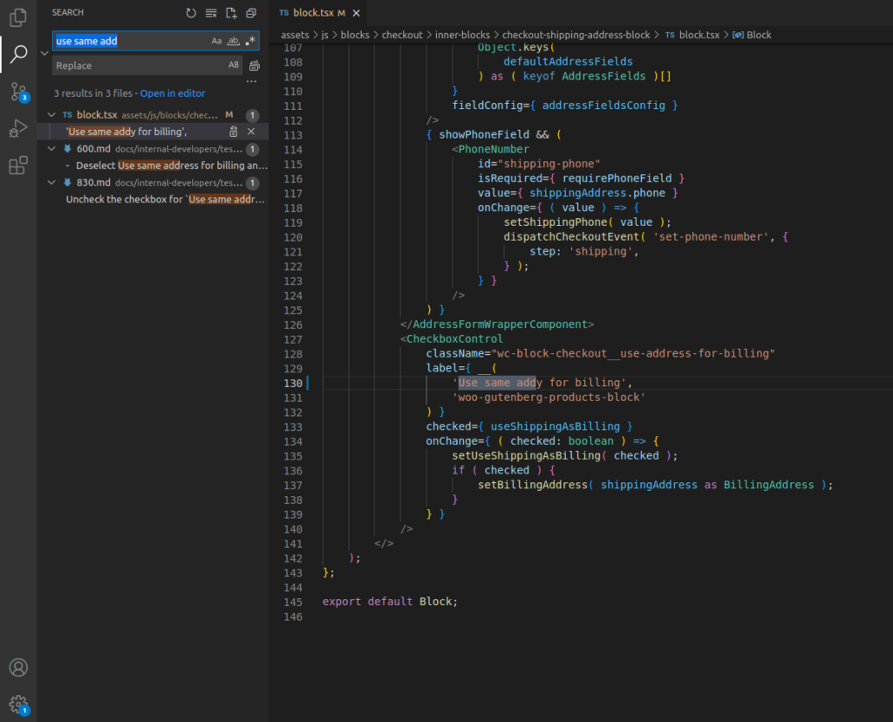
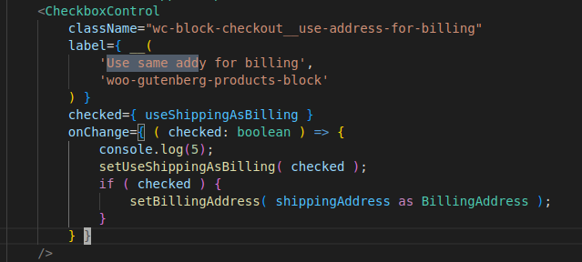
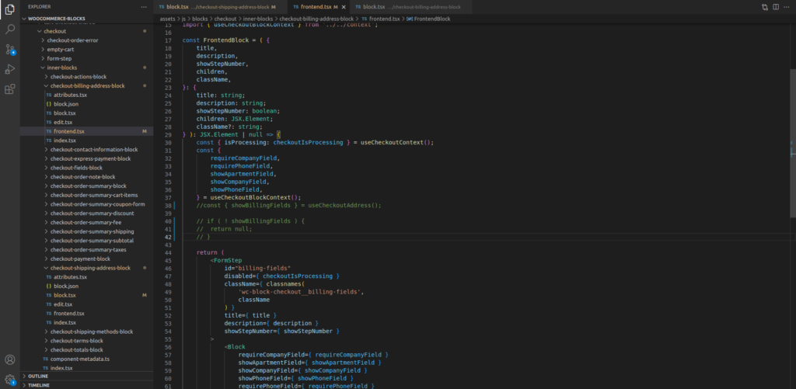
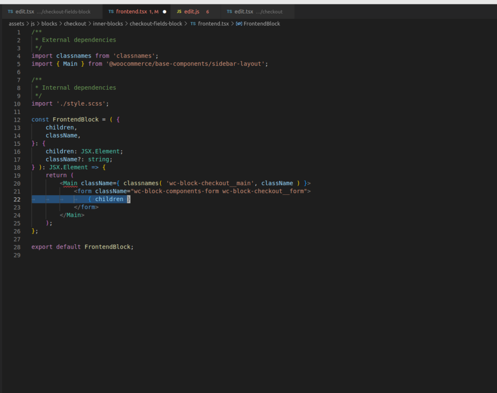
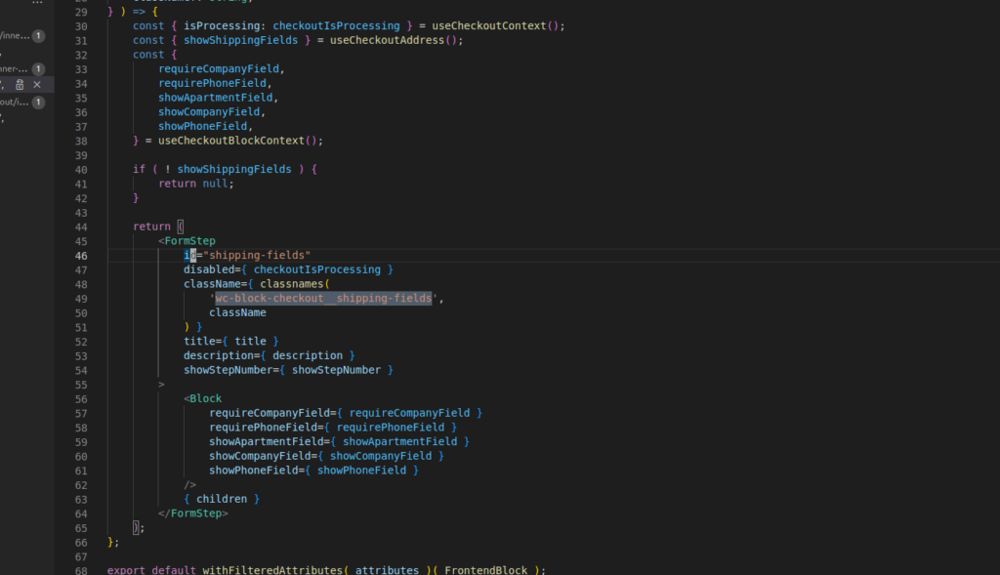
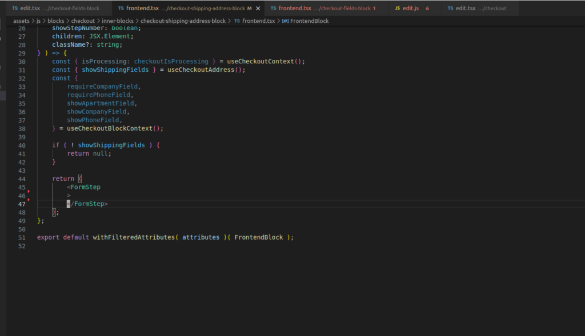
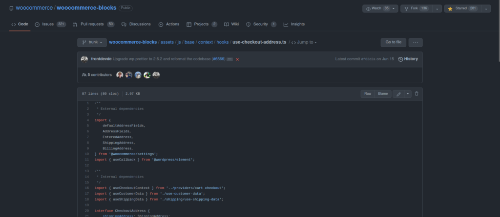
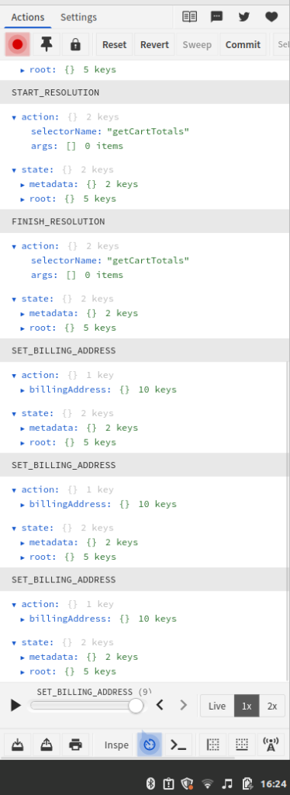
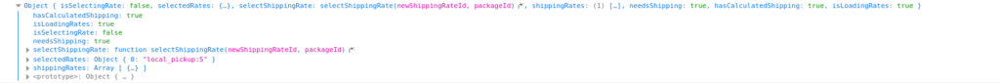

Okay. So what I want to do is I want to modify to check out to have it so like the the billing things already always on.

I would like to fire the following events but because of the virtual DOM I can't just append scripts like we could in the legacy way.

```

document.getElementsByClassName("wc-block-checkout__use-address-for-billing")[0].style.display = "none";

document.getElementById("checkbox-control-0").checked = false;

document.getElementById("shipping-fields").style.display = "none";

```

Also, I noticed that whenever I press delivery, our local pickup, the number is immediately calculated. That would be dope if local pick is selected and the shipping address would be like taken off because it is local pickup at store that we already know what the shipping's gonna be if it's Local Pickup (at Store).

Also, this doesn't cover the process it took to the point where I could edit the filer of WooCommerce-blocks. It took me half a day just to set it up the first time. The GitHub for WooCommerce-blocks has instructions and you going to have download nvm and then select the appropriate version of Node.



OK, so I have to figure out the event that occurs whenever. The button is clicked on and the shipping total is recalculated.

I found out how to log an event when the address field is selected:



OK I found out the lines that I need to comment out they are as such :



Need to figure out how to rearrange the order so billing is on top and shipping is on bottom

Also, I appreciate that this is gonna mess up a lot of stuff that's being interested database as far as accuracy so I'm getting the UI the way I wanted to and then focus on the fidelity of the information



The one that I saw working is the children part of this so I have to figure out what {children} comes from. Also, I tried to go around and delete every single occurrence of defaultTemplate and that didn't work but the only thing that works for changing like the macro of the checkout page is deleting that line right there.


If you change this file to the following you'll get rid of it.

Before:



After:



I think I peaked at some possible cappery. Notice the following import statement.

import { useCheckoutAddress } from '@woocommerce/base-context/hooks';

When I looked it up nothing but whenever I entered the following I did some real searching I found out this is the real path



[https://github.com/woocommerce/woocommerce-blocks/issues/5737](https://github.com/woocommerce/woocommerce-blocks/issues/5737)

dispatchCheckoutEvent()



toDo:

- I need to have it arranged where the billing is on top at all times.

- Also, I have to take advantage of the action and the store state which  
    is related to the toggling of Local Pickup and Delivery.

- So I can use that stored state value to iterate upon further logic.

https://developer.woocommerce.com/2022/05/20/hiding-shipping-and-payment-options-in-the-cart-and-checkout-blocks/

[Checkout Flow and Events](https://github.com/woocommerce/woocommerce-blocks/blob/trunk/docs/internal-developers/block-client-apis/checkout/checkout-flow-and-events.md)

[Checkout API](https://github.com/woocommerce/woocommerce-blocks/blob/trunk/docs/internal-developers/block-client-apis/checkout/checkout-api.md)



The following console.log is what finds the shipping rate.

```
console.log(useShippingData().selectedRates);
```

But I have to tie it down to one command because it keeps on going. More specifically.

```
console.log(useShippingData().selectedRates[0]);
```

Today, trying to figure out the attributes that are changed that takes the billing field away from the DOM. Then apply that to the shipping field.

I know that SET\_BILLING\_ADDRESS is an action which is fired. However, I haven't found what DIRECTLY takes it off the DOM.

Answered: That thing which directly takes it from the DOM is returning null when the value is ran against useCheckoutAddress.

I'm not going to go down the rabbit hole of trying to arrange the billing block above the shipping block until I get the pickup-appear functionality working.

Okay, so the logic already exists for not showing shipping if there is no shipping method selected in the settings page. However, if I delete all of it the checkbox goes away. For this [file](http://woocommerce-blocks/assets/js/blocks/checkout/inner-blocks/checkout-shipping-address-block/frontend.tsx).

I would like to be able to have the file return null and still have the billing field show. Then do this process programmatically with store state updates.

OK, the progress that I've made so far. Is the local pick up. Looks perfectly fine. But the delivery needs work.

The billing checkbox is broken so like if it's unticked then billing needs to be shown.

OK, so like. Billing is waiting for the right notice to talk to it and it was used as used billing as like a hook there and I disable that hook from listening so that so that billing block needs to listen to that hook.

...

Trying to figure out the flow of data within context. Of the project within the checkout. So we're reverse engineering that.

[React Provider Docs:](https://reactjs.org/docs/context.html)

"Context lets us pass a value deep into the component tree without explicitly threading it through every component."

More info:

Source 2: [React Context 2](https://kentcdodds.com/blog/how-to-use-react-context-effectively)

Source 3: [Provider](https://react-redux.js.org/api/provider)

I thought that the Provider component had something to do with Redux exclusively but reading here it says that a Provider component is created EVERY TIME a context object is instantiated.

I need to find the data store so I can use useShippingAsBilling. But they say it's available via Context but I haven't been able to figure that out yet. So I have to look through the list of other data varibales and see how they're accessed.

The orderId in this [file](http://assets/js/base/context/providers/cart-checkout/checkout-state/index.tsx) seems to fit the description.

The workspace I was working in has changed so I deleted the folder woocommerce-blocks and did a fresh git clone.

Okay, the checkout is satisfactory for now.

**Ending for now:** Sat Oct 01 2022 16:25:32 GMT-0500 (Central Daylight Time)

**Start Again:** Thu Oct 27 2022 14:53:14 GMT-0500 (Central Daylight Time)

I am looking at how hooks are responding in the [shipping-totals](http://assets/js/base/components/cart-checkout/totals/shipping/index.tsx) block.

These are just parameters for the function that are going to be plugged in later whenever they look like this.

```
export const TotalsShipping = ( {
	currency,
	values,
	showCalculator = true,
	showRateSelector = true,
	isCheckout = false,
	className,
}: 
```

...

I am trying to come up with a rigid solution which will rely more than just string recognition as the comparison logic for functions. Then I found within the "shipping\_rates" value of the shippingRates object there is a method\_id of "local\_pickup". This method\_id should work fine for a rigid solution. Then I'll have a backup function which will throw an error if method\_id isn't there or is changed in someway to mess up the recognition value.

**Done for the day:** Thu Oct 27 2022 20:59:36 GMT-0500 (Central Daylight Time)

I am analyzing the following function:

```
const selectedShippingRates = shippingRates.flatMap(
		( shippingPackage ) => {
  return shippingPackage.shipping_rates
  .filter( ( rate ) => rate.selected )
  .flatMap( ( rate ) => rate.name );
  }
);
```

For reference analyzing this function on Mozilla docs.

```
// Let's say we want to remove all the negative numbers
// and split the odd numbers into an even number and a 1
const a = [5, 4, -3, 20, 17, -33, -4, 18]
//         |\  \  x   |  | \   x   x   |
//        [4,1, 4,   20, 16, 1,       18]

const result = a.flatMap((n) => {
  if (n < 0) {
    return [];
  }
  return n % 2 === 0 ? [n] : [n - 1, 1];
});

console.log(result);

// expected output: [4, 1, 4, 20, 16, 1, 18]
```

...

I just did the following to grab out method\_id from the object:

```
// Looking for method_id 
const selectedShippingRates = 
  shippingRates.flatMap(( shippingPackage ) => {
    return shippingPackage.shipping_rates
    .filter( ( rate ) => rate.selected )
    .flatMap( ( rate ) => rate.method_id );
     }
  );
if(selectedShippingRates[0] == "local_pickup"){
  // Local pickup has been selected. 
  return null;
}
```

...

Shipping has to be closed while billing is open when Local Pickup is seletected and when it's closed I want there to be a notice saying that it is sending the package (for Local Pickup) to the address of the store.

So in order to do that I need to check into this [file](http://assets/js/blocks/checkout/inner-blocks/checkout-shipping-address-block/block.tsx).

...

Before the end of the work day, I want to be able to create a custom field which will be visible in the checkout.

....

Okay so the feature I will be running a Pull Request for is as follows:

So it's gonna be like, like a knob. It's gonna say, do you want local pickup to be at your store? If you hit the dial yes, then it's going to implement what I'm trying to do viz. show no shipping field, and where that field is, it'll say the address of the store. But the billing field will be visible as well.

...

How do I link up a custom field for the checkout process?

Before I can figure that out we need to understand how a non-custom field works.

I am looking at the following component:

```
<PhoneNumber						id="shipping-phone"
isRequired={ requirePhoneField }
value={ shippingAddress.phone }						onChange={ ( value ) => {
setShippingPhone(value);				dispatchCheckoutEvent( 'set-phone-number', {		step: 'shipping',
  } );
} }
/>
```

dispatchCheckoutEvent.:This appears to be firing a Redux event which is apparently going to somewhere, so I need to figure out where that's at and looking at. Or how WordPress saves the Redux store whenever it it does something. Or rather, whenever it's. It gets sent off as a completed checkout or whenever the user presses the checkout button or complete checkout button.

It looks like all the roads are leading to [use-customer-data.ts](http://assets/js/base/context/hooks/use-customer-data.ts).

setShippingAddress is first declared in this [actions.ts](http://assets/js/data/cart/actions.ts) file.

Side Question: What is the difference between blue and yellow variable in TypeScript VS code workspace?

\- I think yellow are functions and blue are objects.

The line of code for extreme study is:

```
const { setShippingAddress } = useDispatch(storeKey );
```

Okay, analyzing the code block directly above.

Okay, so whenever I look at shipping address, it's an action which is described as:

"Sets shipping address locally, as opposed to updateCustomerData which sends it to the server."

Okay, so whenever I look at shipping address, it's an action which is described as:

Okay. So what I'm gonna do is see the button click for place order. See what it looks like on the server. As well as what's being stored "locally".

When the button clicks onSubmit fires which is as follows:

```
const { onSubmit } = useCheckoutEventsContext();
```

This file is where the onSubmit logic lives.

I am reading '[How The Checkout Block Processes An Order](https://developer.woocommerce.com/2022/10/06/how-the-checkout-block-processes-an-order/)'.

I am going to take a look at certain blocks of code and try to analyze where there at in WooCommerce Blocks checkout process.

```
const onSubmit = useCallback( () => {
  dispatchCheckoutEvent( 'submit' );
  checkoutActions.__internalSetBeforeProcessing();
}, [ dispatchCheckoutEvent, checkoutActions ] );
```

I'm guessing for the directly above code block is within the first step because it initiates the place order logic.
