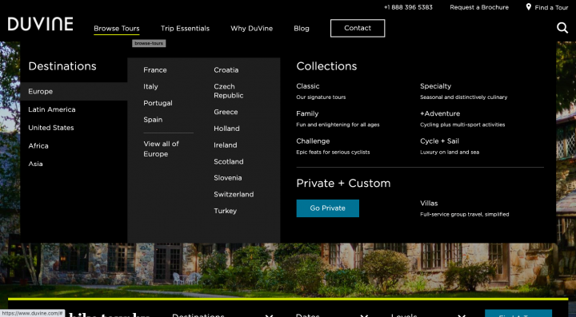
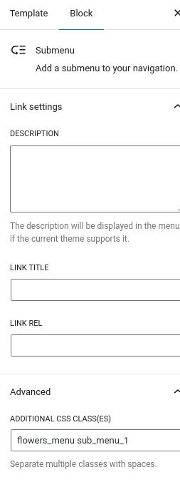
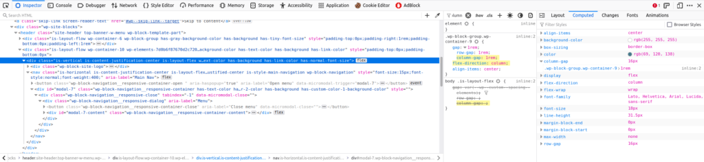
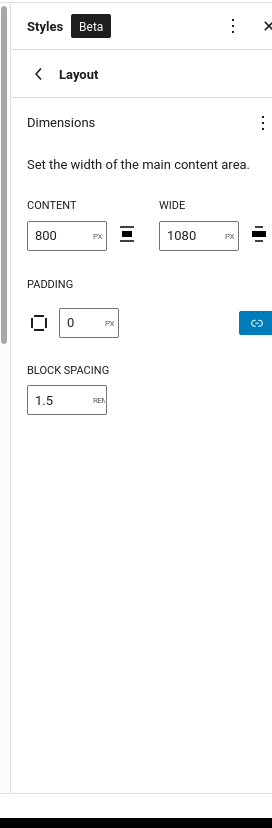
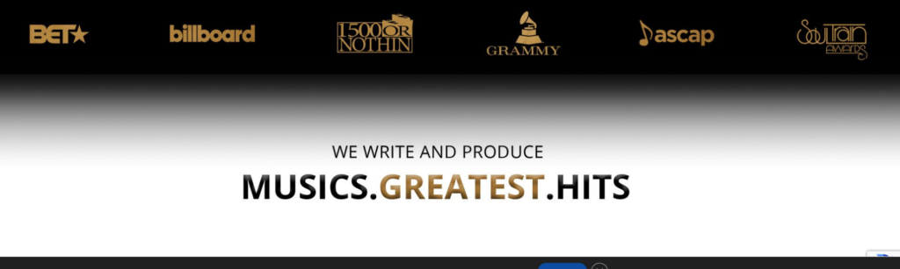
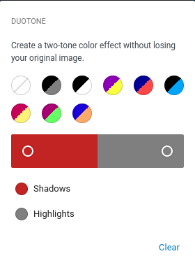
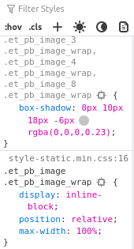
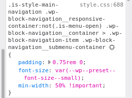
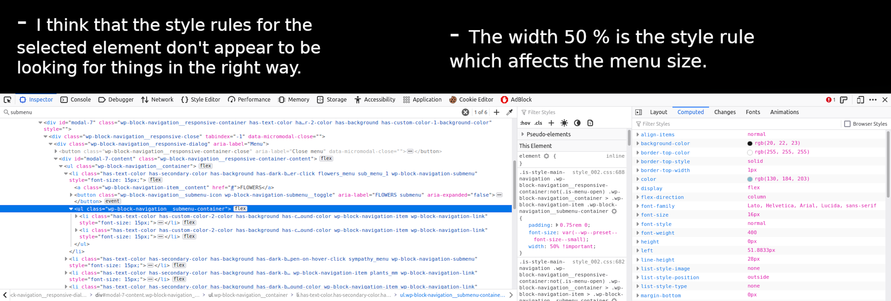

**New Day:** Thu 18 Aug 2022 02:03:46 PM CDT

Okay, I generated the block based theme and now it's time to customize it to mirror the reference site.

So far, I don't have the menu.

It doesn't appear the theme automatically doesn't comes with menu.

Alright let's look into this site on how they handle menus.

Let's search: site:fullsiteediting.com "menus"

Alright, I found it, it is [here](https://fullsiteediting.com/site-creators/switch-your-website-to-full-site-editing/#h-adding-menus) explaining how to add menus to full site WordPress themes. As well as [this course](https://fullsiteediting.com/courses/full-site-editing-for-theme-developers/).

Alright, I tried to use it with the slightly opinionated one but it didn't work so I'm going to go blank.

Okay, back to the FSE [generator tool](https://fullsiteediting.com/block-theme-generator/).

Okay, so I just copied and pasted that theme.json from the slightly opinionated folder into the new one.

Okay, that just made it look exactly the same

I am using the theme Ona because the menu is in the middle which is the same as the theme I'm referencing.

**New Day:** Wed 24 Aug 2022 10:46:35 PM CDT

I am trying to replace the standard menu of a bare-bbt.

This is the .svg I am trying to add to the theme.

```
<svg viewBox="0 0 100 80" width="40" height="40">
  <rect width="100" height="20"></rect>
  <rect y="30" width="100" height="20"></rect>
  <rect y="60" width="100" height="20"></rect>
</svg>
```

Ok I am looking around and I have yet to find a way to do it so I'm just going to reverse engineer the [Ona](https://wordpress.org/themes/ona/) theme.

However, this [official documentation](https://make.wordpress.org/core/2022/01/07/the-new-navigation-block/) is work a look.

The difference between Ona theme and bare-bbt is Ona theme is to the left and the fonts are different.

This is the svg that ships by default in a bbt.

```
<svg width="24" height="24" xmlns="http://www.w3.org/2000/svg" viewBox="0 0 24 24" aria-hidden="true" focusable="false"><rect x="4" y="7.5" width="16" height="1.5"></rect><rect x="4" y="15" width="16" height="1.5"></rect></svg>
```

I have to replace or change the default one to mimic the theme I am referencing.

Logged out: Thu 25 Aug 2022 00:00:00 AM CDT

**New Day:** Fri 26 Aug 2022 05:37:35 PM CDT

Working on the .svg for mobile menu

I have to find where that .svg is in the source code viz. the default BBT .svg for mobile menu.

I'm currently viewing [this theme](https://wordpress.org/themes/naledi/) to see how they changed their .svg.

I am getting two matches related to the .svg

```
	.wp-block-navigation__responsive-container-close svg, .wp-block-navigation__responsive-container-open svg {
		width: 30px;
		height: 30px;
	}
```

The other match appears to be minified text.

Viewing it appears only the css has been changed and the values of the .svg.

I am reading this github [issue](https://github.com/WordPress/gutenberg/issues/37930) appears to be the most helpful I've read so far.

Viola! I found out where the icon is hard coded at, [here](https://github.com/WordPress/gutenberg/issues/37930#issuecomment-1163512043).

So! If I want to make the edits to mimic the theme I am choosing perfectly, I would use the solution provided by a GitHub issue commenter [here](https://github.com/WordPress/gutenberg/issues/37930#issuecomment-1183124914). However, that seems pretty time consuming for a feature which isn't THAT big of deal ATM.

So, onto the next thing.

I would like the top menu to be full width and have a colored background.

I am reading this " — There is no setting for full width because it is not needed: WordPress handles the width limitations by setting a `max-width` on the blocks using CSS." So, I have to figure that out.

I am reading [this article](https://speckyboy.com/styling-wide-full-width-gutenberg-blocks-wordpress/) and it says to make an adjustment to the functions.php file and then you'll see the option for full-width. However, I don't have that file so I think I'll make a modification to my theme.json and hopefully I'll have the same result.

Okay, so I got it to work by adding a functions.php file into the root folder of the theme and then adding this line.

```
add_theme_support( 'align-wide' );
```

Okay, fiddling around with it I managed to get it full-width on everything and then I was like how do I center it and make it look good that way. Then, I searched around and the I found out it gots to be in a block.

Such as: [Block for homepage content](https://lh3.googleusercontent.com/rXDTDibSjACL6CQCj981DvfDFHUgRbXTYT5q2EsbtOZ3JXS6g7bgZ28YQzloqM6RqEgKNpmEcExDNuEKHc6bh5He5Vh2E0HBFbU-5rcxwxUvPHrFUtkdfdSf47CL_M6KNPGwK4aNuEaSzyhqg8RnI5t1RZql65KxjmgJVkkjpYDMcwM_5KqI3Ecr8puR092qfkg6-aLIU0LcJNX8uJXRCyvAMsv2Tm8ooAASayQOceMv85s6cTItcM0gDKkPlhwFPJ5hKfOHGrGXYIRZqfmkeL_wpk3QsmJm4TT5eHewYrIyw2rqi0sMDk7vFzLvTQSkKPzRMoT1bPAuBmzwGazgYI001wONPwQnTQCPMcO0IC8VPtIP4TNOZyP3zNYs5wcwcAMwxSc84vFbzKVCwV7HoSGH86kgyENO4WMuBHVViiUzX9-kYgDyR0IgVYfyoRMmKts02_jka5gTFU_XxJKW1zXhCnXjhguHtZ4Azyr6JJqn4Kvf-DKKrUF-Test8p1IQ-GLNmylDka3IQgk7D5GqwoDcXC4Ofgin-jxsbYVFctSkDWELEhatDLSetW_JbgpdeH2tgL3vWzA6bhhIwGtUH_9-C9BUg9kXT4GB_Aoug5xE6lPVo5TZiztvoqgXgnDNtLB-GarMyF8BuwVNoPlUiRiGUHx_ZVXsbQDXOesBP0EQcPIipAoiNyxIX0dIehOYFCWjnWexbe9Mi8NmxfmhWeVlamTEx9Vx0QTnM-icWxGCGnxNe35whZgRFyt-FMG9BmdEyzp2pvXy1Y3nbhWEaMm6Jd9bMPJYy4BdO2FWmlVXHb-KdpyCC9XoqTLQMia90yT=w1920-h876-no?authuser=1)

Side Note: This [article](https://codepen.io/webmandesign/project/full/AVakKM/) is worth a read. It is related to full-width styling.

The block referred to pictured in the image above is called a Query loop. So, I think that the stylings is by default site-wide then once the Query Loop is brought in, that's where the centered logic is brought in.

It looks like Home is inside of Query Loop. And Home is a template but I can't find the Query Loop template.

....

Okay, after I did that I made a homepage tile with centered assets.

.....

I would like to add the Template Part, 'Header (Dark, small)' from the Twenty-Two theme onto my theme.

**Logging out:** Fri 26 Aug 2022 10:14:52 PM CDT

**New Day:** Sun 28 Aug 2022 01:11:26 AM CDT

I am trying to add a slim top banner to the homepage.

Simply add the row Gutenberg block and it'll work. Similar styling to [this row](https://lh3.googleusercontent.com/dwjO5qGsEaJdtolMKFQX54XAIE0CoR0UMRXpuy8aaicyDrrdkCGnnfhwNt3AEU-QVuBk88nZDe8VeP8BcMZ9wdYd3SHmOopqaI1yn9GiGxvu4yuTm7e7k1fa3ty69Qls7nPGkndRekXhloUJQ7CN6Got6ZE4T15c10jz9udxvxbKMtlPr422ugW4ByLs5bkgPlcaqoueWsLuRSeFK9MhyUlt4ZdsAnsM2kY383lLa9wbaCuX3YwY6RsCQl5lpELcbrmwykMGTRhdE1mqOHAun8re-8_ZcNoGJrL6Fh0V1qArublDeoSgGAFwxO7X04QUHEOxyg-v_urIBH-lP73Fu-SheCMd3fBzSchAhftQQVPqRNQdE3ubP5V0yHcK3xouAuXNAzRwDJRfvQyfsFponsDD1q7gigWHSxew1cALbSn6gFk7X7hUgUQF8zG6v89j73e9Q8t5Dzw1MtfsIOMDbMJ3CRGQUe_z2gGPXfk-7iRHZ8KQG2kYtR2BrH-W5cSNjZN4OUmedtwEGa6vBW4Bg-7OPzASgDLILPFJMCvhKpLKsUuODhIazv-Qut8mxVmXgE0g56_Do9sz3vHx5xlz4exNs_KLaNd0TufNNoZiPgrv7Ae6jYX0kG7y74Ew0ZBsv3RxAomm6p9oLzWM4acV0gs2QSV8M_Wdj64V3PAjS8n5nJH10CBsuqx0zA4NZwz80zR8JdtYsnP7UVYti-Y50x2lKyXD6wnEa6bISOZv1WWK8vcwsYNuxpdEbyCcyZgejBCqF0ki2L7vxdiAqzlQX85r_PccFP2dryyHk3JncYT3SNheJDh4S1xl_klibV-747YBXGFvX_loJm_eArYaxXK1T5OtGcp_P3WMFLA=w959-h20-no?authuser=1).

**New Day:** Sun 28 Aug 2022 01:57:55 PM CDT

Styling Menus in BBT:

Simply add a class to the menu if other methods don't work.

I am currently trying to make the header one piece. So the logo and menu  
are in one template.

Changing the fonts in BBT: This [documentation/article](https://fullsiteediting.com/lessons/theme-json-typography-options/) is helpful.

To change the default font, click styles in the right hand side.

It might be better to work on a built up theme. Isolate the parts that are different and then put that onto a new theme. Rather than building from scratch.

This plugin export styles made with theme or at least it say it does precisely that.

[Plugin Repo](https://github.com/WordPress/create-block-theme)

The fact that this plugin has <1000 downloads on [WordPress.org](https://wordpress.org/plugins/create-block-theme/) is shocking.

Ok, so in the process of this, I found out that the multi-row header I am looking for is a shell within a shell within a shell. It says that it's a template than a part than a group. That file they are pointing to is in, 'inc/patterns/header-default.php'. Which is where the logic for the header really resides.

It appears that I have to just reverse engineer where the path is going and I guess add it to the patterns folder which is in the inc folder.

[Theme Currently Mentioned](https://wordpress.org/themes/auto-car-dealership/)

**New Day:** Mon 29 Aug 2022 06:23:04 PM CDT

Honestly, at this point I would rather find a theme that mimics the theme I am referencing and then customize it till it matches.

It appears the only theme that supports FSE and WooCommerce is [WowMall](https://wordpress.org/themes/wowmall/) and I don't see the shopping cart icon, so I guess I'm supposed to add that as well.

For adding that icon I will be referencing this [FSE documentation.](https://fullsiteediting.com/lessons/woocommerce-and-full-site-editing/)

I am having success with [this theme](https://wordpress.org/themes/driven/).

Alright, if your having a hard time centering assets make sure the container it's in is set to full width.

**New Day:** Tue 30 Aug 2022 06:04:54 PM CDT

I am trying to add CSS to my project but when I add it the changes aren't showing in FSE and I don't want that.

I even tried to add it to the customize CSS area and that didn't work.

Since I haven't found an answer to that, I'm just going to move on.

..... However, I am watching [this video](https://www.youtube.com/watch?v=XikXzLLojhk&ab_channel=DaveonWP) and I see how they're placing styles within theme.json, I wonder if this would work with text-decoration.

Viewing Driven theme, I am seeing global inline themes. I wonder if that's boilerplate used for all BBT's or added developer logic. Still found no solution, now onto the next one.

Making assets disappear when reduced.

I will be covering [this video](https://www.youtube.com/watch?v=dY3f8sHcAPA&t=536s&ab_channel=DaveonWP).

Okay, I managed to make the top banner of my theme disappear with this CSS rule:

```
/* This rule makes the header go away when it is below 782px */
@media ( max-width: 782px ) {
 .wp-block-group.top-banner-w-contact{
  display: none;
 }
}
```

The rule stated above is showing in both the FSE and on the actual site.

Make Menu full-width with Full Site Editing

I would like the menu to be similar to a Mega Menu. Such as:



I am going to be using the following sources:

[Source 1](https://code.tutsplus.com/tutorials/how-to-make-a-drop-down-menu-in-wordpress--cms-32991)

But before I look into that source, I notice that a CSS rule affecting the sub-menu in the inspector is the following:

```
.is-style-main-navigation .wp-block-navigation__responsive-container:not(.is-menu-open) .wp-block-navigation__container > .wp-block-navigation-item > .wp-block-navigation__submenu-container {
    left: auto;
    right: 0;
    border-top: 1px solid #fff;
        border-top-color: rgb(255, 255, 255);
}
```

The CSS class that appears to be most responsible is .wp-block-navigation\_\_submenu-container.

Thus, from that I think I can create custom CSS class by that. But I doubt that FSE, will show the changes. It would be ideal if.... FSE had the options to make it Full-Width like say a group. It only shows the following on Sub-menu, I would like for there to be more options.

Whenever I create the sub menu, it appears an additonal class name is added with the name of the node that it is under. So if you had a top-menu node named Ketchup, the submenu would be named ketchup\_class.



**New Day:** Wed 31 Aug 2022 09:09:46 PM CDT

Before I work on the Mega Menu I would like to reduce the space between blocks.

I found that the logic creating the space between the blocks:

```
.wp-block-group.wp-container-9 {
    gap: 1rem;
        row-gap: 1rem;
        column-gap: 1rem;
    flex-direction: column;
    align-items: center;
}
```

Now, figuring out how to change it.

I looked in the source code of theme and the home page's souce code for "row-gap" and it didn't work. So searching for 'gap'.



I am currently looking for this variable: "--wp--custom--spacing--elements".

I think the input to change that variable is here:



Keep in mind, when editing the padding input, just because it is empty DOES NOT mean that it is zero.

For more information on spacing view: [FSE Source](https://fullsiteediting.com/lessons/theme-json-layout-and-spacing-options/)

Ok, now that I got that figured out... Time to work on Cover. I would like a cover with a border on it. So in order to this, I have put in a group first then add the cover to the group because if you just add a bare Cover to the FSE it won't give you options for a border but if you add a group to the FSE and then the Cover then you get the border.

Creating a shadow border within the elements.

Reference:



For this process I am referencing the following video: [Header with Duotone](https://www.youtube.com/watch?v=DGH9AMYzyrg&t=396s&ab_channel=WPDevelopmentCourses)

Looking the Duotone editor it appears that styling is side to side and not up down. As such:



Therefore it looks like I'm going to have to apply my own custom styles.

[This answer](https://stackoverflow.com/questions/32329591/create-linear-gradient-border-for-top-and-bottom-edges-only) looks helpful.

... ok, working with these gradients by hand with CSS isn't really working so I'm going to use Duotone and Theme.json to produce the desired effect.

Reading through the FSE Documentation on gradients, it appears that they still use the same css rule.

On another note, this css rule appears to be making a gradient effect for the wei theme.

This style rule produces the desired effect:

```
.wp-block-cover.featured-image .wp-block-cover__background {
	background: linear-gradient(180deg, var(--wp--custom--color--background) 0%, rgba(0, 0, 0, 0) 25%, var(--wp--custom--color--background) 75%) !important;
	opacity: 1;
}
```

Ok, I figured it out and it is imperative that we use [this CSS gradient tool](https://cssgradient.io/).

...

After looking around, I think the desired effect I am looking for can be accomplished with a CSS shadow rather than a light gradient.



Note: When you refresh the page on FSE you can see the assets behind other assets momentarily.

The issue I am currently running into is the fact that the shadow is showing behind the image and not the other way around. Therefore, I must add rules to put the image behind the shadow showing logic.

**Logging out:** Thu 01 Sep 2022 06:38:23 AM CDT

**New Day:** Fri 02 Sep 2022 01:24:11 AM CDT

I managed to fix the z-index issue. It appears the FSE is not unwelcoming to z-index rules.

On the other hand, the box shadow is still not looking all the way right so I'm going through [this article](https://css-tricks.com/almanac/properties/b/box-shadow/) to look for the right CSS styling for the task.

```
-webkit-box-shadow: 0 10px 6px -6px #777;
-moz-box-shadow: 0 10px 6px -6px #777;
box-shadow: 0 10px 6px -6px #777;
```

However, I have found the following style rule to fit the needs of the task:

```
.menu-class {
  box-shadow: 0 10px 18px -6px rgba(0,0,0,0.23);
}
```

.. back to..

Making A Menu full-width with Full Site Editing

Referencing this [tidbit](https://montelogic.com/?p=349/#class-instantiation) related to how classes are created from menu nodes. We'll be working around that aspect.

After viewing changes on Mobile I've come to the conclusion that I must have a different menu for mobile and follow a menu scheme similar to the one laid out in [this video](https://www.youtube.com/watch?v=dY3f8sHcAPA&t=543s&ab_channel=DaveonWP).

However, I plan on completing the Desktop menu in it's entirety before switching to working on mobile.

I am now looking through codepens for menus that match the functionality I desire.

I am searching for code pens that preferably have just the feature which I am looking for viz. large width menu.

I will be working off of [this codepen](https://codepen.io/nickelse/pen/YGPJQG). Note, the placeholder image link is broken. Take it out for the website to load in a sufficient way.

**New Day:** Tue 06 Sep 2022 12:55:02 AM CDT

I am trying to turn the menu I'm working on into a mega menu.

The following style rule affects the style of the menu:



Furthermore:



## Flexbox Editing

[Source 1](https://codepen.io/WebDevSimplified/pen/rqNVVb), [Source 2](https://blog.webdevsimplified.com/2021-11/flexbox/)

It appears that the bare FSE comes with a menu that's in a flexbox. However, the menu that I am referencing which is a mega menu is not using a flexbox. Therefore, I have to figure out how to make a submenu full-width even though it's in a flexbox.

Okay, looking through this post, the codepen presented what changed the width of the menu is changing the width by using vw unit on '.submenu'. Fair enough.

Okay, after trying to change the stylings and having no meaningful changes, I figured out why I couldn't make the menu on my FSE WordPress theme full-width. It is because the file that comes stock with every FSE 'instantiated' theme has a CSS file in this route, "`/wp-includes/_css_/dist/_block_-_library_/_style_.min._css_`" which can contradict certain style rules.

To fix this issue we can dequeue the file and then add the block library files into theme files, link it and then make the necessary changes.

Reading this GitHub Pull Request we can observe that only block which are being actively called are being rendered so that complicates matters.

Reading this article on how to remove Default styles and it's saying that in order to do it our solution are going to be "hacky" which are the solutions I try to avoid. So it looks like I'm going to have to run with it and build around it.

So in the style.min.css file mentioned previously what rules are affecting the menu from being full width.

Side Note: The first project I wanted to code involved creating a menu just like the one we are working with today. Suffice to say, there are easier first time projects.

It looks like I'm going to have to follow the lessons of [this article](https://kraftner.com/en/blog/building-your-own-wordpress-core-block-css/) in order to override the default styles I am trying to override. As as [this article](https://wpdevelopment.courses/articles/gutenberg-source-code-wordpress-5-0/).

Orrr I could do what they are saying in [this article](https://kraftner.com/en/blog/building-your-own-wordpress-core-block-css/) and just clone a default block and then add my own custom styling to it.

WordPress docs for this. [Source 1](https://developer.wordpress.org/block-editor/reference-guides/block-api/block-edit-save/), [Source 2](https://gziolo.pl/2022/04/16/buddy-webinar-14-wordpress-blocks-development/)

**New Day:** Wed 07 Sep 2022 12:05:02 AM CDT

So today, we going take the default navigation block, decompile it, and turn it into a mega menu.

However, I feel like this project requires a creating new documenting article so I will be doing precisely that.

After skimming through this article and the difference between gradient and box-shadow research has been done to show that using gradients over box shadow is a faster solution and a more lightweight solution. I may write an article in the future on the implementation of this within BBT as well as citing the pertinent research. If you would like to look deeper into the comparison [RyanSolid](https://www.youtube.com/c/RyanCarniato9) did a [podcast](https://www.youtube.com/watch?v=Vcq2DvkMz3k&ab_channel=RyanCarniato) where the topic came up of gradient vs. box-shadow.

This post is extended to a part 2 due to word count constraints, when it is taken out of draft mode the viewer able to view it [here](https://montelogic.com/?p=1022).

**Ending for now:** Sun Oct 02 2022 13:30:38 GMT-0500 (Central Daylight Time)
