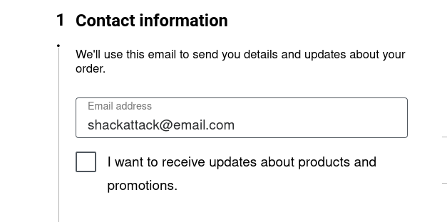
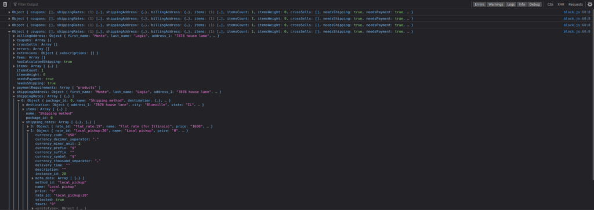

This project is contingent upon being able to have the information being added into the REST API post which creates the $order object. If I can get it there then it'll be sent to the admin part of WordPress which will then be able to be viewed by the client.

I know that when I was running console.log(state) I saw a value in the object named extensions\[\]. Plausibly it could go there.

The [slot fill](https://github.com/WordPress/gutenberg/tree/c53d26ea79bdcb1a3007a994078e1fc9e0195466/packages/components/src/slot-fill). 65

This [slot fill](https://github.com/woocommerce/woocommerce-blocks/tree/trunk/packages/checkout/slot) is directly related to WooCommerce Blocks.

https://developer.wordpress.org/block-editor/reference-guides/slotfills/

https://github.com/woocommerce/woocommerce-blocks/issues/6579

https://developer.wordpress.org/block-editor/reference-guides/components/slot-fill/

I am working on getting SlotFill to work but the problem is that I cannot get the following import statement to work on my plugin.

```
import { createSlotFill } from '@woocommerce/blocks-checkout';
```

With that I am getting the error: Can't resolve '@woocommerce/blocks-checkout'

In order to fix this we have to configure the aliases.

Also, when I am downloading woocommerce/blocks it says,

'NPM package is no longer updated, please use composer instead'. So I guess I'll try it with composer.

So without aliases it's going to look something like:

import { createSlotFill } from '../../woocommerce-blocks/packages/checkout/slot'';

If you don't want to keep on searching for the createSlotFill within woocommerce-blocks plugin folder just do this:

```
// Global import
const { createSlotFill } = wc.blocksCheckout;

const slotName = '__experimentalSlotName';

const { Fill, Slot } = createSlotFill( slotName );
```

This is useful:

https://developer.woocommerce.com/2021/11/09/available-extensibility-interfaces-for-the-cart-and-checkout-blocks/

Read this GitHub file first related to SlotFill:

https://github.com/woocommerce/woocommerce-blocks/blob/trunk/docs/third-party-developers/extensibility/checkout-block/slot-fills.md

I wonder if there is a test or a way to see the order in which scripts are enqueued so I know it occurs when it's supposed to.

...

Okay, so I'm going to have to look at that old gist that I made before I added the new changes and then apply the applicable changes. Until it works.

**Done for day**: Wed Nov 16 2022 20:26:07 GMT-0600 (Central Standard Time)

The only other plugin I have seem to have found which is using the IntegrationInterface is [Mailchimp for WooCommerce](https://wordpress.org/plugins/mailchimp-for-woocommerce/). So I'll be tearing through that to find the right answers.

Okay so reverse engineering [Mailchimp for WooCommerce](https://wordpress.org/plugins/mailchimp-for-woocommerce/).

Alrriiighttyy, I haven't been able to get an alery going but I notice when I added and signed up for MailChimp WC there's now a field below the email. Which looks like:



The checkbox "I want to receive updates about products and promotions." that was not there before. Also in the backend there is more content related to this block.

Also, the Mailchimp for WC has a [GitHub repo](https://github.com/mailchimp/mc-woocommerce).

Side note: Here, [IntegrationInterface](https://github.com/Automattic/woocommerce-subscriptions-core/blob/trunk/includes/class-wcs-blocks-integration.php) is used in another project

I am actually not seeing any use of SlotFill in this project. But there is IntegrationInterface so maybe I'll be able to finagle something. Thus, I'll be able to use SlotFill.

So I think I'm going to pursue the functionality that I want then after that I will work on SlotFill.

I noticed the Malichimp-wc plugin requires node version 14.

You gotta run npm start in the blocks folder once you've ran npm install with version 14.

I am trying to figure out how they inserted that checkbox there.

I am reading this:

https://youtu.be/v00m1PaRaJ0?t=1867

This might be the perfect example:

https://youtu.be/v00m1PaRaJ0?t=1867

Updated (Sun Nov 20 2022 )

However, I edited it to make easier to start as well as documenting the Readme more.

Improved newsletter test:

[Improved version](https://github.com/MonteLogic/newsletter-test/commit/1ead700498f89b9e84a587d3e474dc013a32717d)

End update

I couldn't get the repo above to run NPM start maybe node version issues(?)

Okay.

I have no idea how that field got underneath the email area. So because of that I'm going to have to implement a SlotFill. But I shouldn't have the issues I have had prior due to the fact that I now have a working class which implements IntegrationInterface.

I need to focus on moving the Mailchimp plugin to a smaller plugin.

Okay now that I got the logic of the Mailchimp plugin into a smaller plugin and more specifically into one file, I need to

Need to log the order ID number, and he loaded the order ID number. So I can put that back into the backend or figure out a way to like add, that's the backend or like to like maybe say like the extension data because I know that they're using extension data somewhere.

Okay, so I have to study, I have to study how extension data can go into the backend of reports. So like, it becomes like the shipping, like the like viewable on like a custom field in the back. So I need to select. I need to study how to extension data can do that.

So, like, I'm gonna try to see like the mail chimp for WooCommerce plugin. See how that does it. And then I'm gonna try to I'm trying to like, read up more because I know I'm gonna need to get the order ID and would need to get more stuff to like pipe in there.

So I need, I just need like, study that stuff and I already might have got the answer with my previous attempts at trying to skip slot fill in. You want to comes blocks and tried to finagle around readups to do a slot fills. It's supposed to do.

For a successful order on the endpoint of '`wp-json/wc/store/v1/checkout?_locale=user'.`

This is the request:

```
{
	"billing_address": {
		"address_1": "58 Bluberry lane",
		"address_2": "",
		"city": "Blueville",
		"company": "",
		"country": "US",
		"email": "shackattack@email.com",
		"first_name": "Monte",
		"last_name": "Logic",
		"phone": "88788454",
		"postcode": "65705",
		"state": "IL"
	},
	"create_account": false,
	"customer_note": "",
	"extensions": {
		"newsletter-test": {
			"optin": true
		}
	},
	"payment_data": [
		{
			"key": "wc-cheque-new-payment-method",
			"value": false
		}
	],
	"payment_method": "cheque",
	"shipping_address": {
		"address_1": "58 Bluberry lane",
		"address_2": "",
		"city": "Blueville",
		"company": "",
		"country": "US",
		"first_name": "Monte",
		"last_name": "Logic",
		"phone": "88788454",
		"postcode": "65705",
		"state": "IL"
	}
}
```

This the response:

```
{
	"order_id": 7338,
	"status": "on-hold",
	"order_key": "wc_order_jruU4XSTu80zd",
	"customer_note": "",
	"customer_id": 4186,
	"billing_address": {
		"first_name": "Monte",
		"last_name": "Logic",
		"company": "",
		"address_1": "58 Bluberry lane",
		"address_2": "",
		"city": "Blueville",
		"state": "IL",
		"postcode": "65705",
		"country": "US",
		"email": "shackattack@email.com",
		"phone": "88788454"
	},
	"shipping_address": {
		"first_name": "Monte",
		"last_name": "Logic",
		"company": "",
		"address_1": "58 Bluberry lane",
		"address_2": "",
		"city": "Blueville",
		"state": "IL",
		"postcode": "65705",
		"country": "US",
		"email": "shackattack@email.com",
		"phone": "88788454"
	},
	"payment_method": "cheque",
	"payment_result": {
		"payment_status": "success",
		"payment_details": [
			{
				"key": "result",
				"value": "success"
			},
			{
				"key": "redirect",
				"value": "https://matlack-rebuild.local/checkout-2/order-received/7338/?key=wc_order_jruU4XSTu80zd"
			}
		],
		"redirect_url": "https://matlack-rebuild.local/checkout-2/order-received/7338/?key=wc_order_jruU4XSTu80zd"
	},
	"extensions": {}
}
```

These are the sources I am looking at to extend the schema being returned.

I notice I annot access extensions or redirect url in $order when I run.

```
/**
 * Display field value on the order edit page for shipping.
 */
add_action( 'woocommerce_admin_order_data_after_billing_address', 'shipping_custom_checkout_field_display_admin_order_meta', 10, 1 );
function shipping_custom_checkout_field_display_admin_order_meta($order){
  // echo '<p><strong>'.__('Yeetness Report').':</strong> ' . get_post_meta( $order->id, 'Yeetness Report', true ) . '</p>'. $yeetness_var . "  " . 505;
  echo '<p><strong>'.__('Yeetness Report').':</strong> ' .  $order  . "  " . 505;
}

```

I need to extensions object to display there.

It's for some reason. V1 are we used? The use statement works for some very strange reason, but the old ones still work, I don't know why that is. But I have to what I want to do is just like just be on the To be able to like open the gate extended data.

They try to work on that for the one that's already there. It's stopped in. So try to get try to retrieve that information somehow based on based on some stuff.

```
use Automattic\WooCommerce\Blocks\Integrations\IntegrationInterface;
use Automattic\WooCommerce\Blocks\StoreApi\Schemas\CheckoutSchema;
use Automattic\WooCommerce\StoreApi\Schemas\v1\BillingAddressSchema;
use Automattic\WooCommerce\StoreApi\Schemas\ExtendSchema;
use Automattic\WooCommerce\StoreApi\StoreApi;
```

I think I am going to access the API instead and then put those results into an action which will put it in the backend.

So I need to understand this:

https://woocommerce.github.io/woocommerce-rest-api-docs/#retrieve-a-customer

or this:

https://woocommerce.github.io/code-reference/classes/WC-REST-Orders-Controller.html#303

I need to focus on accessing extensionData as well:

```
const Block = ( { children, checkoutExtensionData } ) => {
	const [ checked, setChecked ] = useState( false );
	const { setExtensionData } = checkoutExtensionData;

```

Looking at using this:

```
curl https://example.com/wp-json/wc/v3/customers/25 \
    -u consumer_key:consumer_secret
```

Because I would think that there's extended api data there.

But what is consumer\_key:consumer\_secret ? And how do I use it?

I am following this tutorial on how to set the keys for WooCommerce API

https://www.youtube.com/watch?v=FGqydIm4tN8&ab\_channel=TechiePress

I am having a problem getting the SSL certificate working so Linux Mint so I'm going to have to switch my distro to Ubuntu and see if that helps.

But before I do that if I can just get the extensions object to not return an empty object I can circumvent that work so I'm woking on the code block as follows:

```
		add_action(
			'woocommerce_blocks_checkout_update_order_from_request',
			function( $order, $request ) {
				// $optin = $request['extensions']['automatewoo'][ 'optin' ];
				$optin = "Something";

				// your logic
			},
			10,
			2
		);
```

Maybe I can update the post\_meta like this:

Place extension into the table with this:

https://gist.github.com/47f8208d4b776d5dd242e98c799de01a

I have to find the object of that calendar again and put it in that newsletter-test array.

I would like greater customization on Date Picker so I am going to edit and rebuild the Gutenberg component DateTime.

https://github.com/WordPress/gutenberg/tree/trunk/packages/components/src/date-time

I downloaded that folder with DownGit rather than using git and downloading the whole tree which could take 30+ mins.  
DownGit: https://minhaskamal.github.io/DownGit/#/home

Reading this to see how to add external react components:  
https://www.cssigniter.com/how-to-use-external-react-components-in-your-gutenberg-blocks/

https://torquemag.io/2018/11/sharing-react-components-with-gutenberg/

I am not going to rebuild the gutenberg component because it's too much work I'd rather start from scratch, less dependencies to worry bout.

I am using Material UI.

https://mui.com/x/react-date-pickers/getting-started/

I'd rather do one over newsletter-test than use 'npx @wordpress/create-block wordpress-calendar'.

I am trying to isolate the development process into a smaller area. So it's only the checkout page and I don't have to run LocalWP or anything like that.

Watching this:  
https://www.youtube.com/watch?v=0v5MaDuaMys&ab\_channel=ZacGordon

This is interesting:  
https://codesandbox.io/s/gutenberg-playground-3et9k?file=/src/App.tsx

This looks the most promising:  
https://github.com/Automattic/isolated-block-editor

I am going to fork this codesandbox:  
https://codesandbox.io/s/material-ui-date-picker-forked-34u2gx

and this one:  
https://codesandbox.io/s/mui-v4-datetimepicker-with-rhf-forked-2ueqsg

It looks like I'm going to have to add a webpack config which is something I was trying to avoid.

Following this tut:  
https://www.cssigniter.com/how-to-use-external-react-components-in-your-gutenberg-blocks/

[CodeSandbox 1](https://codesandbox.io/s/sbwn73?file=/demo.tsx)

or

[CodeSandbox 2](https://codesandbox.io/s/2i8bgr?file=/demo.tsx)

I'm inspecting dayjs to have the right date be shown.

I have to add the MUI component and then make it customizable so it perfectly matches reference store.

I also have to make it so the state var is read and if local pickup the calendar and other component are rendered in a certain way.

I would also like for it to distinguish between different displays/devices and display the appropritate component per display.

I need to make a drop down list which references a day of the week for which the calendar was selected. Due to the fact that the weekends are going to have less hours than the weekdays and vice versa.

So I need to be able to grab the day of the week from the _value_ var.

Been coding with ChatGPT and it is super dope!

I am having a tough time finding projects which build their own store and not just use the core store.

But this one seems to be:

https://github.com/shalawfatah/wp-headless-plugins/blob/ab71266292c55893faa219c3634fca5e8d97433d/wp-graphql-gutenberg-develop/src/PostTypes/block-editor-preview/index.js

Working on this, in all actuality, I could just be find using attributes to hold the date and time. But I'm working on the redux store customization so I might as well finish it.

I wish I would've watched this video at the beginning of the day.

https://www.youtube.com/watch?v=OQczO6VOMkY&t=280s&ab\_channel=ZacGordon

I am searching this on GitHub.com to find example projects, 'https://github.com/search?p=2&q=gutenberg+useDispatch&type=Code'.

If you would like to over-engineer a widget or use Redux for appropriately sized web app for WordPress Gutenberg, this project has the code:

https://github.com/Automattic/sensei/blob/trunk/assets/setup-wizard/data/index.js

But I am going to use checkoutExtensionData to store the data for my code.

Okay, I am having issues with the parent component and passing data.

(appended)

But I figured that I will just create more blocks rather than using certain methods to pass data because there seems to be one source of truth which is preferred by the setup of wc blocks.

Okay, so the date. Select is always going to be up but I need to figure out like time selectors. So the date and time select they're going to be separate. Those can be separate somewhere after retrograde that back and then I'm also the time selectors going to need to be tied to the local pickle variable.

So I'm going to need to rewrite that but that's going to be, let's not really that hard. So I have to just be able to access that within the within the block slot. And then after that I need to make more blocks within that And that project it's like no more blocks like maybe more things that related to the project are related to the plugin rather.

I need to be able to send the information that it is Local Pickup up the store state so it can be detected by other apps.

Reading:

https://github.com/woocommerce/woocommerce-blocks/blob/trunk/docs/internal-developers/block-client-apis/checkout/checkout-flow-and-events.md

I need to grab this info from WC Blocks data:

```
const {
  shippingRates,
} = useStoreCart();
```

I think this is what I'm going to have to do:

https://github.com/MonteLogic/woocommerce-blocks/blob/trunk/docs/third-party-developers/extensibility/rest-api/extend-rest-api-update-cart.md

Okay, there is an object wc which you can access.

I think I'm going to have to use useSelect rather than select but don't know fully yet.

Probably something like this:

```
import { useSelect, AsyncModeProvider } from '@wordpress/data';


function BlockCount() {
    const cartData = useSelect( ( select ) => {
        return select( 'wc/store/cart' ).getCartData();
    }, [] );

    return cartData;
}
```

I need to turn this good console.log into a function for my code base.

```
wp.data.select('wc/store/cart').getCartData();
```

I just ran

```
console.log(
wp.data.select('wc/store/cart').getCartData()
);
```

and it gave me back the object I was looking for, so I just have to sift through that object and find the shipping rates. These rates can be found as follows:



I am having issues getting the right date value out of the the time picker.

Reading this:

https://github.com/iamkun/dayjs/issues/1038

I think I am going to add another block to newsletter-test which is going to be the different forms. I want to test if I can use setExtensionData in a different part of the project and hopefully be able to get rid of the array and only use one value (a string) per endpoint.

I am trying to add 2 blocks to the same plugin and this is the result I got from ChatGPT:

"

To add multiple blocks to a Gutenberg plugin, you will first need to create a new plugin using the `npm init @wp-gutenberg` command. This will generate a new plugin with the necessary files and folders for you to begin developing your blocks.

Once you have your plugin set up, you can start creating your blocks. Each block should be created in its own file, using the `registerBlockType` function from the WordPress Gutenberg API. This function takes a few arguments, including the name of the block, its title, and a render function that determines how the block will be displayed on the frontend of your site.

For example, let's say you want to create a block that displays a simple message. Your block file might look something like this:

```
const { registerBlockType } = wp.blocks;

registerBlockType('my-plugin/message-block', {
  title: 'Message Block',
  category: 'common',
  edit: ({ className }) => {
    return (
      <p className={className}>
        This is a message block!
      </p>
    );
  },
  save: ({ className }) => {
    return (
      <p className={className}>
        This is a message block!
      </p>
    );
  }
});
```

This block will display a simple paragraph with the text "This is a message block!" when it is added to a post or page.

To add multiple blocks to your plugin, you will simply need to create a new file for each block and register it using the `registerBlockType` function. You can then use the `wp-scripts build` command to build your plugin, which will combine all of your blocks into a single plugin file.

Once you have built your plugin, you can install it on your WordPress site and start using your custom blocks in the Gutenberg editor.

"

Working on a simple drag and drop block so following this tut:

https://www.youtube.com/watch?v=2CGFLwSoDbY&ab\_channel=AlessandroCastellani

This seems to be a small drag and drop Gutenberg component.

This tut is much more modern:

https://youtu.be/v00m1PaRaJ0?t=1867

I just remembered that I already build a custom block with drag and drop capabilities. With this plugin:

https://github.com/MonteLogic/mol-custom-blocks

But I'll watch the above tut anyways.

This RyanWelcher project seems to be what I'm looking for.

https://github.com/ryanwelcher/twitch/blob/trunk/plugins/multiple-blocks/webpack.config.js

Multiple Blocks Repo:

https://github.com/wpbros/Gutenberg-Block-Development/tree/ep.3

Tutorial for the repo:

https://www.youtube.com/watch?v=RUDxr\_nedbI&t=3s&ab\_channel=wpBros.

I just realized that. I didn't need to use MUI. The functionality I was looking for could work perfectly fine on the WordPress component I was looking for. I thought that the invalidate prop wasn't used for restricting dates. I was incorrect in that assumption.

Back to the checkout page. For some reason, I cannot add a custom block to the checkout page for WooCommerce Blocks.

This is all the info I am getting for adding blocks as far as anwering questions by @Auttomatic.

https://github.com/woocommerce/woocommerce-blocks/discussions/5736

BUT, I would still like to have drag and drop functionality and it appears I cannot with the current setup of WC Blocks. I am going to have to go into the source code and change it, or just render one block that is going to be a master mind of different SlotFills which are not shown. The latter of the two would be a good option if SlotFills were viewable from the edit section and [some currently aren't](https://github.com/woocommerce/woocommerce-blocks/issues/7939#issuecomment-1354932718).

So I have a PR I am working on I think I will try to make all relevant SlotFills viewable in the edit section then try to work on drag and drop functionality after that.

If I had no way to change the WC Blocks repo, I could still make one block with all the functionality work but the problem is the master control panel may not properly read the boolean inputs and some components may not be rendered.

Okay, so what I'm trying to do is Have the master panel but have a certain input be there and then maybe I can switch it out for that one area or I might be able to make more components from there. And then I could have like inputs there but I was still like that to date picker and other areas But it's definitely.

I'm gonna have to warn the user all about these restrictions.

For the longest time I was wondering why it only rendered there and not in the myriad of different locations and that's because that's the ONLY place that component logic can render.
