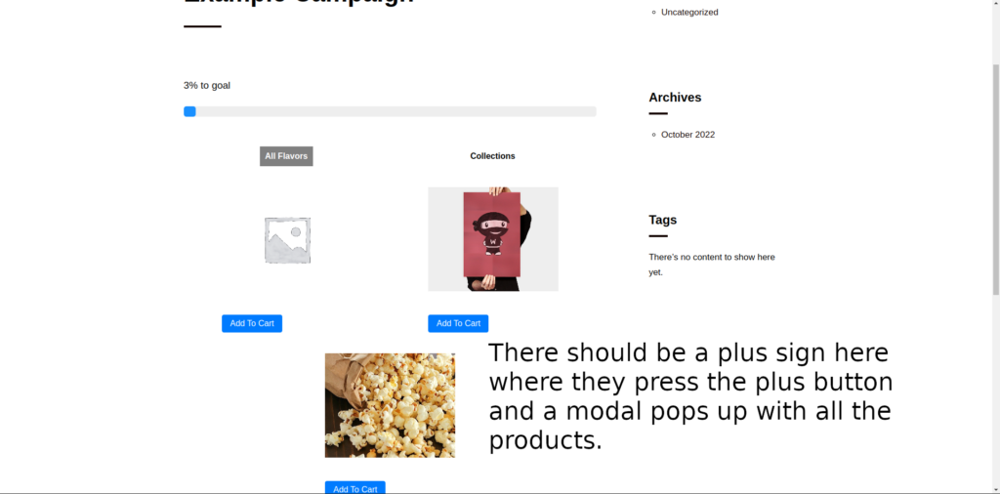
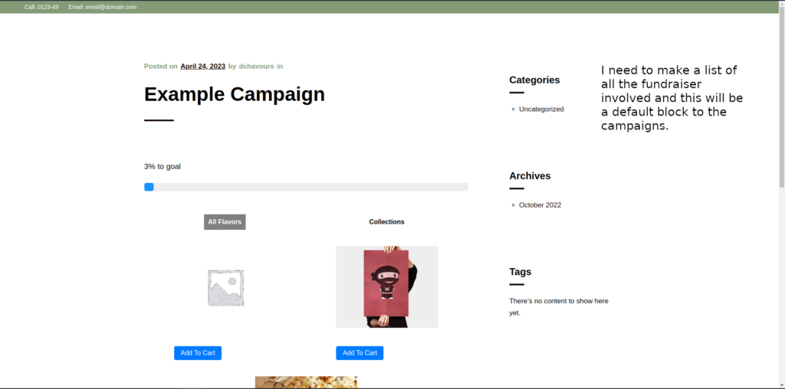

\[x \] I may be able to query that PHP statement and allocate to an array it'll be get underscore users using a PHP thing and that will save me the hassle of having to create a mirror API.

\[ x\] Change the checkout page to show users rather than CPT, hopefully, I will be able to do this via settings call, seen in slot-fill-test-repo.

\[x\] So on the list of fundraisers, I need to change the source of truth array to a JavaScript fetch call which fetches the users whom all have a role of fundraiser.

\- So I'll have to focus on this URL, http://donatepretz1.local/wp-admin/admin.php?page=list\_of\_fundraisers\_page

\[ \] At this current moment (Tue Apr 18 2023 10:43:57 CST ), fundraisers/admin-scripts/fundraiser-admin-script.js is janky and SHOULD be refactored at a later date.

\[ X \] Show who has the most sales, on the admin fundraiser list.

\[ \] Show what campaigns each user is associated with on the admin side.\* Still not an array.  
\[ \] I need to make a modal out of the list of assoc campaigns and a modal out of order list due to the fact that it can be a large number.

\[ \] Show which orders each fundraiser has.

\[ \] I need to change that into an array because it'll get crowded, also have to change the post meta.

\[ \] I would like to use a post meta scheme for the checkout page and that meta will tell if the component of EC should run.

\[ \] I also, have to do the front facing block which ranks fundraisers.

\[ \] I need to get the admin side and frontend block side, so they don't replace each other and have only one of them working at a time.

\[ \] 158dg: Refactor the checkout to use the post\_meta of the checkout page, if there is not already post meta for the checkout page, the regiter post\_meta for the checkout page which the api will reference.

\- I am going to try to do this functionality by accessing attributes via php.  

\[X\] 4719f: I need to figure out how to send plugin updates via API to fix plugins which NEED updating.

**Side Note**: I want to switch it to using attributes and then I want to add some more edit and then just release Extended Checkout on my own platform.

Side Note:

I'll think I'll make an affiliate program/plugin using EC to save the metadata from a link.

I would then use this as a way to market Extended Checkout.

I need to add this bit of good news to the repo and it should work:

```

require_once 'fundraisers/fundraisers.php';

register_activation_hook( __FILE__, 'my_rewrite_flush' );
/**
 * Starting update via different method.
 */
function my_rewrite_flush() {
	// First, we "add" the custom post type via the above written function.
	// Note: "add" is written with quotes, as CPTs don't get added to the DB,
	// They are only referenced in the post_type column with a post entry,
	// when you add a post of this CPT.
	\PrePublishChecklist\register_fundraisers_post_type();

	// ATTENTION: This is *only* done during plugin activation hook in this example!
	// You should *NEVER EVER* do this on every page load!!
	flush_rewrite_rules();
}


```

I am trying to add a goal field to the fr-campaigns which would then in turn be able to be updated via REST. I've manage to do a similar functionality with a different meta field:

```
function add_post_meta_assoc_users(userId, selectedNiceName) {

  let newValue = { 'associated_list_of_users_to_this_campaign': [userId, selectedNiceName] };
  let stringedNewValue = JSON.stringify(newValue);

  fetch(`/wp-json/wp/v2/fr-campaigns/${post_ID.value}`, {
  method: 'POST',
  headers: {
    'Content-Type': 'application/json',
    'X-WP-Nonce': wpApiSettings.nonce
  },
		body: stringedNewValue
	}).then(response => {
	  if (response.ok) {
				return response.json();
			}
			throw new Error('Network response was not ok.');
		})
		.then(data => {
			console.log(data);
		})
		.catch(error => {
			console.error('There was a problem with the fetch operation:', error);
		});
}
```

**Side Note:** getEntityRecords works well for post types data retrieval but not for user data retrieval.

...

I didn't even know about the useEntity prop, seen [here](https://developer.wordpress.org/block-editor/how-to-guides/metabox/).

...

I haven't figured out 'meta' per se but I can access this meta field like:

```
const [campaignGoal, setCampaignGoal] = useEntityProp('postType', 'fr-campaigns', 'fundraising_campaign_goal');
```

...

It turns out you have to enable custom-fields in order to have that meta stuff and be able to use the useEntityProp.

...

I have to make a campaign dashboard which would be another page.

I have to edit the WooCommerce cart in order to add the fact that the product was added vis-a-vi to a campaign which it was selected.

...

Okay, so I'm adding post meta to the cart by and Add To Cart button. This is what it could look like:

php:

```
function add_cart_item_data($cart_item_data, $product_id, $variation_id) {
    if (isset($cart_item_data['add_to_cart_from_post_id'])) {
        $cart_item_data['add_to_cart_from_post_id'] = $cart_item_data['add_to_cart_from_post_id'];
    }
    return $cart_item_data;
}
add_filter('woocommerce_add_cart_item_data', 'add_cart_item_data', 10, 3);
```

JavaScript:

```
const handleAddToCart = (productIDParam) => {

    const data = {
        product_id: productIDParam,
        quantity: 1,
        add_to_cart_from_post_id: 213 // the post ID where the Add To Cart button was clicked
    };

    const addToCartUrl = '/?add-to-cart=' + data.product_id + '&quantity=' + data.quantity;

    fetch(addToCartUrl, {
        method: 'POST',
        headers: {
            'Content-Type': 'application/x-www-form-urlencoded',
        },
        body: JSON.stringify(data),
    }).then(() => {
        // I don't think I'll need to do this:
        window.location.reload();
    });

};

const Product = () => {
    const [productID, setProductID] = useState(''); // state to hold product ID

    const handleAddToCartClick = () => {
        handleAddToCart(productID);
    };

    return (
        <div>
            <input type="text" value={productID} onChange={(e) => setProductID(e.target.value)} />
            <button onClick={handleAddToCartClick}>Add to Cart</button>
        </div>
    );
};

// add cart item meta data
const addCartItemData = (cartItemData, productID, variationID) => {
    if (cartItemData['add_to_cart_from_post_id']) {
        cartItemData['add_to_cart_from_post_id'] = cartItemData['add_to_cart_from_post_id'];
    }
    return cartItemData;
};

export default Product;
```

Trying to get the custom meta to be associated with a product which is associated with a campaign within an order:

So like when it's added to cart in like 213, I could like the team number of the product in there, but it was like two but now if there's like multiple ones and you like show that and I don't know if that's gonna work, they can go. Like, I don't know.

They go like at a product. That's a part of the campaign. That's saying product can go all over there and won't be part of the campaign in like I guess it will matter. So, like I need just like, had like one There. And I just need, like, have like, my own, my extra, like order, like area product orders my custom bed.

And so, I can't like better research. This standard meta.

...

So like, once that order is processed, I need to like go into the post meta of like the campaign and then like, like change that number to like a new total from that. And then also might be good. I mean, I need to like, later know I can just like, do like the orders that are associated with it and then not like to take that out but like just like the sums of orders associated with it, that's gonna be like the meta of like the custom post type and it's gonna be like added upon like post order submission.

...

I want fundraising\_campaign\_total\_sales to be a custom field of a post type so I can use useBlockProp on it similar to how \_meta\_fields\_book\_author can be used.

...

I need to add this:

```
function add_cart_item_data($cart_item_data, $product_id, $variation_id) {
    $post_id = isset($_POST['add_to_cart_from_post_id']) ? $_POST['add_to_cart_from_post_id'] : 0;
    if ($post_id) {
        $cart_item_data['add_to_cart_from_post_id'] = $post_id;
    }

    $campaign_name = isset($_POST['campaign_name']) ? $_POST['campaign_name'] : '';
    if ($campaign_name) {
        $cart_item_data['campaign_name'] = $campaign_name;
    }

    return $cart_item_data;
}
add_filter('woocommerce_add_cart_item_data', __NAMESPACE__ . '\add_cart_item_data', 10, 3);
```

....

Still probably gonna need the campaign name because I'm gonna like put it on like the checkout page, but I guess, but I guess that would see me some PHP time. But really I just need focus on like the adding the original ID app post ID of this CPT that well the campaign which is, which is a CPT on Twitter and then making that good and then I can worry about campaigning name later.

So I have to figure out that user UI with special permissions which can alter values.

I need to figure out how to load a template onto a newly created CPT. This will make edits much easier.

The productInfo object looks like this.

\[  
{  
"imageURL": "http://donatepretz1.local/wp-content/uploads/woocommerce-placeholder.png",  
"productName": "Kettle Corn - donate",  
"productURL": "http://donatepretz1.local/?post\_type=product&p=262",  
"productID": 262  
},  
{  
"imageURL": "http://donatepretz1.local/wp-content/uploads/2022/10/poster\_4\_up.jpg",  
"productName": "Woo Ninja",  
"productURL": "http://donatepretz1.local/product/woo-ninja/",  
"productID": 65  
},  
{  
"imageURL": "http://donatepretz1.local/wp-content/uploads/2022/10/easy-homemade-kettle-corn-4-3808443868.jpeg",  
"productName": "Kettle Corn - donate",  
"productURL": "http://donatepretz1.local/product/woo-singles/",  
"productID": 50  
}  
\]

So I have to make that programmatically and then input it as a value within the template param of register\_post\_type().

...

I also need to set the default value attribute to the campaign which the CPT is.

Furthermore, if campaign 5 is selected like 15 attributes need to be set.

...

```
// Think this updates the meta of the current post.
  const [meta, updateMeta] = useEntityProp(
    'postType',
    'fr-campaigns',
    'meta'
   );
console.log(meta);
```

...

I have to make the Edit page look like the front end page for the progress bar. I kinda did that but I used a attribute rather than the dynamic value, so I'll have to go back in there and re-do it eventually because the value won't realign to the true value unless the block is selected and the attribute is saved.

...

Now I have to work on the de-elevated user view.

...

Now I am working on the fundraiser UI.

I am evaluating the user UI and looked for the div element of, 'woocommerce-MyAccount-navigation-link'.

I was brought to [this file](https://github.com/woocommerce/woocommerce/blob/trunk/plugins/woocommerce/includes/wc-account-functions.php).

This [post](https://www.businessbloomer.com/woocommerce-add-new-tab-account-page/) is useful.

This [php file](https://github.com/wcvendors/wcvendors/blob/f5e59b755a4c9001f2f8514412244ccb12bb1fd2/classes/front/account/class-wc-account-links.php#L34) could be of use.

This is a good [search](https://github.com/search?q=woocommerce_account_menu_items&type=code).

For the Fundraiser user page I would like a React component which lists all of the campaigns they are involved in and once they click it then they can edit the products.

....

I need to make a Fundraiser creation system which only creates Fundraisers and doesn't give the admin any other options for roles besides Fundraiser.

...

Working on the user fundraiser edit page.



image 2:



I think we're scrub the idea of like I'm gonna scrap the idea of like using a custom like a page. I'm gonna make like because I know it's a dynamic block so I should be with like tech detective. The roles is a fundraiser and if that's the case, then I'll get the ability to like change it.

Like the bit of a plus button at the end or use a page will be like for like a certain user. And then until like do like the bliss of pages Between just go on the admin side and then go there, that'll be like a list of all the pages probably campaigns.

This is how I can get the value of the post meta I am currently in:

```
fetch(wpApiSettings.root + 'wp/v2/fr-campaigns/' + tabbedTableAttrs.campaign_id, {  // Replace {POST_ID} with the actual post ID
	method: 'GET',
	headers: {
		'Content-Type': 'application/json',
		"X-WP-Nonce": wpApiSettings.nonce,
	}
})
	.then(response => response.json())
	.then(data => {
		const metaFieldValue = data.fundraising_campaign_goal; // Replace 'meta_key' with the actual meta key name
		console.log('Meta field value:', metaFieldValue);
	})
	.catch(error => {
		console.error('Error retrieving meta field:', error);
	});
```

This is what updates it:

```
fetch(wpApiSettings.root + 'wp/v2/fr-campaigns/' + tabbedTableAttrs.campaign_id, {
	method: 'POST',
	headers: {
		'Content-Type': 'application/json',
		"X-WP-Nonce": wpApiSettings.nonce,
	},
	body: JSON.stringify({
		meta: {
			fundraising_campaign_goal: 'new_value' // Replace 'new_value' with the desired new value
		}
	})
})
	.then(response => response.json())
	.then(data => {
		console.log('Meta field updated successfully:', data);
	})
	.catch(error => {
		console.error('Error updating meta field:', error);
	});
```

I can get the post to work but not the get, for some reason.

This is sending good post meta objects:

```
var postData = [
  {
    "imageURL": "http://donatepretz1.local/wp-content/uploads/woocommerce-placeholder.png",
    "productName": "Kettle Corn - donate",
    "productURL": "http://donatepretz1.local/?post_type=product&p=262",
    "productID": 262
  },
  // Add more objects as needed
];


fetch(wpApiSettings.root + 'wp/v2/fr-campaigns/' + tabbedTableAttrs.campaign_id, {
	method: 'POST',
	headers: {
		'Content-Type': 'application/json',
		"X-WP-Nonce": wpApiSettings.nonce,
	},
	body: JSON.stringify({
		meta: {
			_fundraiser_added_products: JSON.stringify(postData)
		}
	})
})
	.then(response => response.json())
	.then(data => {
		console.log('Meta field updated successfully:', data);
	})
	.catch(error => {
		console.error('Error updating meta field:', error);
	});

```

This is how you get the value of the meta post field:

```
fetch(wpApiSettings.root + 'wp/v2/fr-campaigns/' + tabbedTableAttrs.campaign_id, {  
	method: 'GET',
	headers: {
		'Content-Type': 'application/json',
		"X-WP-Nonce": wpApiSettings.nonce,
	}
})
	.then(response => response.json())
	.then(data => {
  const metaFieldValue = data.meta._fundraiser_added_products;
		console.log('Meta field value:', metaFieldValue);
	})
	.catch(error => {
		console.error('Error retrieving meta field:', error);
	});
```

...

"

How about I just get that like like value via the fetch and then like save it and like a variable and then update that variable.

I don't even think I even need to use a git request besides anything but like testing because like that since that should be going in to like the attributes and like there should be like an updates like every single time it loads there should be like a get request for the components that like updates it. And this should be on like the admin side to our instead of like that it can just be using institute prop or use entity prop to get that info and then that's like apended to the product

"
