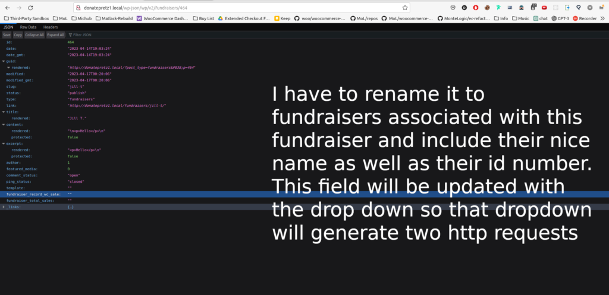
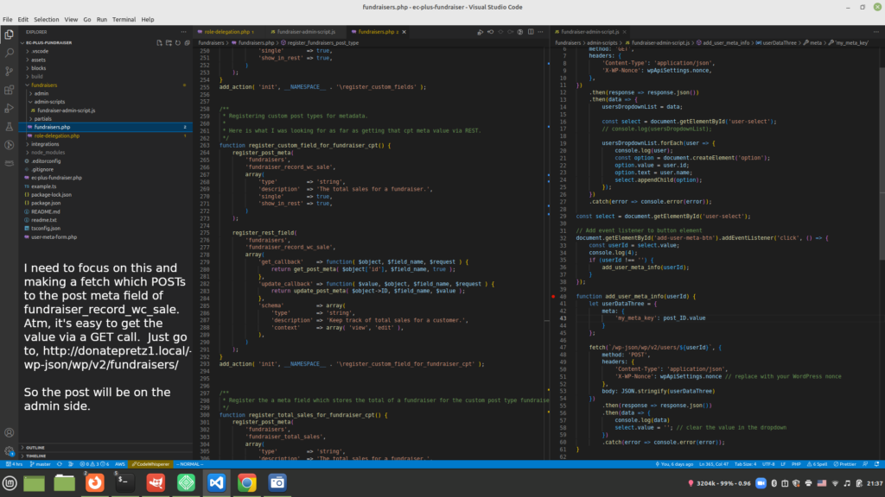
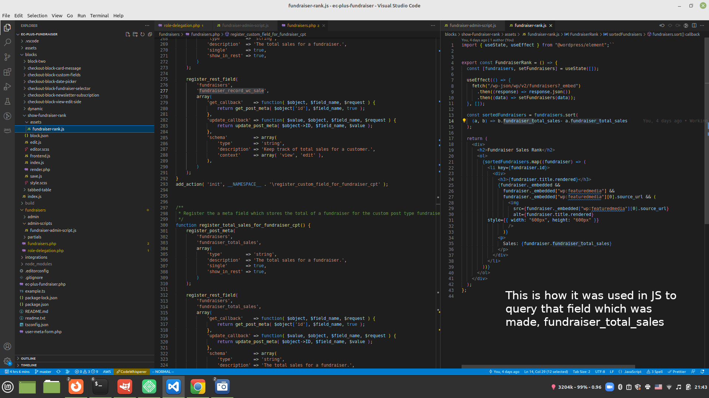
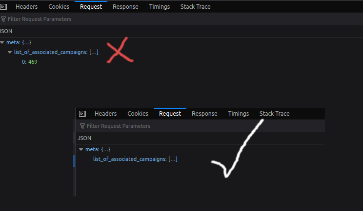

Make the analytics good and then focus on the editing of the component so users can get the fundraisers page looking really good.

\[x\]I also think I am going to switch Fundraiser to Fundraising Campaigns.

- This is due to the fact that it's too awkward to have a fundraisers and users at the same time. So I think I'll just change have the fundraiser view be like all of the Campaigns which a fundraiser can view.

- I would also like a Fundraiser Campaign analytics on the backside as well. SO I have to build up the edit side.

- Make the customization of Fundraiser Pages good.

- I just found out I am going to have to switch that dropdown to users because that is just going to show fundraiser campaigns.

...

The implementation of this got kind of murky so here is the end user process:

Someone who wants to use EC Plus Fundraiser starts a campaign, so they click on the “EC Plus Fundraiser Tab”, since there is no new campaign they are brought to a screen where they can create a new campaign they will have the choice to add fundraisers to the campaign. 

The add user process will be adding a USER and not a CPT. This user screen will be just a copy of the add user screen with the exception of coupling a user(fundraiser) to a campaign and adding a profile picture.

The campaign will have a number goal as well as an option to add fundraisers.

When a customer goes onto the website with the plugin, at checkout there will be a drop down of the users with a fundraiser role.

As for the accrediting of fundraising campaigns to a product within a vicissitude, the landing page will accredit this.

The landing page of it will tell you what fundraising campaign is and I guess I will store that value in local storage.

...

**New Day:**

This adds a new user but apparently I can't list users.

```

const username = 'newuser';
const email = 'newuser@example.com';
const password = 'password';

const data = {
  username: username,
  email: email,
  password: password,
};

fetch('/wp-json/wp/v2/users', {
  method: 'POST',
  headers: {
    'Content-Type': 'application/json',
    'X-WP-Nonce': wpApiSettings.nonce,
  },
  body: JSON.stringify(data),
})
.then(response => response.json())
.then(data => console.log(data))
.catch(error => console.error(error));


```

Alright, this is how you list users:  

```
fetch('/wp-json/wp/v2/users', {
  method: 'GET',
  headers: {
    'Content-Type': 'application/json',
    'X-WP-Nonce': wpApiSettings.nonce,
  },
 
})
.then(response => response.json())
.then(data => console.log(data))
.catch(error => console.error(error));
```

Okay, now I am working on the meta:

```
fetch('/wp-json/wp/v2/users/1', {
    method: 'PUT',
    headers: {
        'Content-Type': 'application/json',
        'X-WP-Nonce': wpApiSettings.nonce,
    },
    body: JSON.stringify({
        meta: [
            {
                key: 'custom_field',
                value: 'some value',
            },
        ],
    }),
})
    .then(response => response.json())
    .then(data => console.log(data))
    .catch(error => console.error(error));
```

or preferably:

```
fetch('/wp-json/wp/v2/users/1', {
    method: 'PUT',
    headers: {
        'Content-Type': 'application/json',
        'X-WP-Nonce': wpApiSettings.nonce,
    },
    body: JSON.stringify({
        ec_plus_fundraiser_meta: [
            {
                key: 'custom_field',
                value: 'some value',
            },
        ],
    }),
})
    .then(response => response.json())
    .then(data => console.log(data))
    .catch(error => console.error(error));
```

I have to reverse engineer this code block from WooCommerce source code to figure out how they got that field in user meta.

```
/**
 * Adds fields so that we can store activity panel last read and open times.
 *
 * @param array $user_data_fields User data fields.
 * @return array
 */
public function add_user_data_fields( $user_data_fields ) {
  return array_merge(
    $user_data_fields,
    array('activity_panel_inbox_last_read', 'activity_panel_reviews_last_read',
	)
 );
}
```

[Here](https://github.com/woocommerce/woocommerce/blob/trunk/packages/js/data/src/user/types.ts) are the types for the woocommerce\_meta field:

...

I think the edit of the information has something to do with context:

> You can see the difference when authenticated as an admin by comparing the response of a GET request to “wp-json/wp/v2/user/1” to a request to “wp-json/wp/v2/users/1?context=view.” The former looks exactly like a non-authenticated request while the latter shows a lot more information.

...

It looks like this is what I need to do.

This [article](https://wp-kama.com/function/register_meta) is useful for learning more about register\_meta().

You need to register the meta in php where it can be accessed as such:

```
/**
 *  Register user meta which will be changed via REST call.
 */
function my_register_user_meta() {
	register_meta(
		'user',
		'my_meta_key',
		array(
			'type'              => 'string',
			'description'       => 'My User Meta',
			'single'            => true,
			'show_in_rest'      => true,
			'sanitize_callback' => 'sanitize_text_field',
		)
	);
}
add_action( 'init', 'my_register_user_meta' );
```

Then change/add values to it with a fetch call like this:

```
const userDataThree = {
  meta: {
    'my_meta_key': 'my_new_meta_value'
  }
};

fetch('/wp-json/wp/v2/users/2', {
  method: 'POST',
  headers: {
    'Content-Type': 'application/json',
    'X-WP-Nonce': wpApiSettings.nonce // replace with your WordPress nonce
  },
  body: JSON.stringify(userDataThree)
})
.then(response => response.json())
.then(data => console.log(data))
.catch(error => console.error(error));


```

After getting this process to work and researching get\_meta, I still haven't figured out where it's located within a local site but we're onto the next one.

...

Okay, now that I figured out how to change user meta via JavaScript, back to working on what I was working on before.

I have to go back to doing the changing of user abilities to view campaigns.

The button will do two things, save the user's own meta for the user's sake and it will also put it on a field which can be queried by the public.

Back to working on this:

```
/**
 * Callback function to display the content within a meta box of the orders attributed to one fundraiser.
 *
 * @param comment $post comment.
 */
function add_privileges_to_fundraiser( $post ) {

	?>
		<h3>Add Access to Fundraiser</h3>
	<select id="user-select">
	  <option value="">Select a user</option>
	</select>

	<button id="add-user-meta-btn">Submit</button>

	<script>
	const usersDropdownList = <?php echo json_encode( get_users( array( 'role' => 'fundraiser' ) ) ); ?>;

	const select = document.getElementById('user-select');

	usersDropdownList.forEach(user => {
	  const option = document.createElement('option');
	  option.value = user.ID;
	  option.text = user.data.display_name;
	  select.appendChild(option);
	});

	// Add event listener to button element
	document.getElementById('add-user-meta-btn').addEventListener('click', () => {
	  const userId = select.value;
	  if (userId !== '') {
		// User selected a valid option, add the user meta info
		const selectedValue = select.options[select.selectedIndex].value;
		window.location.href = window.location.href + '&to_add_privs=' + selectedValue;
		add_user_meta_info(userId);
	  }
	});

	function add_user_meta_info(userId){
// Define the user ID and the meta field key and value
// const userId = 123; // replace with the actual user ID
const metaKey = 'user_field_1';
const metaValue = 15;

// Define the endpoint URL for the user meta
const endpointUrl = `/wp/v2/users/${userId}/meta/${metaKey}`;

// Define the data to be sent in the request body
const data = {
  value: metaValue
};

// Make the request to update the user meta field
fetch(endpointUrl, {
  method: 'POST',
  headers: {
	'Content-Type': 'application/json',
	'X-WP-Nonce': wpApiSettings.nonce // include the WordPress REST API nonce
  },
  body: JSON.stringify(data)
})
.then(response => response.json())
.then(data => console.log(data))
.catch(error => console.error(error));
	}


	</script>


	<?php

}


```

...

So it'll be like post\_meta and one of the meta will be users with associated with this fundraiser.



For changing the value via post on the admin side:



The JavaScript implementation:



Working on updating fundraiser\_record\_wc\_sale.

This [article](https://code.tutsplus.com/tutorials/wp-rest-api-creating-updating-and-deleting-data--cms-24883) seems to be good.

This article seems insightful as well but it looks like I'm going to have to register a bunch of callback to edit fundraiser\_record\_wc\_sale via REST, so I'm going to do something else.

This works for changing it:

```
fetch('/wp-json/wp/v2/fundraisers/464', {
	method: 'POST',
	headers: {
	  'Content-Type': 'application/json',
      'X-WP-Nonce': wpApiSettings.nonce // replace with your WordPress nonce
	},
	body: JSON.stringify({
	  'fundraiser_record_wc_sale': 'new_value'
	})
  })
  .then(response => {
	if (response.ok) {
	  return response.json();
	}
	throw new Error('Network response was not ok.');
  })
  .then(data => {
	console.log(data);
  })
  .catch(error => {
	console.error('There was a problem with the fetch operation:', error);
  });
```

This is the real answer:

```
userId = 5;
newValue = { 'fundraiser_record_wc_sale': `something ${userId}` };

fetch(`/wp-json/wp/v2/fundraisers/${post_ID.value}`, {
  method: 'POST',
		headers: {
			'Content-Type': 'application/json',
			'X-WP-Nonce': wpApiSettings.nonce // replace with your WordPress nonce
		},
		body: JSON.stringify(
			newValue

		)
	})
		.then(response => {
			if (response.ok) {
				return response.json();
			}
			throw new Error('Network response was not ok.');
		})
		.then(data => {
			console.log(data);
		})
		.catch(error => {
			console.error('There was a problem with the fetch operation:', error);
		});

```

...

How bout I replace the drop down which was a php call with a get request and save that in a variable which will be added onto later.

This call is in another meta box.

So it might just be more convenient for me to put the assoc fundraiser list in the same file as add assoc fundraiser.

So I should combine Add Access to Fundraiser and List of fundraiser into the same meta box

And it should be association and not access.

...

Reworking it so that it's in one box, this fetch just get the post\_meta I was looking for:

```
let infoCreepin;

fetch('/wp-json/wp/v2/fundraisers/464?_fields=fundraiser_record_wc_sale')
  .then(response => response.json())
  .then(data => {
    const fundraiserRecordWCSale = data.fundraiser_record_wc_sale;
    infoCreepin = fundraiserRecordWCSale;
  // Do something with the fundraiserRecordWCSale value here
  })
  .catch(error => console.error(error));
```

infoCreepin will give you the meta data value you want from, "fundraiser\_record\_wc\_sale".

I previously displayed the user list as:

```
?>
	<ul id="user-list"></ul>
	<script>
		const users = <?php echo json_encode( get_users( array( 'role' => 'fundraiser' ) ) ); ?>;
		const userList = document.getElementById('user-list');
		users.forEach(user => {
			const listItem = document.createElement('li');
			const link = document.createElement('a');
			link.href = `user-profile.php?user=${user.ID}`;
			link.textContent = user.data.display_name;
			listItem.appendChild(link);
			userList.appendChild(listItem);
		});
	</script>

```

...

I just figured out I am going to have to make sort of a mirror API for the users due to the fact that there are restricted privelages to list users on the frontend.

This is going to be in JavaScript and it's just going the title of the API will be accessible-from-the-frontend-fundraisers and it is just going to have their id and nice name. Once the sale goes through, then the extension meta data will have that id and give it to the real users info via the elevated user-list API.

Then to show the users(fundraisers) whom have the most sales, I will just use a dynamic block which uses php to list the fundraisers.

**NOTE:** I need to go through the plugin admin and checkout to change fundraisers to fr-campaign.

...

Trying to update the arrays, I am not skilled enough, yet, to update the array the way I envisioned, so I am just going to do it the simple way, as such:

```
fetch('/wp-json/wp/v2/post/123/meta/my_meta_key', {
    method: 'GET',
    headers: {
        'Content-Type': 'application/json',
        'X-WP-Nonce': my_nonce, // replace with your nonce value
    },
})
.then(response => response.json())
.then(data => {
    // Get the existing array value
    let existingArray = data[0] || [];

    // Add a new element to the array
    existingArray.push('new value');

    // Send a POST request to update the meta value with the modified array
    return fetch('/wp-json/wp/v2/post/123/meta/my_meta_key', {
        method: 'POST',
        headers: {
            'Content-Type': 'application/json',
            'X-WP-Nonce': my_nonce, // replace with your nonce value
        },
        body: JSON.stringify(existingArray),
    });
})
.then(response => response.json())
.then(data => console.log(data))
.catch(error => console.error(error));
```

Fetch which really really works:

```
	let userDataThree = {
		meta: {
			'list_of_associated_campaigns': post_ID.value
		}
	};

	fetch(`/wp-json/wp/v2/users/${userId}`, {
		method: 'POST',
		headers: {
			'Content-Type': 'application/json',
			'X-WP-Nonce': wpApiSettings.nonce // replace with your WordPress nonce
		},
		body: JSON.stringify(userDataThree)
	})
		.then(response => response.json())
		.then(data => {
			console.log(data)
			select.value = ''; // clear the value in the dropdown
		})
		.catch(error => console.error(error));
```

Okay, bad request compared to good request:



Good one: "{"meta":{"list\_of\_associated\_campaigns":"469"}}"

Bad one: "{"meta":{"list\_of\_associated\_campaigns":\[469\]}}"

...

Finally I got a script which adds onto an array via a fetch in WordPress REST API, see [here](https://gist.github.com/MonteLogic/bb3e5286f4fea1378f1be1a533cdf3da).

In this function,

```
function handleButtonClickSendDataToDB() {
	// Add event listener to button element
	document.getElementById('add-user-meta-btn').addEventListener('click', () => {
		const userId = select.value;
		// const niceName = select.textContent;
		// Get the selected option
		var selectedOption = select.options[select.selectedIndex];
		// Get the text content of the selected option
		var selectedNiceName = selectedOption.text;
		console.log(selectedNiceName);
		console.log(4);
		if (userId !== '') {
			getThisToWork(userId);
			// This one works for just one value, not a string.
			// add_user_meta_info(userId);
			// I don't think this one works at all.
			// add_post_meta_assoc_users(userId, selectedNiceName);
			// get_and_update_array_for_assoc(userId);
		}
	});

}
```

I think I am going to leave add\_post\_meta\_assoc\_users(userId, selectedNiceName); and get\_and\_update\_array\_for\_assoc(userId);

commented out for now.

\[x \] I may be able to query that PHP statement and allocate to an array it'll be get underscore users using a PHP thing and that will save me the hassle of having to create a mirror API.

\[ x\] Change the checkout page to show users rather than CPT, hopefully, I will be able to do this via settings call, seen in slot-fill-test-repo.

\[x\] So on the list of fundraisers, I need to change the source of truth array to a JavaScript fetch call which fetches the users whom all have a role of fundraiser.

\- So I'll have to focus on this URL, http://donatepretz1.local/wp-admin/admin.php?page=list\_of\_fundraisers\_page

\[ \] At this current moment (Tue Apr 18 2023 10:43:57 CST ), fundraisers/admin-scripts/fundraiser-admin-script.js is janky and SHOULD be refactored at a later date.

\[ X \] Show who has the most sales, on the admin fundraiser list.

\[ \] Show what campaigns each user is associated with on the admin side.\* Still not an array.  
\[ \] I need to make a modal out of the list of assoc campaigns and a modal out of order list due to the fact that it can be a large number.

\[ \] Show which orders each fundraiser has.

\[ \] I need to change that into an array because it'll get crowded, also have to change the post meta.

\[ \] I would like to use a post meta scheme for the checkout page and that meta will tell if the component of EC should run.

\[ \] I also, have to do the front facing block which ranks fundraisers.

\[ \] I need to get the admin side and frontend block side, so they don't replace each other and have only one of them working at a time.

\[ \] 158dg: Refactor the checkout to use the post\_meta of the checkout page, if there is not already post meta for the checkout page, the regiter post\_meta for the checkout page which the api will reference.  
\- This [file](https://gist.github.com/mikejolley/1604009) could be of use.

\[ \] 4719f: I need to figure out how to send plugin updates via API to fix plugins which NEED updating.

I can use the file mentioned previously on the fundraiser list page, so I'll be checking that. .. Which I don't think I'll need becuase of the console funcs below.

This line of code would've saved me 22 hours of coding:

```
wp.data.select('core').getUsers(1,{context:'edit'}) 
```

AND IT'S NOT SHOWING AS AN HTTP REQUEST (which is good).

This is how you get the users with the role of fundraiser:

```
wp.data.select('core').getUsers({context:'edit', 'roles':'fundraiser' }) 
```

...

I am having an issue with the build of admin and the build on the frontend.

The builds are replacing each other.

...

I wonder if it's initialized by nothing then you won't be able to see it until you add a value .

This is on getting user meta via REST. I think this is the case.

I still just need to combine them with a copy and paste into the build folder.

Make this easier by running a npm run build and having the copy functionality work automatically. This will be how I see the end result.

So I guess I'm stuck with just running one at a time.

Also I need to run rm -rf build more.

Also, side note, I need to write down more new functionality I find otherwise it's tough to re-find that functionality.

...

Right now, fundraiser rank and tabbed table are combined into the same block.

...

158dg: I do know that I will be able to add like information to whatever checkout block there is, so I may just use attributes and set that attribute to true or false whether or not to show on the checkout page and then just wrap the components in a boolean which checks that attribute.

Doing this I think I'll be able to get rid of the API I created.

...

I gotta add a boat load of attributes.

The progress bar should have a goal which it is looking for and the user can change that attribute.

...

This class when instantiated with useBlockProps injects this class, wp-block-create-block-example-dynamic which makes the background a weird blue.  
I don't really care about this right now cause we have bigger fish to fry.

...

It looks like I'm going to have to make a fetch request due to the fact that this doesn't work although it should:

```
wp.data.select( 'core' ).getEntityRecords('postType', 'product', { status: 'publish' }).then((products) => {
  console.log(products);
});
```

So in order to get the list of products, we need to run this in the admin:

```
  fetch('/wp-json/wc/v2/products', {
    method: 'GET',
    headers: {
	'Content-Type': 'application/json',
	'X-WP-Nonce': wpApiSettings.nonce,
		},
	})
	  .then(response => response.json())
	  .then(data => {
	    console.log(data)

})
```

...

I saw something about getValidBlockAttributes in WooCommerce Blocks repo lately, they may be effective for refactoring the EC API.

...

I am reading [this article](https://fluffyandflakey.blog/2022/12/06/access-all-block-attributes-structurally-with-the-gutenberg-block-editor/), I wonder what he means by optionally, how can you make sure it's there then.

...

I know that I have access to PHP, with getSetting in WooCommerce. So, I wonder if I can use that get setting to access a PHP attribute the Gutenberg attribute of a block. That'll be really dope and I could do that.

...

I'll work on the banner later and use [this file](https://gist.github.com/MonteLogic/a4e2d765970bf8a148fb542a3f1c850a) for help. But I got bigger fish to fry. I want a banner like this:


...

I'm trying to figure out how to issue 'over the air' updates to user's plugins whom downloaded my plugin, reading [this article](https://github.com/YahnisElsts/wp-update-server).

...

Setting up OTA updates, new notes here.
