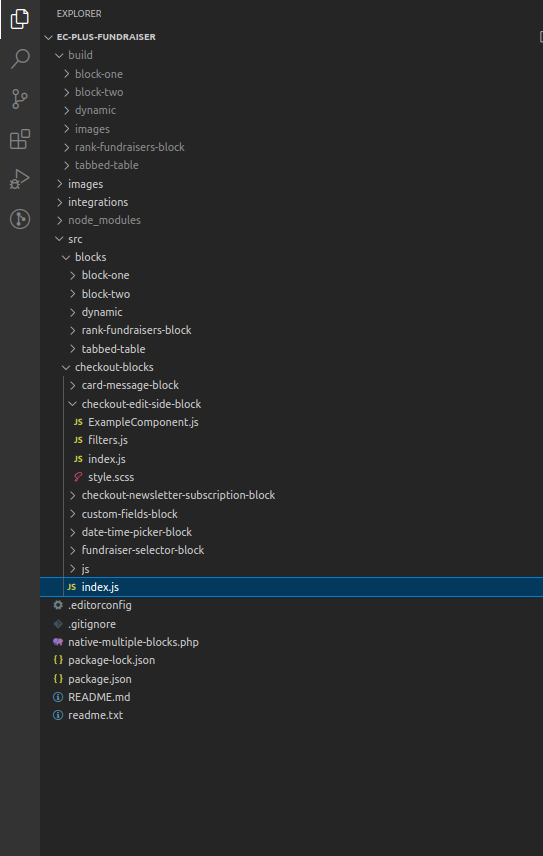

Alright, so how am I going to do this?

I need to do the hardest parts first.

I think I'll use GPLv3 but not put it on GitHub or just make sure all rights are reserved.

But the plan is to use GiveWP GitHub project and add the modifications I need and then redistribute it under my own banner.

I think I'm going to clone all of this into Gutenberg and then I'll better understand the functionality.

https://popup.doublegood.com/s/0cqs33g3

The page I'm going to clone is going to be /donate.

...

Okay, I would like to have a WordPress Gutenberg plugin which can add a template to a theme.

```
<?php
/*
Plugin Name: Gutenberg Template Plugin
Plugin URI: https://example.com/
Description: Add a custom template to a WordPress theme using Gutenberg
Version: 1.0
Author: Your Name
Author URI: https://example.com/
License: GPL2
*/

// Enqueue the necessary assets
function gutenberg_template_enqueue_assets() {
    wp_enqueue_script(
        'gutenberg-template-script',
        plugin_dir_url( __FILE__ ) . 'js/gutenberg-template.js',
        array( 'wp-blocks', 'wp-editor' ),
        filemtime( plugin_dir_path( __FILE__ ) . 'js/gutenberg-template.js' )
    );
    wp_enqueue_style(
        'gutenberg-template-style',
        plugin_dir_url( __FILE__ ) . 'css/gutenberg-template.css',
        array(),
        filemtime( plugin_dir_path( __FILE__ ) . 'css/gutenberg-template.css' )
    );
}
add_action( 'enqueue_block_editor_assets', 'gutenberg_template_enqueue_assets' );

// Register the new block
function gutenberg_template_register_block() {
    register_block_type( 'gutenberg-template/template-block', array(
        'editor_script' => 'gutenberg-template-script',
        'editor_style'  => 'gutenberg-template-style',
        'render_callback' => 'gutenberg_template_render_callback'
    ) );
}
add_action( 'init', 'gutenberg_template_register_block' );

// Define the template path and filename
function gutenberg_template_template_path() {
    return plugin_dir_path( __FILE__ ) . 'template/template.php';
}

// Add the template to the theme using the 'template_include' filter
function gutenberg_template_add_template( $template ) {
    if ( is_singular( 'post' ) && has_block( 'gutenberg-template/template-block' ) ) {
        $new_template = gutenberg_template_template_path();
        if ( '' != $new_template ) {
            return $new_template ;
        }
    }
    return $template;
}
add_filter( 'template_include', 'gutenberg_template_add_template' );

// Define the render callback function
function gutenberg_template_render_callback() {
    ob_start();
    include( gutenberg_template_template_path() );
    return ob_get_clean();
}
?>
```

...

I have to figure out patterns instead.

Patterns are accessible through the block insertor.

"

Okay so a pattern is just like where stuff goes in the components for which I'm instructing some of those need be built to reference the backend logic that I'm going to be building or rather the business backend logic.

"

...

This seems interesting for ascertaining file paths:

```
plugin_basename( dirname( __FILE__ ) ) . '/languages' 
```

Okay, so now that I got the outline showing I need to add the React components which will mimic the functionality of the site I am trying to clone.

...

I think I'm going to make a progress bar like just opinionated for what I want to do. And then after that, then I'm going to unopinionate it with the drop down with the many different sources to truth, which the API will be, which the progress bar will rely on for taking an information related to the progress bar.

I think the edit save dichotomy may be directly suited for writing content.

...

```
export default function Edit() {

// I could make my dummy component here which will then edit values of a backend php array or
// a get_script_data param which will then take info from php backend and present it to the frontend.
/*
* @see https://github.com/MonteLogic/slot-fill-test-repo/blob/master/src/js/index.js
* 
* On ec-refactor I wonder what issues I ran into to not use getSetting instead of the REST API I made.
```

ANswer

It is within a IInterface, also I don't know for sure if it would work on the frontend, to replace the API but I'm going to try.

Using get\_script\_data works but there's not a similarly named and similarly used method for setting data. So for EC the post may not extraneous but the GET was.

For the POST API, I may have been able to do something like this:

```
import { getScriptData } from '@wordpress/scripts';

const MyBlock = ( { attributes, setAttributes } ) => {
    // Retrieve the post ID of the current post from the block's attributes.
    const { postId } = attributes;

    // Retrieve the data passed from the server-side using getScriptData.
    const blockData = getScriptData( 'myGutenbergBlockData' );

    // Handle user interactions with the block.
    const handleClick = () => {
        // Update the post's metadata using the WordPress API.
        const updatedMeta = {
            myMetaKey: blockData.someValue,
        };
        wp.data.dispatch( 'core/editor' ).editPost( { meta: updatedMeta } );

        // Update the block's attributes to reflect the change.
        setAttributes( { metaValue: blockData.someValue } );
    };
    
    // ...
};
```

```
wp.data.dispatch( 'core/editor' ).editPost( { meta: updatedMeta } );
```

"

In this example, we're using the `editPost` action provided by the `core/editor` data store to update the metadata of the post associated with the block. We're dispatching this action with an object that contains the updated metadata (`updatedMeta`). After updating the metadata, we're using the `setAttributes` function to update the block's attributes to reflect the change.

Of course, the specific WordPress API you use will depend on what you're trying to accomplish. If you provide more information about the specific use case you're working on, I may be able to provide more guidance on the appropriate WordPress API to use.

"

Okay so in this codeblock:

```
	save: ({ attributes, className }) => {
		const { text } = attributes;
		return (
			<div className={className}>
				<h2>Extra Extra  </h2>
				<h3>Something Extra</h3>
				<h1>{text}</h1>
			</div>
		);
	}
```

You have to delete the block and re save it, and then there won't be an error. How else can I structure my code so I won't need to do this?

I'm going have to make a dynamic block or a [deprecation](https://developer.wordpress.org/news/2023/03/block-deprecation-a-tutorial/).

...

Static blocks seem to be a lot easier for using React on the frontend because with Dynamic blocks you have to enqueue the React.js assets and add it and all that stuff.

...

I think I just need to add [viewScript](https://developer.wordpress.org/block-editor/reference-guides/block-api/block-metadata/#view-script) and I'll be golden.

This part explain how to use React on the frontend.

[Video](https://youtu.be/iBAYVvdZD74?t=1636)

...

I'm having too many issues with some like trying to like make the CSS good for the whole entire thing so I'm just going to make progress bar, tab component and just make it by the component.

I made this repo, which is for multiple dynamic blocks:

...

What have to do is I have to calculate like how much space to already put on there and that's going to be like the maximum, like it's going to start up with the maximum business going, start with law flavors. I'm going to collections is more than it's going to be like negative more.

"So like so like all flavors is like 50m from like top to bottom and collections is like 30m from top to bottom and it's costed a 50 and go down from 35 because it is always going to default to all flavors. You'll be the first one. It's going to help with all that little skipping type of type of deal."

I may not need to do the above task, a place holder image for a product with no image may do.

...

In order to bring the images, I'm going to have to do a fetch and if the fetch isn't coming back then I'm going to have to use a placeholder image.

...

I couldn't figure out how to get the tabbed content to work while the image to the left of it does not move. So just re-design.

"  
Okay so I'll put an admin part in the admin for the page and I'm going to put a players or active people within the campaign then I'm put like a name for each one and then every single name's going to get an ID and then you'll see it in the back you'll see it once you check out you'll see people who referred you via the fundraiser and then you can like fill in their name like information and if you want to you can even like view their profile and then that's how I'm going to be able to do the first purchases and then once they get the first purchases I'll be able to manipulate the data on the front end of it..  
"

This page is going to be called fundraisers. With info for users/players who are actively in the fundraiser.

I made this coding paradigm for the editor part of the WP admin and I feel like it's really dope and I feel like I should/could get an award for it.

...

Okay, so this issue is that I need to load the state of the object first instead of constantly reloading it with default values.

This resets it:

```
<Button
variant="primary"
onClick={() => {
// This actually saves to the database
saveEntityRecord('root', 'site', {
// 'fundraisers-settings_data': settingsData,
'fundraisers-settings_data': newObject,
});
}}
>
```

newObject:

```
const newObject = {
"fundraisers": ['58', '59'],
"wordcount": 508,
"requiredFeaturedImage": true,
"requiredCategory": false
}
```

...

I am now trying to create a post creator which will create a new post for each fundraiser and then they will be able to customize their own page.

I know you can get pages/posts with the following:

```
wp.data.select( 'core' ).getEntityRecords( 'postType', 'page' )
```

This is how you do it:

https://developer.wordpress.org/block-editor/how-to-guides/data-basics/4-building-a-create-page-form/

```

function CreatePageForm( { onCancel, onSaveFinished } ) {
    const [title, setTitle] = useState();
    const { lastError, isSaving } = useSelect(
        ( select ) => ( {
            lastError: select( coreDataStore )
                .getLastEntitySaveError( 'postType', 'page' ),
            isSaving: select( coreDataStore )
                .isSavingEntityRecord( 'postType', 'page' ),
        } ),
        []
    );

    const { saveEntityRecord } = useDispatch( coreDataStore );
    const handleSave = async () => {
        const savedRecord = await saveEntityRecord(
            'postType',
            'page',
            { title, status: 'publish' }
        );
        if ( savedRecord ) {
            onSaveFinished();
        }
    };

    return (
        <PageForm
            title={ title }
            onChangeTitle={ setTitle }
            hasEdits={ !!title }
            onSave={ handleSave }
            lastError={ lastError }
            onCancel={ onCancel }
            isSaving={ isSaving }
        />
    );
}

function EditPageForm( { pageId, onCancel, onSaveFinished } ) {
    const { page, lastError, isSaving, hasEdits } = useSelect(
        ( select ) => ( {
            page: select( coreDataStore ).getEditedEntityRecord( 'postType', 'page', pageId ),
            lastError: select( coreDataStore ).getLastEntitySaveError( 'postType', 'page', pageId ),
            isSaving: select( coreDataStore ).isSavingEntityRecord( 'postType', 'page', pageId ),
            hasEdits: select( coreDataStore ).hasEditsForEntityRecord( 'postType', 'page', pageId ),
        } ),
        [pageId]
    );

    const { saveEditedEntityRecord, editEntityRecord } = useDispatch( coreDataStore );
    const handleSave = async () => {
        const savedRecord = await saveEditedEntityRecord( 'postType', 'page', pageId );
        if ( savedRecord ) {
            onSaveFinished();
        }
    };
    const handleChange = ( title ) => editEntityRecord( 'postType', 'page', page.id, { title } );

    return (
        <PageForm
            title={ page.title }
            onChangeTitle={ handleChange }
            hasEdits={ hasEdits }
            lastError={ lastError }
            isSaving={ isSaving }
            onCancel={ onCancel }
            onSave={ handleSave }
        />
    );
}

function PageForm( { title, onChangeTitle, hasEdits, lastError, isSaving, onCancel, onSave } ) {
    return (
        <div className="my-gutenberg-form">
            <TextControl
                label="Page title:"
                value={ title }
                onChange={ onChangeTitle }
            />
            { lastError ? (
                <div className="form-error">Error: { lastError.message }</div>
            ) : (
                false
            ) }
            <div className="form-buttons">
                <Button
                    onClick={ onSave }
                    variant="primary"
                    disabled={ !hasEdits || isSaving }
                >
                    { isSaving ? (
                        <>
                            <Spinner/>
                            Saving
                        </>
                    ) : 'Save' }
                </Button>
                <Button
                    onClick={ onCancel }
                    variant="tertiary"
                    disabled={ isSaving }
                >
                    Cancel
                </Button>
            </div>
        </div>
    );
}
```

I wonder if I can save attributes or other meta when I run saveEntityRecord.

...

I still need to link up the react component to an html page via a php partial.

Okay, so I have to integrate that page creator into a page where it's for each user who has a fundraiser and then have to add meta data to it for sorting and later on for the affiliate process and accounting for what fundraiser did what.

Eventually, when I'm bringing in Extended Checkout's functionality I want to app to be geared towards decisions and not options.

If you don't feel like messing around with all of those tutorials, use the finished product [here](https://github.com/WordPress/gutenberg-examples/tree/trunk/non-block-examples/09-code-data-basics-esnext).

I wasn't able to get the code to work directly out of the repo as a standalone plugin but I had good results just copying and pasting the whole [index.js](https://github.com/WordPress/gutenberg-examples/blob/trunk/non-block-examples/09-code-data-basics-esnext/index.js) file and using it in my project.

Now I want to add multiple data things and also, I only want pages of the players/fundraisers to show. So I have to use a special category or something.

Focusing on this:

```
.getEntityRecords( 'postType', 'page' ),
```

In order to discriminate against the pages coming in, I think I would use something like this:

```
function MyFirstApp() {
    const pages = useSelect(
        select =>
            select( coreDataStore ).getEntityRecords( 'postType', 'page', {
                meta_query: {
                    key: 'my_custom_field',
                    value: 'my_custom_field_value'
                }
            } ),
        []
    );
    return <PagesList pages={ pages }/>;
}
```

I would like to add custom fields when the page is created on the table app part.

Maybe do something like this:

```
const handleSave = async () => {
	const savedRecord = await saveEntityRecord( 'postType', 'page', {
		title,
		status: 'publish',
		// Add your custom fields here:
		customField1: 'customFieldValue1',
		customField2: 'customFieldValue2',
	} );
	if ( savedRecord ) {
		onSaveFinished();
	}
};
```

I think I wasn't properly linking it so I'm just going to make a CPT.

...

I just found out, my was issue was this:

```
add_action( 'admin_init', __NAMESPACE__ . '\fundraisers_settings' );
```

This code snippet should help with the saveEntityRecord challenge I'm having, [here](https://github.com/VitalkaLev/wp_mysimplygreen/blob/a303bca3c3d70485ec22500309bf1f06c1948818/wp-content/mu-plugins/gd-system-plugin/plugins/nextgen/assets/js/layout-selector/image-categories.js). ChatGPT is coming up short on this issue.

I just need to figure out the best way to post to [this API](https://developer.wordpress.org/rest-api/reference/pages/).

....

I can make new pages all have the same parent and then use that result to query quickly. Or use the slug and make the slug do something, but I don't think that would work. But the more I think about it, the more I think I could just iterate through it from what pages were published. I feel like pages aren't as plentiful as posts so I won't have to worry about performance hits.

...

I am going to make a component which you can't touch and then thats where I'm going to put Fundraiser ID and then in the search box for list of Fundraisers, 'Fundraiser ID:' will automatically be selected.

But, for now, I'll just write it in.

...

This is how you get all CPTs of a certain type, in this case, books:

```
fetch('https://yourdomain.com/wp-json/wp/v2/books')
```

I've yet to easily get the featured image of the post type mentioned about via API call.

...

My goal is to just get a drop down for the Fundraisers/CPTs on checkout page and on edit page.

...

"

So I have to get that drop down to show every custom post type for fundraiser and the id of post for the Fundraiser will be shown for selection.

Then I can just add that to post\_meta and then once the sale is done, I can find that sale in the DB and know it's attributed to the Fundraiser/CPT selected.

Also, I could have in the dashboard which sales are unaccouunted for.

Also, after project, I could have an affiliate based on if the first page visted was related to what CPT they landed on.

I just found out you can even view the player so I'm holding back on creating a player/fundraiser page until after the project is done.  
"

...

I feel like I shouldn't have to search hard to find the path related to this statement:

```
include dirname( __FILE__ ) . '/integrations/class-date-picker-integratio.php';
```

There should be a VS code extension that gives you can auto complete for it.

I need to make a VS Code extension that makes Gutenberg development easier, which have functionality in php and React. This plugin will make it so that there is only need for this plugin when you are developing with Gutenberg.

...

So I am loading it in the backend but I'm not adding onto it, currently the results are:

```
 
  1 -{"card-message":{"card-message":["kjlkjljkl"]},"custom-fields":{"custom-fields":[""]},"date-picker":{"date-picker":["2023-04-05T17:12:33.890Z"]},"fundraiser-selector":{"fundraiser-selector":[]}}
 
```

...

"Okay, now that I can select a post type, I need to add a 4th button, which says fundraisers and put that behind a paywall to upsell people."

...

Okay, now it saves. So I guess I have to rewrite to attribute certain people to sales, so I guess I have to make a meta box with data for which player had which sale.

Okay,

I have to add another meta box on the Fundraiser CPT to show the total this will also be available on the frontend via a getEntityRecord. I will use the getEntityRecord to create a GB block to show the top sales.

I'm going to rewrite this thing to use a setup without webpack.

I'm going to have one folder for checkout blocks and another folder for regular blocks you can drag and drop anywhere except for the checkout due the slot fill loading restrictions.

I'll also include the php part with admin CPT hopefully I'll have another class for fundraiser cpt to avoid clutter.

I actually already have it setup with that rw, and I was trying to do UI with it. Well I'm at it, I might as well throw some TypeScript in there.

So TypeScript with all of it together, TypeScript no touching webpack.config.

And if I have time I would like to have a template of the aforementioned style of project for future use.

It looks like adding TypeScript won't lead to a good dev experience, see [here](https://github.com/a8cteam51/build-processes-demo/pull/8).

Even using the 'native' version it still uses Webpack, I wonder if I this way can be hassle free enough to not have issues with Webpack again.

....

I am frustrated with how little some of these php checkers are checking for obvious errors.

...

So I'm getting multiple source points and I see a file like this:

```
import './js/index';
import './js/checkout-newsletter-subscription-block';
```

I wonder the exact effects of having this file be an entry point within a webpack.config file.

I'm looking at this script start:

```
"start": "wp-scripts start --webpack-src-dir=src/blocks --webpack-src-dir=src/blocks    --webpack-copy-php"
```

I could make another component that's just on the edit side which would be a block.

I've yet to fully test out the functionality of the checkout page but the file structure looks as such:



So I'm just going to try to get it to build and then once I get it to build then I'll worry about registering the correct slot fill for checkout-edit-side-block.

I couldn't get it to work where it's two folders without a webpack.config so I guess I have to rename the blocks to like checkout-block-name-of-block

I may rewrite the project to use gulp as it can do more than webpack include automatic a wide range of tasks.

I want to see how t3/t4 stack is made and inspire my stack of off said stack.

...

I feel like, if I can just get on import statement for that file, then it'll just load into a new folder in the build dir just how images was loaded in the build folder without a block.json

I could make a folder called assets and put the necessary checkout slot-fill logic in there.

...

It's only loading the block.json for the blocks.

...

So I guess I have to rewrite them from scratch from a new block to find out why webpack doesn't like the blocks imported from ec-refactor-2.

I think I could also get rid of the frontend.js file while I'm at it and just have that registerCheckoutBlock part be in the index.js file.

...

I think webpack aliases @woocommerce/blocks. See [here](https://github.com/woocommerce/woocommerce-blocks/blob/e089ae17043fa525e8397d605f0f470959f2ae95/bin/webpack-helpers.js#L16-L35)

...

The reason was because the block.json is imperative for the webpack configuration. You have to link to the index.js.

This 'native' webpack is something that gets the block.json first and then works on other things.

...

The reason I believe why I couldn't drag and drop blocks was due to the fact I didn't put a category or name into it like the dragable blocks had.

I just found out that if you have a plugin deactivated the JS files may still be loaded.

You code base will be rewritten at least a dozen times so write your code as such.

...

Maybe the first param of get-setting is related to the name of the integration which script\_data is in.

...

registerCheckoutBlock is cool for the frontend but not registerBlockType. I added a isEditor check to discriminate the showing of the two on frontend and admin side.

....

Trying to get the settings part of the plugin to work, this is how it loads on donate-pretz-admin-react:

```
"start:admin": "wp-scripts start src/admin/index.js --output-path=build/settings",
```

I need to rearrange the imported files to be idiomatic with the file structure pattern I created.

I wonder if I can add multiple files to a block.json so I can have it compiled. I also need to get good at compiling single 'standalone' files using the file structure I have denoted [here](https://montelogic.com/?p=3178).

Work on privelages, so that each fundraiser can make their own customized page. Ideally newly made fundraiser would be able to view their sales once they logged but only the total sale and the name of the person who gave them the sale.

- I would need to go into the checkout and only show the title and small image of the fundraiser.

- I would also have to go to the control panel area and have a field to turn on or turn of the fundraiser selection field
    - I REALLY need to make the api collection process and saving to local storage SUPER seamless.

- Add a list in the CPT of every user has access to the current page/CPT and their authorization level.

Make edit page more seamless.

I would really like to make the stack use TypeScript.

...

I think I'm over estimating the ability for a Fundriaser to edit their page.

I don't need to do that yet but whtat I do need to do is show them information about how much sales they have.

I'm not going to have custom functionality where fundraiser can edit their page, yet. It will just show their featured image along with how much sales they've got and maybe a graph showing what they've sold monthly etc. Once I got that I'll add a QR Code. After all of this, if there is still a need I will let the 'Fundraisers' customize their page.

I may just be able to provide a switch board for the Fundraisers which can toggle values which will then be heard by A GB component on their page and results are made based on the board switch on the fundraiser WooCommerce My Account page.

...

I guess I have add that drop down selector from the checkout and pair it with a user.

This will then be a database check for get\_post\_meta which will be on the jamalt/fundraisers page. The post\_meta, will be an array which will be the usernames which are granted privileges to view the sales info for a certain fundraiser.

It'll be called associated fundraiser. Fundraiser who can view the more in-depth data.

I could see it becoming confusing because there'll be two pages associated with each fundraiser, the user where a fundraiser will be at and the front facing page/cpt.

I wonder if there is a way to view what jamalt would see from an admin's point of view.

But really, I would like to use AJAX or a similar method to asynchornously add data to the db without loding the page, just a click of the button.

Gotta use this with a hidden input:

```
<input type="hidden" name="selected_user_id" id="selected-user-id" value="" />
```

Then this isset:

```
function save_associated_fundraisers( $post_id ) {
  if ( isset( $_POST['selected_user_id'] ) ) {
    $selected_user_id = sanitize_text_field( $_POST['selected_user_id'] );
    update_post_meta( $post_id, 'selected_user_id', $selected_user_id );
  }
}
add_action( 'save_post', 'save_associated_fundraisers' );
```

I'd rather have it so the values are added asynchronously.

...

I think I'm going to have to change [this page](http://donatepretz1.local/author/jamalt/) to redirect to the page I want to.

...

I am just going to make it so all fundraisers can view each other's fundraiser data.

...

So check if logged in user has a role of, Fundraiser then show, I guess. But that won't be in the meta box.

...

On the fundraiser settings page I'm going to have it still like there's like certain campaigns to like make 10K or something. And then I thought that would be the fundraiser settings page and then you can just like click on all the and then like I want to like Like like make a new page.

I feel like making you page and like the new page will automatically have the Gutenberg block loaded onto it. If there's no page. And if there is pages with EC+ fundraiser, logic on it, I want that to be shown on the fundraiser settings page.

...

Okay, I need to be focusing wp\_usermeta.

...

So I need to add another meta box which says the posts that this 'user' can access.

Therefore this box can only have one user/fundraiser with the username showing.

This box will show there capabilities. I think I might make the CPT saying Fundraiser Campaigns and make the fundraiser info be a custom page.

...

Just have to press save in the permalink area to have the links refresh and not have a 404 error.
