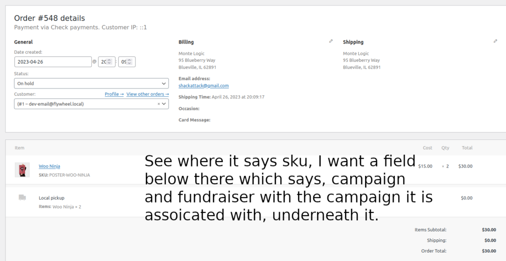
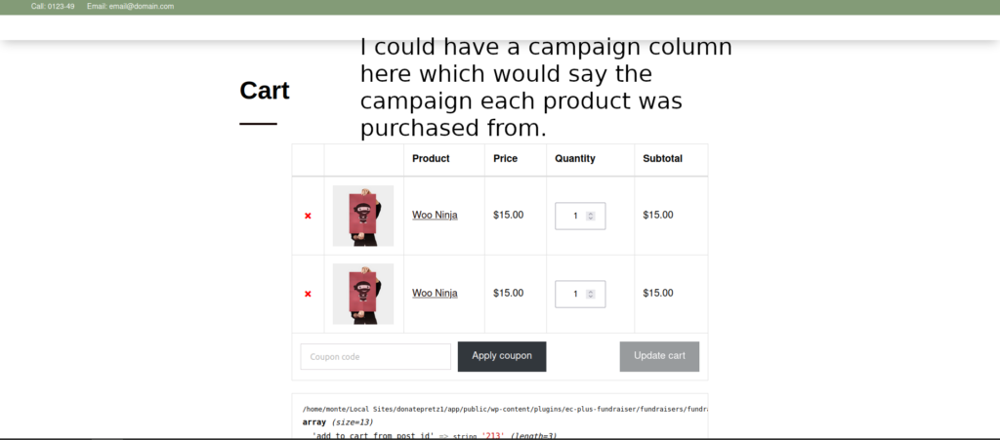

This is how you add custom meta data to a cart in WooCommerce using JavaScript(React).

The php:

```
function add_cart_item_data($cart_item_data, $product_id, $variation_id) {
    $post_id = isset($_POST['add_to_cart_from_post_id']) ? $_POST['add_to_cart_from_post_id'] : 0;
    if ($post_id) {
        $cart_item_data['add_to_cart_from_post_id'] = $post_id;
    }
    return $cart_item_data;
}
add_filter('woocommerce_add_cart_item_data',   __NAMESPACE__ . '\add_cart_item_data', 10, 3);


function check_cart_item_meta_data() {
    $cart_items = WC()->cart->get_cart();

    foreach ($cart_items as $cart_item_key => $cart_item) {
        $add_to_cart_from_post_id = $cart_item['add_to_cart_from_post_id'];
        if ($add_to_cart_from_post_id) {
            echo 'Meta data exists for the cart item.<br>';
            echo 'Add To Cart From Post ID: ' . $add_to_cart_from_post_id;
        } else {
            echo 'Meta data does not exist for the cart item.';
        }
    }
}
add_action('woocommerce_after_cart_table', 'check_cart_item_meta_data');


add_action( 'woocommerce_after_cart_table',   __NAMESPACE__ . '\check_cart_item_meta_data' );


```

The React:

```
export const FrontTabbedComponent = () => {
	const [isAddedToCart, setIsAddedToCart] = useState(false);

	const [selectedTab, setSelectedTab] = useState("allFlavors");
	if (isEditor) {
		return null;
	}


	const handleAddToCart = (productIDParam) => {
		const data = {
		  product_id: productIDParam,
		  quantity: 1,
		  add_to_cart_from_post_id: 213 // the post ID where the Add To Cart button was clicked.
		};

		const addToCartUrl = '/?add-to-cart=' + data.product_id + '&quantity=' + data.quantity;

		const formData = new URLSearchParams(data); // Convert data object to URL-encoded string

		fetch(addToCartUrl, {
		  method: 'POST',
		  headers: {
			'Content-Type': 'application/x-www-form-urlencoded',
		  },
		  body: formData.toString(), // Pass the URL-encoded string as the body
		}).then(() => {
		  // I don't think I'll need to do this:
		  // window.location.reload();
		});
	  };


	// alert(5);
	const handleTabClick = (tabName) => {
		setSelectedTab(tabName);
	};

	return (
		<div>
			<div className="tab-buttons">
				<button
					onClick={() => handleTabClick("allFlavors")}
					className={selectedTab === "allFlavors" ? "active" : ""}
				>
					All Flavors
				</button>
				<button
					onClick={() => handleTabClick("collections")}
					className={selectedTab === "collections" ? "active" : ""}
				>
					Collections
				</button>
			</div>
			{selectedTab === "allFlavors" && (
				<div className="product-list">
					{tabbedTableInfoAttrs.map((product) => (
						<div key={product.name} className="product-item">
							
							<div className="product-info">
								<h3>{product.name}</h3>
								<p>{product.price}</p>
							</div>
							{/* <button className="add-to-cart-btn" onClick={handleAddToCart(product.productID)}  >Add To Cart</button> */}
							<button
								onClick={() => handleAddToCart(product.productID) }
								className={'add-to-cart-btn'}
							>
								Add To Cart
							</button>


						</div>
					))}
				</div>
			)}
			{selectedTab === "collections" && (
				<div className="collection-list">
					{collections.map((collection) => (
						<a
							key={collection.name}
							href={collection.link}
							className="collection-item"
						>
							<h3>{collection.name}</h3>
						</a>
					))}
				</div>
			)}
		</div>
	);
};
```

Now we have to add it to the post meta so that we know what order the product has.

I am fascinated by this line:

```
$add_to_cart_from_post_id = $request['add_to_cart_from_post_id'];
```



I may use $order->update\_post\_meta, as seen [here](https://github.com/woocommerce/woocommerce/wiki/High-Performance-Order-Storage-Upgrade-Recipe-Book) but for now I'm just sticking to update\_post\_meta for now.



I'm thinking it would be a good idea to have what campaign it's in in select wp\_woocommerce\_order\_itemmeta.

Only add meta data to ones which already have the special meta data:

```
$order_id = 564; // Replace with the actual order ID
$meta_key = 'Color'; // Key for the metadata
$meta_value = 'Red'; // Value for the metadata

// Get the order object
$order = wc_get_order($order_id);

// Loop through order items to find the specific product
foreach ($order->get_items() as $item_id => $item) {
    // Get the product object for the order item
    $product = $item->get_product();

    // Check if the product is "Woo Ninja" and has the desired meta field and value
    if ($product && $product->get_name() === 'Woo Ninja' && $product->get_meta('add_to_cart_from_post_id') === '213') {
        // Add the metadata to the order item
        wc_add_order_item_meta($item_id, $meta_key, $meta_value);

    }
}
```

This adds it and shows it:

```

/**
 * Starting update via different method.
 */
function save_cart_item_meta_data( $item, $cart_item_key, $values, $order ) {
	$add_to_cart_from_post_id = $values['add_to_cart_from_post_id'];
	if ( $add_to_cart_from_post_id ) {
		error_log(
			PHP_EOL . 'Function will fire.',
			3,
			WP_CONTENT_DIR . '/debug-second.log'
		);
		$item->add_meta_data( 'Add To Cart From Post ID 5', $add_to_cart_from_post_id );
	}
}
add_action( 'woocommerce_checkout_create_order_line_item', 'save_cart_item_meta_data', 10, 4 );


function display_order_item_meta_data( $html, $meta, $item ) {
	if ( $meta->key === 'Add To Cart From Post ID' ) {
		$add_to_cart_from_post_id = $meta->value;
		$html                    .= '<p><strong>Add To Cart From Post ID:</strong> ' . $add_to_cart_from_post_id . '</p>';
	}
	return $html;
}
add_filter( 'woocommerce_order_item_display_meta_value', 'display_order_item_meta_data', 10, 3 );


```
