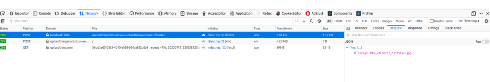

\[ \] 51cxt8 - Work on the UI for the scheduling.

\[ \] 852vsm - Quickbooks plugin to tie Trucking Buddy with Quickbooks.

\[ \] 95fs - I need to make dev url and prod url.

\[ \] 418fs - Backup, import and export receipt information ideally in a way which can be imported by Quickbooks.

\[ \] 25af4 - How do I add a table in Prisma without dropping the whole db?

\[ \] 1452ag - How do I import from a csv file into a Prisma table?

\[ \] 15gsbg - Backup from a .csv file.

\[ \] 14ags - Add breadcrumbs at the top of the screen.

\[ -\] 234asd- Switch to SQlite

\[ \] 516faw - Get Chase banking API linked as well as be able to link to smaller banks/credit unions.

\[ \] 526agt - Social logins

\[ \] 251agh - Okay, so for the timecard stuff, I want to have an employee time card and then a manager's time card.

\[ \] 159har - Delineate between which routes by using a dropdown on the modal. So Chandlerville would have a dropdown and in order to request a new route there should be a button which says asks for new route. Also if it's just Chandlerville it could just be Morning and Afternoon.

\[ \] 185ast- Make updates made to the server show up automatically rather than having to reload the page.

\[ \] 141aga - Type of purchase so for the db.

\[ \] 526agd - Show the latest receipts on the receipts page.

\[ \] 590shd - Switch to the app router of next.js on Next.js 13.

...

I forgot I needed to change all the links.

I should console.log out the whole object of relevant times for each employeeId.

I'm trying to reset the modal ticker to off and not have the state persist on tick on switches. I figured this out but it's a slow tick. This function is good for now so I'm just going to keep it moving.

...

Let's add a receipts menu item.

For the add receipt functionality, I need to make the routes an option so there can be a drop down list once an employee is selected. This same drop down is also applicable to vehicles.

Okay, so upload works fine but I need to figure out a way to compress it down if it exceeds the file size limit(8mb atm).

...

Working on uploadthing, I just need to figure out how to post to this:



This is the fetch I need to mock:

```
await fetch("http://localhost:3000/api/uploadthing?actionType=upload&slug=imageUploader", {
    "credentials": "include",
    "headers": {
        "User-Agent": "Mozilla/5.0 (X11; Ubuntu; Linux x86_64; rv:109.0) Gecko/20100101 Firefox/110.0",
        "Accept": "*/*",
        "Accept-Language": "en-US,en;q=0.5",
        "Content-Type": "text/plain;charset=UTF-8",
        "Sec-Fetch-Dest": "empty",
        "Sec-Fetch-Mode": "cors",
        "Sec-Fetch-Site": "same-origin"
    },
    "referrer": "http://localhost:3000/uploader",
    "body": "{\"files\":[\"receipt - PXL_20230713_235358525.jpg\"]}",
    "method": "POST",
    "mode": "cors"
});
```

This is the failed api fetch I am trying to contort to work:

I need to turn it into a Date object and then evaluate the Date object so I'm going to have to add a Date object field.

What I have to do is get a good console.log for the month and then put that in the button and it'll export time for "March" to File.

Then in that file it'll use march and whatever year it's in to know where it's at as far as what it needs to scaffold for the monthly views and then once it's scaffold, then go back again with values from WorkTime and paint them into the areas if they don't fit, produce an error.

Also, have a drop down to select what type a file, CSV, PDF or PNG.

Also, I need to change it from a string in the date column to a date object so I can get rid of that 'clever' code.

So I just go the value of the month and year figured out, so I can pipe it in good.

I want to add a setting page so I can backup the whole system to a file.

This would output to a JSON file and at the top it'll say what version the prisma is at to avoid conflicts.

...

I need to figure out how to have multiple instances of an app per contractor app.

So right now only my company can use it, I need to figure out how to build it so 10,000 companies can use it.

But for now I need to get the receipts part of it done so our company can use it.

Receipts page todo:

\[ \] I need to have more auto complete so it will be shown in the relevant areas and just the user's view of what the route should be when writing it there but the official name for the route. This process should be repeated for all inputs.

\[ \] Change string of date to calendar.

\[ \] In the page which you can view the receipts, it's important that each month is delineated.

\[ \] Add analytics for the receipts but that could be on an analytics page where you can view all purcahses via receipts.

Employees area todo:

\[ \] I would like to have submenu so you can just click it or hover the employees area and it'll say Schedule, Timecard and Receipts under employee.
