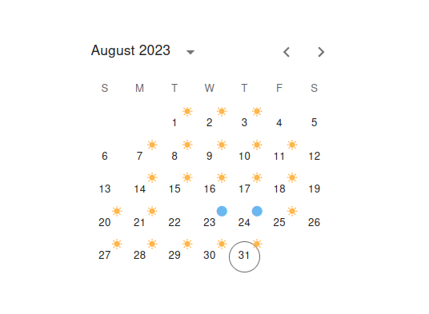
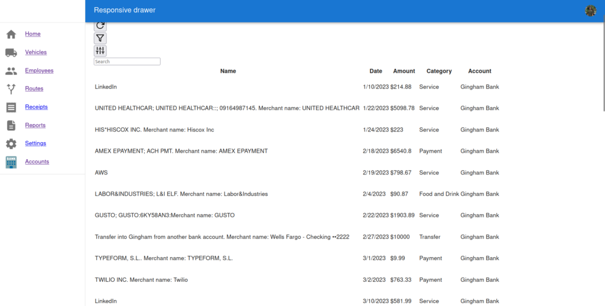

\[x\] 51cxt8 - Work on the UI for the scheduling.

\[ \] 852vsm - Quickbooks plugin to tie Trucking Buddy with Quickbooks.

- Import transactions from a CSV file to Planetscale DB, [work notes](https://montelogic.com/?p=4325).

\[ \] 95fs - I need to make dev url and prod url.

\[ \] 418fs - Backup, import and export receipt information ideally in a way which can be imported by Quickbooks.

\[ - \] 15gsbg - Backup from a .csv or JSON file.

\[ \] 14ags - Add breadcrumbs at the top of the screen.

\[ -\] 234asd- Figure out a good solution for no connectivity coding.

\[ \] 516faw - Get Chase banking API linked as well as be able to link to smaller banks/credit unions.

\[ \] 526agt - Social logins

\[ \] 251agh - Okay, so for the timecard stuff, I want to have an employee time card and then a manager's time card.

\[ - \] 159har - Delineate between which routes by using a dropdown on the modal. So Chandlerville would have a dropdown and in order to request a new route there should be a button which says asks for new route. Also if it's just Chandlerville it could just be Morning and Afternoon.

\[ \] 185ast- Make updates made to the server show up automatically rather than having to reload the page.

\[ \] 141aga - Type of purchase so for the db.

\[ X\] 526agd - Show the latest receipts on the receipts page.

\[X \] 590shd - Switch to the app router of next.js on Next.js 13.

\[ \] 415ayg - Get 10 daily users of Contractor Buddy.

\[ \] In the page which you can view the receipts, it's important that each month is delineated.

\[ \] Add analytics for the receipts but that could be on an analytics page where you can view all purchases via receipts.

Employees area todo:

\[ \] I would like to have submenu on the DrawerMenu so you can just click it or hover the employees area and it'll say Schedule, Timecard and Receipts under employee.

...

I am going to try the card route.

...

Cont Bud

Is a way to tell if the money being sent is spent on what it was supposed to be  
spent on.

...

I am working on getting account information from Chase.

OfX(?) Quicken uses OFX.

https://pypi.org/project/ofxtools/

https://www.ofxhome.com/

Also, [developer.chase](https://developer.chase.com/).

toDo:

\[ \] Bulk upload so so dozens of files can be uploaded at the same time

\[ \] Also have to make sure the uploads account for naming conflicts. So no duplicates.

\[ \] Reduce image load time for viewing images on CB.

\[ \] Cards:

```
A business I am working with has a tough time with like, cards. So I might be able to like, look around for like banks like cards and they try to strike a deal so they can supply cards for CB and it'll say Contractor Buddy on them. Then I can import the data from there on a relevant user's dashboard.

```

\[ \] For banking information which is imported, I'm going to need to encrypt that banking info so only they can see it.

....

Figuring out how to upload multiple files:

So, I'm going to have two buttons one for single uploads and one for multiple uploads.

[Here](https://montelogic.com/?p=4187)

I guess the most closest thing this would be is like a private discord server or a Slack channel with restricted access or maybe a Telegram group chat with again restricted access.

I will make it so that once a user is invited then they can be admins they must be invited first you can't make someone an admin from the first invite.

I am planning on doing this as well as having a form for one receipt vs. multiple receipts.

But what I would like is to figure out clerk so that way I'm closer to a MVP.

I got clerk working on my project which uses both app dir and pages dir. The way to have it so clerk works on both is to wrap the heart component of both the pages and dir file in a clerk provider.

Plaid API works with mixed success but now I'm focused on Timecards.

I need a Timecards link on my menu page.

It also may be a good idea to start segmenting between the Employee UI and Owner  
UI.

Getting this error now:

```
PrismaClientValidationError: 
Invalid `prisma.workTime.findFirst()` invocation:

{
  where: {
    employeeId: 'clkoudsi70001l808iezfybdu',
    Date: '2023-08-25'
          ~~~~~~~~~~~~
  }
}

Argument Date: Got invalid value '2023-08-25' on prisma.findFirstWorkTime. Provided String, expected DateTimeFilter or DateTime:
type DateTimeFilter {
  equals?: DateTime
  in?: List<DateTime> | DateTime
  notIn?: List<DateTime> | DateTime
  lt?: DateTime
  lte?: DateTime
  gt?: DateTime
  gte?: DateTime
  not?: DateTime | NestedDateTimeFilter
}
type DateTimeFilter {
  equals?: DateTime
  in?: List<DateTime> | DateTime
  notIn?: List<DateTime> | DateTime
  lt?: DateTime
  lte?: DateTime
  gt?: DateTime
  gte?: DateTime
  not?: DateTime | NestedDateTimeFilter
}


    at Li.validate (/home/monte/Downloads/contractor-trucking-app-rewrite/node_modules/@prisma/client/runtime/library.js:147:73)
    at dn.createMessage (/home/monte/Downloads/contractor-trucking-app-rewrite/node_modules/@prisma/client/runtime/library.js:164:1298)
    at /home/monte/Downloads/contractor-trucking-app-rewrite/node_modules/@prisma/client/runtime/library.js:177:10818
    at Object.runInChildSpan (/home/monte/Downloads/contractor-trucking-app-rewrite/node_modules/@prisma/client/runtime/library.js:174:1343)
    at t._executeRequest (/home/monte/Downloads/contractor-trucking-app-rewrite/node_modules/@prisma/client/runtime/library.js:177:10795)
    at async handler (webpack-internal:///(api)/./src/pages/api/work-time.ts:17:34) {
  clientVersion: '4.15.0'
```

I had to change my code block to look like this:

```
  // What is req.body?
  try {
    const { employeeId, date, morning, midday, afternoon, employeeName } =
      req.body;
    const parsedDate = new Date(date);

    const existingWorkTime = await prisma.workTime.findFirst({
      where: {
        employeeId,

        Date: { equals: parsedDate },

        // Date: parsedDate }, // Check if the record already exists
      }
    });

    if (existingWorkTime) {
      const updatedWorkTime = await prisma.workTime.update({
        where: { id: existingWorkTime.id },
        data: {
          Morning: morning,
          Midday: midday,
          Afternoon: afternoon,
        },
      });

      res.status(200).json(updatedWorkTime);
    }

    if (!existingWorkTime) {
      const timeInput: Prisma.WorkTimeCreateInput = {
        employeeId: employeeId as string,
        employeeName: employeeName as string,
        Date: parsedDate,
        Morning: morning as boolean,
        Midday: midday as boolean,
        Afternoon: afternoon as boolean,
      };
```

These days are MESSING UP, Saturday and Sunday aren't acting right!

I'm going to look at this [repo](https://github.com/t3dotgg/imgmanager/tree/main) to try to figure out dates and in particular, this [file](https://github.com/t3dotgg/imgmanager/blob/main/src/app/_components/full-page-dropzone.tsx).

This code block is interesting:

```
import dayjs from "dayjs";
import relativeTime from "dayjs/plugin/relativeTime";
import isToday from "dayjs/plugin/isToday";
import isYesterday from "dayjs/plugin/isYesterday";
import { groupImagesByDate } from "@/utils/group-images";

dayjs.extend(relativeTime);
dayjs.extend(isToday);
dayjs.extend(isYesterday);

const genTimestamp = (timestamp: string) => {
  const time = dayjs(timestamp);
  if (time.isToday()) return "Today";
  if (time.isYesterday()) return "Yesterday";
  return time.toDate().toLocaleDateString();
};

const ImageGrid: React.FC<{ children: React.ReactNode }> = (props) => (
  <div className="grid h-full grid-cols-fluid justify-items-center">
    {props.children}
  </div>
);
```

The WA creates duplicate records.

There are multiple records of this value within the Date column of the WorkTime table:

```
2023-08-20T00:00:00.000Z
```

So I guess, it's reading falsely from Monday.

It looks like it's all shifted to the right one.

It's these two functions which are skewing the WA:

```
    const isMorningWorked = workTimeForEmployee.some(
      (workTime) => dayjs(workTime.Date).format('YYYY-MM-DD') === day.format('YYYY-MM-DD') && workTime.Morning
    );

    const isAfternoonWorked = workTimeForEmployee.some(
      (workTime) => dayjs(workTime.Date).format('YYYY-MM-DD') === day.format('YYYY-MM-DD') && workTime.Afternoon
    );
```

The badge:

```
        <Badge
          key={day.toString()}
          overlap="circular"
          badgeContent={badgeContent}
          style={{ visibility: 'visible' }}
        >
```

console.log(8, day.toString());

outputs:

8 Mon, 21 Aug 2023 05:00:00 GMT

...

The prior calendar:



But now I've changed the date to go 5 hours ahead. Now it seems to be working.

Side note: for the MoL block, I would like to have the toDos viewable on the side so I don't have to scroll up.

I basically gotta learn more about categorization.

So I'm going to make another article on [categorizing data in Plaid API](https://montelogic.com/?p=4460).

But at the same time I need to switch the UI to the regular UI.

[YT playlist](https://www.youtube.com/playlist?list=PL6dZTR-Ez9JCrXmUwwxV-RKmUCiIlVrKa) with Categorization in it.

Okay, so I Switched it to use the Drawer so now I have to make 'modals' for each one of the transaction for changing the category and other pertinnet information.

I'm still going to focus on Categories because you can filter categories on import which will save users TONS of time.

These modals will be for,

When a transaction is made like a CashApp send or ATM with draw and money is sent the Employee should be sent a link to tell them to link that CashApp or money that they got to the transaction in the account.

"

Now, I need to hmm. Now, I need to like, um, take all those transaction data for a month because I know there's like 250 transaction limit and then put that into a configuration object, and then try do something with it. And then I'm just working on modal logic for it and then try to link it to image receipt.

Then also trying to make that like a profit and loss statement for it. And then I might want to like compare with the profit and lost statement would be on the Quicken one compared to what it would automatically be on import for accuracy.

"

Make a function which writes to a JSON file with the format of the config object.

I need to figure out how to add money as well as subtract it from the account via transactions.

...

Note, the money is positive for money going out of account and negative for money going in. This is intutive for credit cards but can be confusing for checking accounts.

Reports page is empty but accounts page works for some reason.

Alright, so the categories are just in the database.

..

It needs to be in such format within the description area of transactions

```
      "description": "AMEX EPAYMENT; ACH PMT. Merchant name: AMEX EPAYMENT",
```

So, I guess Plaid will parse each value by the semi colon separation.

...

What if I have another column which says view receipt

Also, the table looks like dog doo doo on mobile. I think I'm going to have to switch it to a list based view on mobile or just do the whole thing list view because it's mobile first.

...

Insights on unique identifier with Plaid, [here](https://stackoverflow.com/questions/67719106/is-there-a-unique-identifier-for-merchants-in-plaid-transactions).

...

What if I have another column which says view receipt

Also, the table looks like dog doo doo on mobile. I think I'm going to have to switch it to a list based view on mobile or just do the whole thing list view because it's mobile first.

~  
~

It's not showing money negative or positive when it's supposed to it just shows money being a added when some of it should be subtracted.



For this, I have to make the withdraws be red and have a '-' next to them showing they took money OUT of the account.

Focusing on turning this Green to show it's an addition:

```
Transfer into Gingham from another bank account. Merchant name: Wells Fargo - Checking ••2222	2/27/2023	

$10000
	Transfer	Gingham Bank
```

The functions described [here](https://github.com/vedkale/zest/blob/main/app/transactions/page.tsx) are too simple to make green and red as well as adding or not adding dashes OR the color aren't loading.

I want a modal to popup on every transaction once the title is clicked. This modal is where you will be able to tie a receipt image to a transaction.

I guess I have to bring in useState via a component and bring it in that way. Like the useState in,

import SearchBar from '@/components/SearchBar';

Okay so I added the modal but it's not taking in data yet.

What I would like to do is make it more mobile friendly like this [sandbox](https://qmrc3v.csb.app/) from this [source code](https://codesandbox.io/s/unruffled-dream-qmrc3v?file=/Demo.tsx).

...

Okay the data is taking in but what I have to do is making mobile friendly.

Also, what I would like to do is get back to working on tracking gas levels in the vehicles.

Focusing on gas inventory,

I would like to have one table called vehicles.

...

I need to add the schema prisma for vehicles.

I would like to highlight the menu item which is being selected.

This doesn't work with app router but with page router:

```
import { useSearchParams } from 'next/navigation';
```

The zest one has active links.

I had to rewrite the API/Vehicles endpoint but I want to use the app api rather than pages so I can remove a lot Next.js's crufty code.
