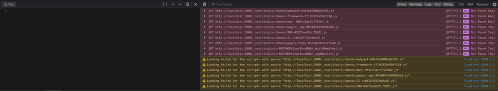
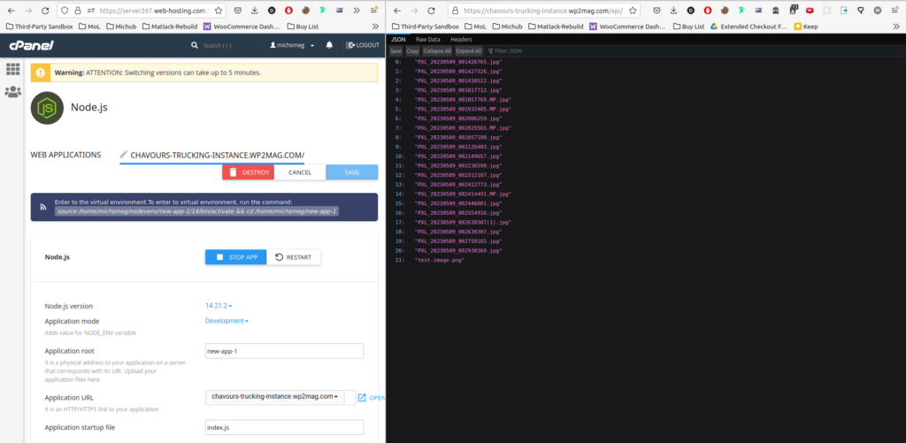
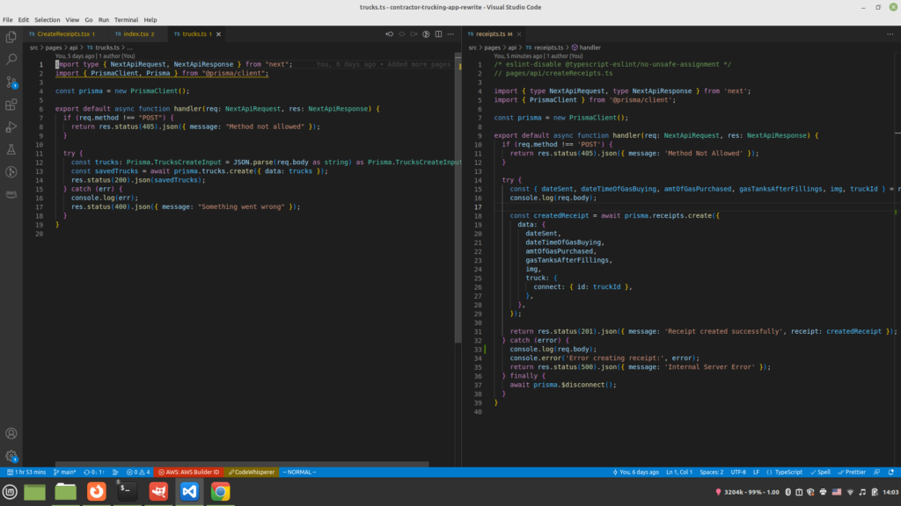
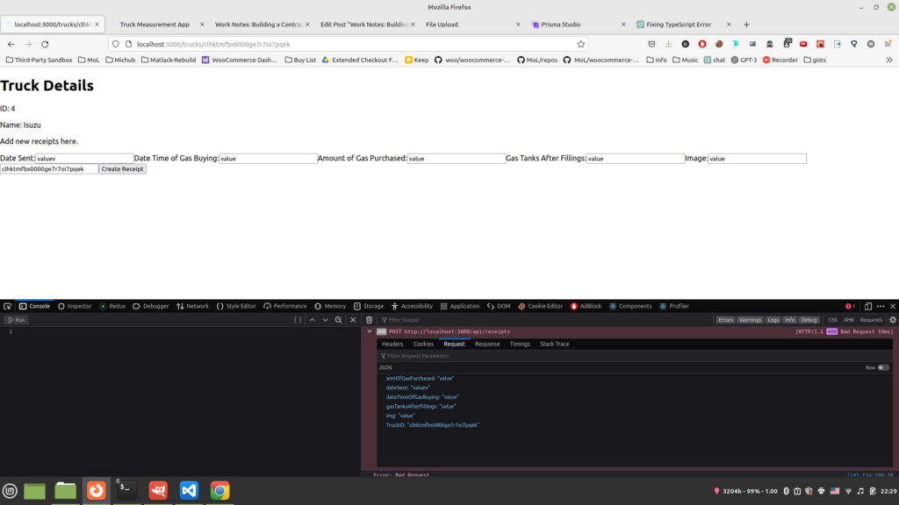

In the next.js docs they talk about using a discord provider to use off. But I don't really like discard at all so I'm going to try to do the same thing with Telegram.

https://github.com/nextauthjs/next-auth/issues/2406

So right now, in t3 stack, adding data to databases is what I'm working on.

....

That would be cool if I could figure out how to use WordPress for a headless solution for this trucking product.  
\- This wouldn't suit the needs of the project.

...

I think I'm going to do what Theo is doing with his cheap db stuff and then eventually navigate away from SQLite into MySQL. Or MySQL is already being used in the stack.

That's cool and all the t3 example but I think I'm just going to do it 'my way' and every now and then checkup on t3 examples.

So apparently I have to do a Singleton pattern for Prisma.https://odysee.com/@montelogic:b/simplescreenrecorder-2023-05-08\_15.29.55:9

After this is setup, the goal would be to edit the values via SMS message.

Summary vid:  
https://odysee.com/@montelogic:b/simplescreenrecorder-2023-05-08\_15.29.55:9

...

So I have to make an express server ( I would like to use .ts) which can handle the providing of information as well as being able to add new images.

This manager will work for me in the form of the hosted folder of all the images on my site.

Got the api with, 'https://chavours-trucking-instance.wp2mag.com/api/'.

So apparently I have to use [Twilio](https://www.twilio.com/docs/sms/send-messages) for SMS messaging.

....

So I want to setup everything on a vps or Cpanel server.

So I am reading [this](https://github.com/prisma/prisma/discussions/3163).

I made first-prima-app on cPanel so now I need to figure out how to get prisma working there.

I gotta test out this api to upload and keep in mind there will be a cors error but the image should still upload.

Okay, so SMS messages take too long to register via the A2P campaign, also, I don't want to make Facebook chat bot, so I'll be trying to do alerts via push notifications and uploading images via a web browser.

Once my A2P campaign is approved, then I will go back to using SMS.

I am also interested in making a Telegram bot which would use a similar system as the SMS.

...

So, I'm gonna like, I'm gonna be, like, like is an array, I'm getting ready of like, I'm trying to, like get the folder name, and then I'm gonna get request and that's gonna be an array of all, like, did like this stuff and for each one, I'm gonna loop through, and then that'll be image.

And then the prepended, like string would be the slash above

...

And apparently you can just keep adding. '../' and you can go up a directory even outside of the node.js app.

So, I'm going to use an Express server for the image hosting and then bring in those Express hosted images onto the Next.js app.

SO on https://chavours-trucking-instance.wp2mag.com/api/

I get all the names of the files and then loop through them showing all files.

Then once I got that done, I'll work on the upload stuff, using the Next.js app and Twilio.

....

Uploading images using Multer. I will be uploading images via express which will be using Multer middleware.

...

So I got the part of uploading images without express just Next.js done, now let's work on uploading images via SMS.

This article is useful for deploying to VPS.

https://github.com/vercel/next.js/discussions/14339

So I'm going to need to use the node\_modules folder.

So import the project, run npm install, then npm run build, then npm start.

I guess I still NEED to add the static folder.

I don't think I need to add the public folder but it is certainly worth looking into.



To what I have to do is I kind of make a hid list thing because my I need to make

I need. Okay, so well first of all I knew like test with the incoming things going to be so just be like text message in a little bit like an image. And then once I get that like the answer for that, I'm gonna like have it be waiting on like there.

So it's like wait for like one of the files, then it's kind of like separate it. So it's gonna like, it's gonna like separate like messages and like put that in the database. And this guy split off the image and the image is gonna go to the headless WordPress solution.

Okay, so I got twilio to work now, I need to figure out how to send images and how to save messages and images sent from sms.

Figure out how to receive images, see [here](https://www.twilio.com/docs/sms/tutorials/how-to-receive-and-download-images-incoming-mms-node).

I would certainly like to use headless WordPress but I'm in a rush to get it done so I think I'm going to use S3 instead.

I'm just going to use an Express

This is what I have so far on my git, I need to reconfigure it so I can post to it and save to the images folder which would be on the root of the folder.

https://github.com/MonteLogic/NodeJS-File-Hosting

It's finicky but you have to have the url clear and then put api. I guess you just can't start at /api.

See,



So now I need to figure out again how to make a fetch request so I can post to this end point with image data.

Here's a start:

```

fetch(imageUrl)
  .then(response => response.blob())
  .then(blob => {
    var formData = new FormData();
    formData.append('password', password);
    formData.append('file', blob, 'default-image.png');

    return fetch(url, {
      method: 'POST',
      body: formData,
    });
  })
  .then(response => response.text())
  .then(data => {
    console.log('Response:', data);
  })
  .catch(error => {
    console.error('Error:', error);
  });
```

Okay, so what I have to do is like that HTML form. I need to turn that into like, um, it could post requests for the next JS server and then like any like separate engine body did send that image body off. You know, I'd be a post request to the server and then save that stuff exceed it and then say like the text to a save the text to the database.

Then after that, I want to look at image recognition to turn that stuff into like like um like any work on the same that stuff like as some but I need to like man I need to look at it in a certain way to like even have text ads the database.

So like I'm that biggest, it'll be like the receipts model like the prison database

So that if there seats model case, so like that. Yeah, like I like send it off to proceeds model because if just the images And won't really be any text or just being an image, but I still need to say that image often to the express server.

...

I feel like it would be easier if I just used express for MMS and do the image calculation there and then send the data to an endpoint on the contractor app.

SO the backend is still express.

I'm not against taking factoring out Express in the future but for convenience it's easier to keep express.

This [repo](https://github.com/ismaelc/TwilioConcurMMS/blob/master/index.js) is useful.

...

Looking at where the express images are going, they are actually going in the public/images folder on the cPanel server.

...

So apparently all of the media images are within an array and you need to loop through them to access them.

...

This is the [image](https://s3-external-1.amazonaws.com/media.twiliocdn.com/AC3fc484454e6a7fb3735615c5b7ebf1a0/fb7433e4a359e9250f1ac50ebc26d3aa) I sent, so I guess I have to take that url and have it be copied on my express server, or I could just save the url of the image into a database. (So Twilio is hosting the images. So for a premium feature, I could do backups of the images, which would make use of the Express server.

...

I'm adding another Prisma schema for Receipts and I'm just going to save the url of Twilio hosted image.

Okay, so I have to link each truck to receipts. And I have to use the \[id\].tsx page.

Looks like I have to do the one to one relationship, show [here](https://www.youtube.com/watch?v=fpBYj55-zd8).

Apparently you can get it here with c.id:

```
          {contacts.map((c, i) => (
            <div className="mb-3" key={c.id}>
              <Link href={`/trucks/${c.id}`} as={`/trucks/${c.id}`}>
                <ContactCard trucks={c} />
              </Link>
        </div>
     ))}
```

...

I am getting a 200 error when I'm trying post receipt info, don't know quite why yet.

The fetch I am trying to call to api/receipts but this is the one which works for api/trucks.

```
await fetch("http://localhost:3000/api/trucks", {
    "credentials": "include",
    "headers": {
        "User-Agent": "Mozilla/5.0 (X11; Linux x86_64; rv:104.0) Gecko/20100101 Firefox/104.0",
        "Accept": "*/*",
        "Accept-Language": "en-US,en;q=0.5",
        "Content-Type": "text/plain;charset=UTF-8",
        "Sec-Fetch-Dest": "empty",
        "Sec-Fetch-Mode": "cors",
        "Sec-Fetch-Site": "same-origin",
        "Pragma": "no-cache",
        "Cache-Control": "no-cache"
    },
    "referrer": "http://localhost:3000/",
    "body": "{\"truckMake\":\"Isuzu\",\"truckNumber\":\"151\",\"amtOfGas\":\"0.5\",\"img\":\"https://wp2mag.com/wp-content/uploads/2023/05/b6902d7582c52b85e20fce7fabe3457c-150x150.jpg\"}",
    "method": "POST",
    "mode": "cors"
});
```

...

Testing api endpoints in Next.js

If all the fields aren't good, then it'll be a 400 error, I guess if it's not setup at all then there will be a 500 error.

I still want to buy another phone number which will be a test number and then configure my next.js app to use an external domain using ngrok.

...

I think I over engineered receipts.ts



...

My 500 error is a 400 error, so I guess I need to send each value in which is required.

...

This is what it looks like now:



...

The error I am getting is:

"

PrismaClientValidationError:  
Invalid `prisma.receipts.create()` invocation:

{  
data: {  
TruckID: 'clhktmfbx0000ge7r7oi7pqek',  
~~~  
dateSent: 'valuev',  
dateTimeOfGasBuying: 'value',  
amtOfGasPurchased: 'value',  
gasTanksAfterFillings: 'value',  
img: 'value'  
}  
}

Unknown arg `TruckID` in data.TruckID for type ReceiptsCreateInput. Did you mean `truck`? Available args:  
type ReceiptsCreateInput {  
id?: String  
dateSent: String  
dateTimeOfGasBuying: String  
amtOfGasPurchased: String  
gasTanksAfterFillings: String  
img?: String  
truck?: TrucksCreateNestedOneWithoutReceiptsInput  
}

at Ai.validate (/home/monte/Downloads/contractor-trucking-app-rewrite/node\_modules/@prisma/client/runtime/library.js:144:73)  
at un.createMessage (/home/monte/Downloads/contractor-trucking-app-rewrite/node\_modules/@prisma/client/runtime/library.js:161:1298)  
at /home/monte/Downloads/contractor-trucking-app-rewrite/node\_modules/@prisma/client/runtime/library.js:174:10818  
at Object.runInChildSpan (/home/monte/Downloads/contractor-trucking-app-rewrite/node\_modules/@prisma/client/runtime/library.js:171:1343)  
at t.\_executeRequest (/home/monte/Downloads/contractor-trucking-app-rewrite/node\_modules/@prisma/client/runtime/library.js:174:10795)  
at async handler (webpack-internal:///(api)/./src/pages/api/receipts.ts:50:31) {

clientVersion: '4.14.1'

"

Where is the good request?

If you get a 400 error just look in the node terminal and the errors there will tell you where it's messed up.

...

It looks like I have the majority of the business logic for the receipt tracking.

I would also like to get the time card logic stuff done before the end of the month.

I would like a Trucks page or a vehicles page, which is on a menu.

I would also like an employees page where employees can record their hours.

I am trying to make a menu on the side. This [codesandbox](https://codesandbox.io/s/xeiqp) is good for this purpose.

So look at that console.log which is in the req.body and make a function which is going to hover up all of that data into the IncomingTexts table.

I need to screenshot that req.body and put it here.

This is the current error message I am getting:

```
[Object: null prototype] {
  ToCountry: 'US',
  ToState: 'IL',
  SmsMessageSid: 'SM165c111f2a1c3960255855aa3f8af19d',
  NumMedia: '0',
  ToCity: 'SPRINGFIELD',
  FromZip: '62707',
  SmsSid: 'SM165c111f2a1c3960255855aa3f8af19d',
  FromState: 'IL',
  SmsStatus: 'received',
  FromCity: 'SPRINGFIELD',
  Body: 'Hi',
  FromCountry: 'US',
  To: '+12179608924',
  ToZip: '62703',
  NumSegments: '1',
  MessageSid: 'SM165c111f2a1c3960255855aa3f8af19d',
  AccountSid: 'AC3fc484454e6a7fb3735615c5b7ebf1a0',
  From: '+12177208715',
  ApiVersion: '2010-04-01'
}
Received message from: +12177208715
Message body: Hi
Media URL: undefined
TypeError: Cannot convert object to primitive value
    at JSON.parse (<anonymous>)
    at handler (/var/task/.next/server/pages/api/receive-texts.js:67:35)
    at /var/task/node_modules/next/dist/server/api-utils/node.js:463:16
    at /var/task/node_modules/next/dist/server/lib/trace/tracer.js:113:36
    at NoopContextManager.with (/var/task/node_modules/next/dist/compiled/@opentelemetry/api/index.js:1:7057)
    at ContextAPI.with (/var/task/node_modules/next/dist/compiled/@opentelemetry/api/index.js:1:516)
    at NoopTracer.startActiveSpan (/var/task/node_modules/next/dist/compiled/@opentelemetry/api/index.js:1:18086)
    at ProxyTracer.startActiveSpan (/var/task/node_modules/next/dist/compiled/@opentelemetry/api/index.js:1:18847)
    at /var/task/node_modules/next/dist/server/lib/trace/tracer.js:102:107
    at NoopContextManager.with (/var/task/node_modules/next/dist/compiled/@opentelemetry/api/index.js:1:7057)
```

I need to setup ngrok, buy another phone number, so I can test it out locally.

If there is a message there is no reply but if there isn't a media message there is a reply.

I need to get my calendar working, looking at this [codesandbox](https://codesandbox.io/s/react-typescript-fullcalendar-example-calendar-03-4hw1t?file=/src/App.tsx).

I like the way this [calendar](https://codesandbox.io/s/simple-react-calendar-r1h3b?file=/src/calendar.tsx:1996-2001) works and look. Below this calendar, I could have Morning, Mid-day, Afternoon. The problem is I can't go into the past, only forward.

This [calendar](https://codesandbox.io/s/j87dq) is able to look in the past.

I'm just going to use MUI so it's mobile-friendly rather than building from "scratch". I will be using this [codesandbox](https://mui.com/x/react-date-pickers/date-calendar/) for the task.

I can use this [codesandbox](https://codesandbox.io/s/0gjd8b?file=/demo.tsx) to mark to show which days have been worked.

So I added the calendar to the app, now I have to be able to get the value which is being selected and show that in relation to the time or day which has been worked on.

I need to change the prod domain to be different so it doesn't update on every branch push.

I need to change [this](https://github.com/MonteLogic/contractor-trucking-app-rewrite/commit/d02d1f28bed56a3759b05688e08805e744f937aa) to prod and keep moving it.

...

So, I have to clone locally the dev branch and then work on it so I don't get failing deployments.

I also have to tie a domain to it viz. the dev branch.

I can't send a reply back for some reason.

"

Failed to send automated response: RestException \[Error\]: Authenticate  
at success (/home/monte/Downloads/dev-branch/contractor-trucking-app-rewrite/node\_modules/twilio/lib/base/Version.js:79:23)  
at process.processTicksAndRejections (node:internal/process/task\_queues:95:5) {  
status: 401,  
code: 20003,  
moreInfo: 'https://www.twilio.com/docs/errors/20003',  
details: undefined  
}

"

This commit is sending an automated message but I changed the accountsid and token to be hard coded values rather than using it as an environment variable.

ChatGPT response on this topic, [here](https://gist.github.com/MonteLogic/e7ec964dc4e33177031beb93168fd2a2).

I ran out of credits and I can't get anymore so I need to simulate the pipeline. So I'll test it with Telegram and Wi-Fi and I'll use image recognition so that when I do have Twilio working, it'll work fine.

So, I need to get the Telegram API to work.

Maybe, it was the best idea to use Telegram from the job.

I could also work on stuff like the scheduling page.

Continued in [Part 2](https://montelogic.com/?p=3758).
