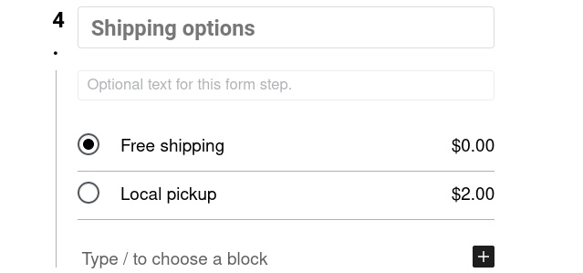
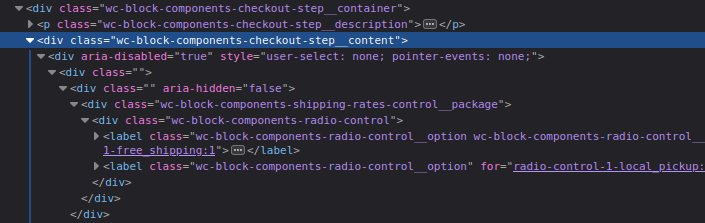
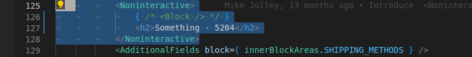
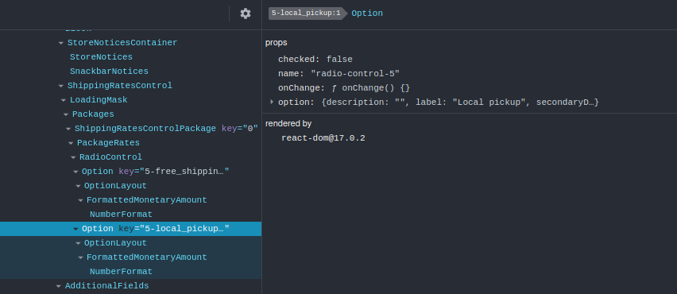
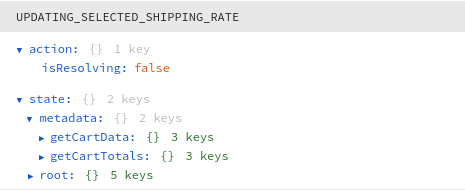
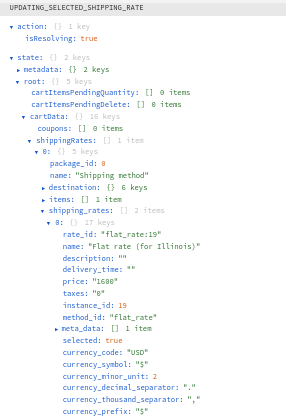
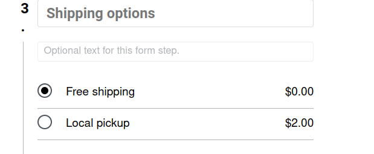
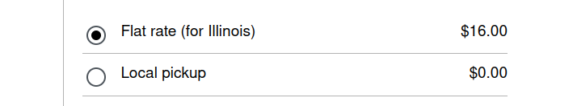

**The goal:** To have it so the Local pickup option is selected then the Shipping Fields will be replaced with a message which says the order will be delivered to the store's HQ. This is going on to be the frontend as well as the edit page. While on the edit page the user will be able to edit the message of where the Local pickup is at.

\- Working on

[Part 2](https://montelogic.com/?p=2219)

Before I review that PR I am going to make a list of features that my WC Blocks currently has and then attach them to an issue.

I just found out I don't need to add much just this line to WooCommerce WC Blocks repository.

```

	/*
	  Start MoL Codeblock 
	*/

	const {
		shippingRates,
	} = useStoreCart();
	
	// console.log(shippingRates);
	// So I guess shippingRates is an array. 
	// Looking for method_id 
	const selectedShippingRates = shippingRates.flatMap(
		( shippingPackage ) => {
			return shippingPackage.shipping_rates
				.filter( ( rate ) => rate.selected )
				.flatMap( ( rate ) => rate.method_id );
		}
	);

	// console.log(selectedShippingRates[0]);
    if(selectedShippingRates[0] == "local_pickup"){
        setUseShippingAsBilling( false );
	      return (
		        <>
		           <p>You have selected Local Pickup your order will be at your store's HQ.</p>
		        </>
		)
	}
	/*
	  End MoL Codeblock 
	*/

```

Also, it's not viewable in the editor so I have to do that and I have some [insight](https://github.com/woocommerce/woocommerce-blocks/issues/7939) how to match up the frontend and editor view.

The implementation I am using for a client doesn't need to have the WC Blocks code block above added to the mainstream repo.

So how do I get in the editor view?

I am not even able to select local pickup in the editor view.





So I got to focus on that stuff and like replicated. So I got to be like I got like look at every single day and I focus it and then see how free shipping is like already like registered. And then I need to be able to render local pickup because I don't think that it changes it all.

Once you change free shipping to local people. So I need to look at what the boilerplate already. Is there for free shipping. I'm the standards like what's already there. And then see if I can use some sort of react or rendering or react it, like what renders any can happen occurring from me for that to be there?

I searched this query within the code base:

```
components-shipping-rates-control
```

**New Day:** Tue Jan 03 2023 13:12:13 GMT-0600 (Central Standard Time)

Within a file I am seeing this:

```
	if ( collapsible ) {
		return (
			<Panel
				className="wc-block-components-shipping-rates-control__package"
				initialOpen={ ! collapse }
				title={ header }
			>
				{ body }
			</Panel>
```

{ body } =

```
	const body = (
		<PackageRates
			className={ className }
			noResultsMessage={ noResultsMessage }
			rates={ packageData.shipping_rates }
			onSelectRate={ ( newShippingRateId ) =>
				selectShippingRate( newShippingRateId, packageId )
			}
			selectedRate={ packageData.shipping_rates.find(
				( rate ) => rate.selected
			) }
			renderOption={ renderOption }
		/>
	);
```

The problem is I can't even choose the radio option for local pickup.

It looks like the path I need to focus on.

```
assets/js/blocks/checkout/inner-blocks/checkout-shipping-methods-block/edit.tsx
```

I just found out that the editor div and the frontend div are kinda of the same div.

But why is it I can press the radio input on the frontend page but not on the edit page.

I think by default it checks a certain radio option with:

```
<label class="wc-block-components-radio-control__option wc-block-components-radio-control__option-checked" for="radio-control-4-free_shipping:1">
```

Which is in this path:

```
assets/js/base/components/radio-control/option.tsx
```

I just found out a lot of the logic that defines the edit block lives in the regular block and is imported. See this line in 'assets/js/blocks/checkout/inner-blocks/checkout-shipping-methods-block/edit.tsx':



Also, notice the non-interactive block. Whenever I change it I can now change the radio option. So NOW ... I need to figure out how to make the checkout edit page change.

I also notice when I check an option then check off it immediately defaults to the shipping option and not the local pickup option. Why is this?

On the frontend if the class is selected it looks like this:

```
class="wc-block-components-radio-control__option wc-block-components-radio-control__option-checked"
```

Notice, "wc-block-components-radio-control\_\_option-checked".

Which is in the file:

```
assets/js/base/components/radio-control/option.tsx
```

But how is that option choice stored as state?

...

When I comment out <ShippingRatesControl/> the options go away.

Just found this:

```
 `renderOption`: a render function that takes a rate object and returns a render option.
```

Shipping rates control package to shipping rates control and then to the [block](http://assets/js/blocks/checkout/inner-blocks/checkout-shipping-methods-block/block.tsx).

I went into to detail about the trail the options take from the option.tsx to editor view [here](https://montelogic.com/?p=2058).

So I think the shippingRates attribute is the one that is the most important for displaying options.

```
<ShippingRatesControl
noResultsMessage={
	<Notice
		isDismissible={ false }
		className={ classnames(
			'wc-block-components-shipping-rates-control__no-results-notice',
			'woocommerce-error'
		) }
	>
		{ __(
			'There are no shipping options available. Please check your shipping address.',
			'woo-gutenberg-products-block'
		) }
	</Notice>
}
renderOption={ renderShippingRatesControlOption }
collapsible={ false }
// shippingRates={ shippingRates }
shippingRates={ isLoadingRates  }
isLoadingRates={ isLoadingRates }
context="woocommerce/checkout"
/>
```

This [file](https://github.com/woocommerce/woocommerce-blocks/blob/trunk/assets/js/base/components/cart-checkout/shipping-rates-control-package/package-rates.tsx) appears to be the state for it. Notice the line:

```
const [ selectedOption, setSelectedOption ] = useState( selectedRateId );
```

Maybe that line isn't accessed or isn't available on the editor side of things.

Okay so the useState of selectedRateId, appears to dictate which option is selected. Let's see if I can get this in the frontend view. Okay I can view it only if I use useEffect and have a console.log of the statement.

For the following code block:

```
// Update the selected option if cart state changes in the data stores.
  useEffect( () => {
    if ( selectedRateId ) {
      setSelectedOption( selectedRateId );
	// eslint-disable-next-line no-console
	console.log( selectedRateId );
		} else {
		// eslint-disable-next-line no-console
		console.log( selectedRateId );
		}
	}, [ selectedRateId ] );
```

I get in the editor view, "free\_shipping:1" whilst in the frontend view, "flat\_rate:19".

I think rate\_id is the 1 or 19.

I think that it retrieves state data from the cart object of an order. But I wonder how it sets the default value for the editor view if there is no cart object, what would be the analog?

Notice:

```
const {
  shippingRates
} = useShippingData();
```

I think it figures out how it renders but I still don't think I figured out how it saves the options.

Figuring out the state, the props say that its checked false.



In hindsight when I investigate the logic trail and I should use the React Components tree inspector view more.

This tutorial is dope for trying to change props.

[https://stackoverflow.com/questions/30218664/how-to-set-react-component-state-and-props-from-browser](https://stackoverflow.com/questions/30218664/how-to-set-react-component-state-and-props-from-browser)

This action appears to be what chooses the shipping method according to the state.



or more detailed:



Why is the titles and prices for the shipping methods on the editor page different than the ones on the frontend view?

Editor view:



Frontend view:



Okay I just found out that it's placeholder text. See this [file](https://github.com/woocommerce/woocommerce-blocks/blob/trunk/assets/js/previews/shipping-rates.ts):

It's going to be a lot of work to change it from a preview and actually have it be rendered in from what you see on the checkout page. This might be a good idea to do later on in the future.

But what I need to do, I just need to check if it's local or just go pick up and render the edit page accordingly. With that considered it should be easy because there's only free shipping and local pickup.

I wonder how the editor view is bringing in that object into the Redux store to be read as state.

The object reads as such:

```
const rates = {
  shipping_rates: [
    {
      currency_code: "USD",
      currency_symbol: "$",
      currency_minor_unit: 2,
      currency_decimal_separator: ".",
      currency_thousand_separator: ",",
      currency_prefix: "$",
      currency_suffix: "",
      name: __("Free shipping", "woo-gutenberg-products-block"),
      description: "",
      delivery_time: "",
      price: "000",
      taxes: "0",
      rate_id: "free_shipping:1",
      instance_id: 0,
      meta_data: [],
      method_id: "flat_rate",
      selected: true,
    },
    {
      currency_code: "USD",
      currency_symbol: "$",
      currency_minor_unit: 2,
      currency_decimal_separator: ".",
      currency_thousand_separator: ",",
      currency_prefix: "$",
      currency_suffix: "",
      name: __("Local pickup", "woo-gutenberg-products-block"),
      description: "",
      delivery_time: "",
      price: "200",
      taxes: "0",
      rate_id: "local_pickup:1",
      instance_id: 1,
      meta_data: [],
      method_id: "local_pickup",
      selected: false,
    },
  ],
};
```

Okay that object goes from shipping-rates to [cart.ts](http://assets/js/previews/cart.ts) preview. Then export previewCart can be found in the relevant files. Which it is imported as "import { previewCart } from '@woocommerce/resource-previews';".

I'm trying to understand this line, not sure about how the !! are used in the expression:

```
const isEditor = !! select( 'core/editor' );
```

In [use-shipping-data.ts](http://assets/js/base/context/hooks/shipping/use-shipping-data.ts) it shows the following logic:

If it's in the editor show preview if it's not use the store version.

```
        shippingRates: isEditor
            ? previewCart.shipping_rates
            : store.getShippingRates(),
```

This logic is exported as a const as "useShippingData".

The rate\_id for shipping\_rates editor preview is, "rate\_id: 'free\_shipping:1".

"

So I'm going to figure out how to like check if it's like editor view. And then I'm going to Go into the, I'm going to like, create like a variable or like, send an event to the store, which can be read from the shipping address or like just read from the editor store.

So I'm gonna like dispatch an extra wp.- something which will be able to be read by the shipping address component.

"

I am going to have to add onto the Redux store or find an extra boolean within an object to toggle so that local pickup can be selected and checked.

So I am going to try to create an alert when "Local pickup" is selected.

Side note: The "state" appears to be "useShippingData()".

This is going to be kinda tricky because it's relying on the preview state. But I just need for it to just be a simple event.

I am going to have to change the preview from dumb text to into use the Redux store. I do not see a way around this. I don't this it should be as functional as the Redux store cart but not as not functional as the dumb text; in between.

I have to add onto the custom store to show the editor radio field has selected a different option. This has to be the way because the Shipping Component field won't have a way of viewing the change of state.

So for this to happen, I need to focus on [use-shipping-data.ts](http://assets/js/base/context/hooks/shipping/use-shipping-data.ts).

When I use this in the useShippingData const I get an empty array:

```
const store = select( storeKey );
// eslint-disable-next-line no-console
console.log( store.getShippingRates() );
```

So apparently it doesn't have access to the store. But that same console.log does not output an empty array on the frontend but a usable array.

I'm trying to figure out how to access the global variable and run events on it.

Just remembered I can use something like this:

```
wp.data.select('wc/store/cart').getCartData()
```

Even when I run the line directly above I STILL am getting an empty array for shippingRates.

But I think for some reason when I changed one of the options once I was able to see the shippingRates in Redux dev tools. I though it may have been me seeing the "dummy" text but no once you take off the NonInteractive wrap and change it an action is sent to the Redux store which shows the shippingRates which would have been on the frontend.

So I'm trying to dispatch an action, namely, 'UPDATING\_SELECTING\_SHIPPING\_RATE'. When the browser runs that action from response to the UI change, I am getting useful information in the 'state.root' object.

So getCartData() is not getting the information I am looking for but dispatching the action, 'UPDATING\_SELECTING\_SHIPPING\_RATE' is.

wp.data.dispatch('wc/store/cart').dispatch({ type: 'UPDATING\_SELECTING\_SHIPPING\_RATE' });

But I am unable to get the information from running t without interacting with the radio component.

'SET\_CART\_DATA' is also producing useful information.

I find it hard to believe that there's no way to view the shipping rates from the editor view.

Also, I need to find the data store which is viewable from the editor and frontend view so I can pass data between it.

This [API call](https://github.com/woocommerce/woocommerce-blocks/issues/1318) may be what I'm looking for.

The easiest thing may to just be make another Redux store which is viewable on editor store called admin-editor-data or something like that then on the editor side run an API call like that which will produce the radio options. Then once the radio options are produced then you can go onto Local Pickup which will then be a string there. Then that can be saved onto admin-editor-data store which can be used for the string which will appear on the frontend view.

Then the editor view and on the frontend view it'll read data from two stores.

The [docs page](https://github.com/woocommerce/woocommerce-blocks/blob/a9b4df4bc9d0facb691a43abd60e17680bb68b32/src/StoreApi/README.md) is more useful for the WC Blocks API.

In the inspector panel I am noticing the shipping zones are there but the shipping methods aren't.

I'll be extending this to a [Part 2](https://montelogic.com/?p=2219).
