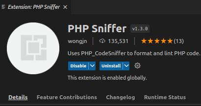

- Get Local Storage saving logic to be just as smooth as if it were Redux. -t0L08

- Add more dummy components which are viewable on the slot fill area on the editor side. At the moment there are only one of these components showing on the editor side.

- Add a check when local storage does not equal the API because the API is the true source of truth. This would trigger a re-render to make sure what's on the screen reflects the source of truth within the API.

- Submit EC to WooCommerce Marketplace -y5397

- Change Newsletter Subscription to Control Panel on the Control Panel area.

I also have to make a demo site but I don't feel like making a WordPress site for this so I'll probably end up making a SPA for the checkout and edit checkout page to demonstrate functionality.

y5397: Script for walk through video

Step 1: Get the plugin on your computer and upload it to the WordPress website.

Step 2: Activate plugin

Step 3: Go to edit page of the Checkout.

Step 4: Click on Control Panel and customize settings.

Step 5: Go to checkout page, refresh a couple of times to see changes.

Video Link [here](https://youtu.be/_sIC57Repio)

Okay, so I have to figure out how to make a demo site for a Gutenberg component.

I would like something like [this](https://wordpress.org/gutenberg/) but the Extended Checkout editor view will be available.

Okay, so I am going to attempt to, run a WordPress Gutenberg component outside of WordPress.

I submitted EC but I got the following errors.

```
$ cd /srv/; composer i; /srv/vendor/bin/phpcs --standard=/srv/phpcs-rulesets/full.xml --warning-severity=0 --report-source --report-xml=/phpcs-report.xml --ignore-annotations --extensions=php,html /tmp/product

extended-checkout has failed (non-zero exit code) for 'checking the code with phpcs':

PHP CODE SNIFFER VIOLATION SOURCE SUMMARY
----------------------------------------------------------------------
    STANDARD  CATEGORY            SNIFF                          COUNT
----------------------------------------------------------------------
[x] Generic   White space         Disallow space indent spaces   874
[x] Generic   Functions           Opening function brace kernig  49
[x] Squiz     Functions           Function declaration argument  24
[x] Squiz     Strings             Double quote usage not requir  7
[ ] WordPres  Security            Escape output output not esca  7
[x] Generic   Classes             Opening brace same line brace  4
[ ] Generic   Naming conventions  Upper case constant name cons  4
[ ] PHPCompa  Operators           New operators t_coalesce foun  4
[ ] WordPres  PHP                 Yoda conditions not yoda       4
[ ] WordPres  Security            Validated sanitized input inp  2
[ ] WordPres  Security            Validated sanitized input inp  1
----------------------------------------------------------------------
A TOTAL OF 980 SNIFF VIOLATIONS WERE FOUND IN 11 SOURCES
----------------------------------------------------------------------
PHPCBF CAN FIX THE 5 MARKED SOURCES AUTOMATICALLY (958 VIOLATIONS IN TOTAL)
----------------------------------------------------------------------

Time: 1.44 secs; Memory: 16MB
```

Okay, so I have 63 errors in my php code via phpcs, so I have to go back into the codebase and fix all of these errors.

...

The WPCS is confusing can't even get a silence is golden index.php file to work.

Looking at [this](https://github.com/KnowTheCode/starter-plugin) example.

I'm trying to find php code sniffers and some are having an issue with finding the right path for phpcs command but this one seems to work all the time.



Trying to setup phpcs/WPCS for Linux Mint on VS Code and this article helped:

https://www.rollybueno.com/how-to-install-wordpress-coding-standard-in-visual-code-studio-on-ubuntu-20/

You can check the most important WC sniffs with:

https://woocommerce.com/document/create-a-plugin/#error-1008

...

I guess you just gotta submit again from scratch if something doesn't go right and fails.

I could put a link to the GitHub post which is a call for my product to be created.

...

I just de-sniffed all of my php files and I don't feel like testing (by hand) all of the functionality I tested before so here's what I want to do:

> Okay, so, ideally I would just be able to like be able to like render the web browser and then like go to like the URL on my local machine and it'll return what's in between a div tag which I say what's in the div tag

So kind of like how you would do a postman request or a cURL and it returns the html of the url put in, it would the parse through and look for html element of my choosing.

So this is how you do it:

Make sure the number in add-to-cart is a number which is a valid product id for a product.

```
2nd to last step:
curl -X POST   -d 'add-to-cart=83'   -c cookie.txt   http://siterebuild3.local/

Last step:
curl -b cookie.txt http://siterebuild3.local/checkout/
```

Seeing what's in the checkout page, I need to work hard to get that checkout page as small as plausible to make it easier for me to consume.

There's so much boilerplate/cruft that I'm probably going to have to make a "clean space" to put the outputs I want.

I wonder what the checkout page would look like on a minimum theme, no styling, just enough to get the checkout page to show.

...

I tried to submit the plugin but I ran into an error because I've yet to delete the vendor folder for composer.

In order for the submission process to detect this error they had to use the following command:

/srv/php-malware-finder-master/php-malware-finder/yara.php /tmp/product\_clone So I guess I need to lookup composer packages which search your project for malware.

...

Apparently, you have to add a changelog file, which I'm guessing is a readme.txt with the information of what has been changed.

I wish I could've seen this repo sooner:

https://github.com/woocommerce/marketplace-extension-guide/tree/master/woocommerce-extension-template

Okay, I submitted the plugin and now it's waiting under business review. I would like to have a bash file which runs ALL of the automated commands to pass the code review process for WooCommerce.
