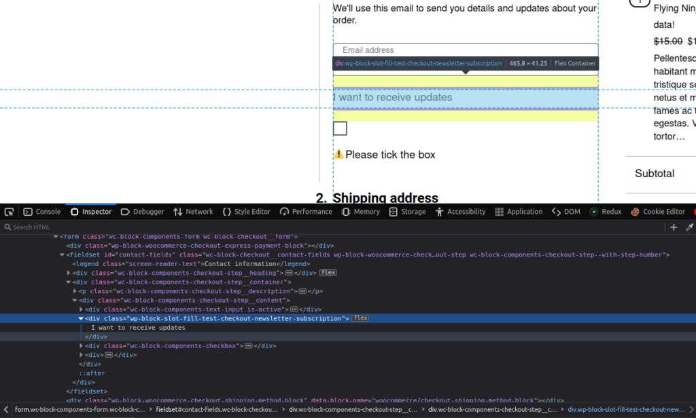
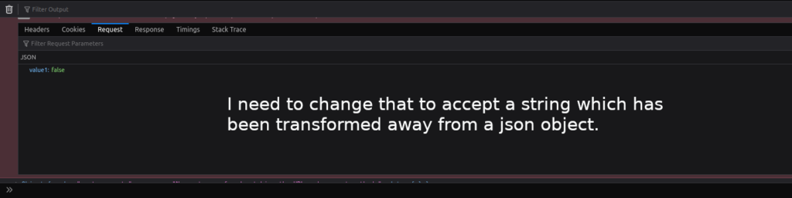
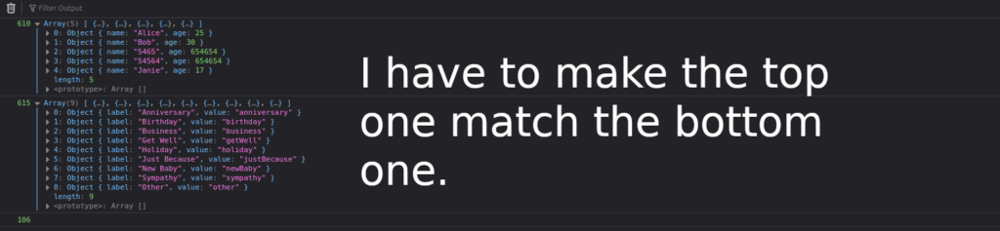
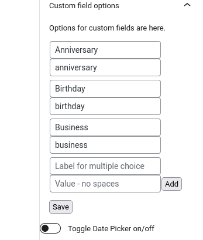

toDo:

- Get the custom fields component to be able to load values into it rather than being hard coded. - 3dfx \[X\]

- Get Local Storage saving logic to be just as smooth as if it were Redux. -t0L08

- Make it so that the selector is where checkout newsletter checkbox component is but instead it's a component of a control panel and have control panel look to it. This of course would only be viewable on the edit side. \[x\]

- Add more dummy components which are viewable on the slot fill area on the editor side. At the moment there are only one of these components showing on the editor side.

- Add a check when local storage does not equal the API because the API is the true source of truth. This would trigger a re-render to make sure what's on the screen reflects the source of truth within the API.

I still haven't connected or checked the Extension Data fully.

The results, the results of like order and like, what a relates to the custom fields of all of it on the extended checkout us. I still want that to be in the control panel and that be like, under, like orders.

There will be a button which says 'load orders' and like the button will load orders and it'll show like related to that. Another idea is is to have have a link which is going to view previous order and it's going to be in the legacy area of the admin section.

I'll do the latter idea first, because it's easier than I'll do the former functionality.

I'll be working on connecting the functionality which extends the API which sets checkoutExtensionData. This functionality is within the Integration Interface.

Made some changes and cardMessage info is not being shown in the admin area of the order.

I'm working on setExtensionData.

I used to know of a way where I could check what the Extension Data is set to.

For accessing extension data in the admin section in the OG EC I am doing,

```
$occasion = $order->get_meta('extended_checkout_occasion');
$occasion_string = substr($occasion, 2, -2);
```

This is the piece of code which clears it up:

```
add_action(            'woocommerce_blocks_checkout_update_order_from_request',
            function ($order, $request) {
                $extensions = $request['extensions'] ?? [''];

                $shipping_time = $request['extensions']['date-picker']['shipping-time'] ?? [''];
                $occasion = $request['extensions']['custom-fields']['occasion'] ?? [''];
                $card_message = $request['extensions']['card-message']['card-message'] ?? [''];


                // send email
                mail("someone@example.com", "My subject",
                    "\n \n  1 -" .
                    json_encode($extensions) .
                    "\n \n 2 -" .
                    json_encode($shipping_time) .
                    "\n \n 3 -" .
                    $order->id .
                    "\n \n 4 -" .
                    json_encode($date_data)
                    . "\n \n 5 -" .
                    " - 504");

                update_post_meta($order->id, 'extended_checkout_shipping_time',     { label: "Business", value: "business" },
    { label: "Get Well", value: "getWell" },
    { label: "Holiday", value: "holiday" },
    { label: "Just Because", value: "justBecause" },
    { label: "New Baby", value: "newBaby" },
    { label: "Sympathy", value: "sympathy" },
    { label: "Other", value: "other" },json_encode($shipping_time));
                update_post_meta($order->id, 'extended_checkout_occasion', json_encode($occasion));
                update_post_meta($order->id, 'extended_checkout_card_message', json_encode($card_message));

                // End email.

                // do_action( 'woocommerce_store_api_checkout_update_order_meta', $this->order );
                // your logic
            },
            10,
            2
        );
```

Within the npm package of [@woocommerce/extend-cart-checkout-block](https://www.npmjs.com/package/@woocommerce/extend-cart-checkout-block), I don't see any logic within the php file to add extension data, so checking the checkbox may just do nothing for extending checkout data. The codeblock directly above is code brought in from a different project which I added to a cloned project which used the aforementioned npm package.

This is what my object currently looks like:

```
{
    "shipping_address": {
        "first_name": "Monte",
        "last_name": "Logic",
        "company": "",
        "address_1": "95 Blueberry Way",
        "address_2": "",
        "city": "Blueville",
        "state": "IL",
        "postcode": "62891",
        "country": "US",
        "phone": ""
    },
    "billing_address": {
        "first_name": "Monte",
        "last_name": "Logic",
        "company": "",
        "address_1": "95 Blueberry Way",
        "address_2": "",
        "city": "Blueville",
        "state": "IL",
        "postcode": "62891",
        "country": "US",
        "email": "shackattack@gmail.com",
        "phone": ""
    },
    "customer_note": "",
    "create_account": false,
    "payment_method": "cheque",
    "payment_data": [
        {
            "key": "wc-cheque-new-payment-method",
            "value": false
        }
    ],
    "extensions": {
        "ec-refactor-2": {
            "optin": true
        },
        "card-message": {
            "card-message": [
                "887997897978"
            ]
        },
        "custom-fields": {
            "occasion": [
                ""
            ]
        },
        "date-picker": {
            "shipping-time": [
                "2023-03-04T17:26:14.455Z"
            ]
        }
    }
}
```

3dfx:

I'm noticing that if I click on the checkout button from the cart page, I have to do it twice in order to change the Local Storage but if I'm on the checkout page, I change it in the backend and then reload it, then the change is shown.

More on Local Storage [here](https://montelogic.com/?p=2824).

t0l08:

I have to rewrite this so the user can edit it in the admin area:

```
  const options = [
    { label: "Anniversary", value: "anniversary" },
    { label: "Birthday", value: "birthday" },
  ];
```

Trying to use gettingSetting() to access wp\_options.

I got this ChatGPT answer not sure, how well it works, so we're trying it out.

```
public function get_script_data() {
	$data = array(
		'ec-refactor-2-active' => true,
		'example-data' => __( 'This is some example data from the server', 'ec-refactor-2' ),
        'optInDefaultText' => __( 'I want to receive updates about products and promotions.', 'ec-refactor-2' ),
	);

	// Save the 'example-data' value as a WordPress option
	update_option( 'example_data_option', $data['example-data'] );

	// Get the 'optInDefaultText' value from a WordPress option, with a default value of 'No value found'
	$opt_in_default_text = get_option( 'opt_in_default_text_option', 'No value found' );

	// Update the 'ec-refactor-2-active' value in the WordPress options to be the same as the value in the $data array
	update_option( 'ec_refactor_2_active_option', $data['ec-refactor-2-active'] );

	// Return the modified array with the new value for 'optInDefaultText'
	$data['optInDefaultText'] = $opt_in_default_text;
	return $data;
}
```

Considering that based on the name of the project created with the npx command, the names generated for the getSetting will be different and should be analyzed and changed per the project's needs.

```
const exampleDataFromSettings = getSetting('slot-fill-test_data');
const { changeableText } = getSetting('ec-refactor-2_data', '');
```

Now that I am able to get values from php now it's time to figure out how to set values.

I think what I'm going to do is do the same thing I did for showing options through the API viz. set the attributes and have the data inputted through the API reflect the values of the attributes. Another thing I could do would to be to use the children prop for passing attributes to the frontend.

I'm not sure how children are passed into here and are accurately tied to edit.js side of where the attributes are saved.

```
<CheckboxControl
  id="subscribe-to-newsletter"
  checked={ checked }
  onChange={ setChecked }
>
{ children || optInDefaultText }			</CheckboxControl>
```

I think it matches it through this logic in the block.json.

```
	"attributes": {
		"lock": {
			"type": "object",
			"default": {
				"remove": true,
				"move": true
			}
		},
		"text": {
			"type": "string",
			"source": "html",
			"selector": ".wp-block-slot-fill-test-checkout-newsletter-subscription",
			"default": ""
		}
	},
```

So I conjecture that it knows it's supposed to be there on the frontend and takes that backend attribute info and brings it to the frontend.

I think my conjecture was right but what brings that selector all the way out there back into the checkbox field?



I wonder as to how the attribute within the selector is being corralled in is somehow related to useBlockProps.

Looking at the slot-fill-test

The @woocommerce/extend-cart-checkout-block is "supposed" to be from this [package](https://github.com/woocommerce/woocommerce/tree/trunk/packages/js/extend-cart-checkout-block). But I made a GitHub [repo](https://github.com/MonteLogic/slot-fill-test-repo) without the mustache type files.

toDo: figure out how the selector of the attribute of block.json is exactly tied to the component on how does the block wrap, ".wp-block-slot-fill-test-repo-checkout-newsletter-subscription".

The answer to the following task is non essential to the project due to the fact that I'll be using wp\_options due to the fact that is more apt at manipulating data structures.

...

Okay, now that I got a valid get\_option, I have to have it an array form put more importantly I also have to run update\_option on it.

Now focusing on setting the logic which will update the option based on input.

... Going through this process, I keep wanting to use the attributes.

I don't think the attributes are good enough yet to manipulate data structures in the way I would like. So I have to make an API with php again, (sigh).

...

Okay. So, um,

This API, it's going to be on the edit side and all the block side of To be on the edit side in the block side on edit sides. We're going to be able to post to it in the array and be able to change it and then unlock side which is able to get values.

And then it'll just be something that we can turn into a multiple choice and if it's not being able to be format formatted into multiple choice, I want some sort of like diagnostic error reporting to like report back to me.

My PUT call is to

http://my-site.local/wp-json/my-api/v1/extended-checkout-api

The useEffect looks like this:

```

useEffect(() => {

// Send a PUT request to update the values on the server
  fetch('/wp-json/my-api/v1/extended-checkout-api', {
    method: 'PUT',
    headers: {
    'Content-Type': 'application/json'
  },
body: JSON.stringify(
{
  value1: show_card_message,
  value2: show_custom_fields,
  value3: show_date_picker
}
)
})
  .then(response => response.json())
  .then(data => {
  console.log(data);
  });
}, [show_card_message, show_custom_fields, show_date_picker]);
```

This is more other useEffect for the array.

```
	useEffect(() => {
		// Send a PUT request to update the values on the server
		fetch('/wp-json/my-api/v1/update-multiple-choice-options', {
			method: 'PUT',
			headers: {
				'Content-Type': 'application/json'
			},
			body: JSON.stringify(
				{
					value1: show_custom_fields_array,
				}

			)
		})
			.then(response => response.json())
			.then(data => {
				console.log(data);
			});
	}, [show_custom_fields_array]);
```

I'm going to use the attribute changing of the array to trigger a useEffect which will run a PUT request.

toDo:

- I need to have a check when local storage does not equal the API because the API is the true source of truth. This would trigger a re-render to make sure what's on the screen reflects the source of truth within the API.

Working on a way to edit choices for the multiple choice component and it's going to look something like this:

```
import { useState } from 'react';

function AddToJSON({ initialArray }) {
  const [inputValue, setInputValue] = useState('');

  const handleInputChange = (event) => {
    setInputValue(event.target.value);
  };

  const handleAddClick = () => {
    const newObject = {
      label: inputValue,
      value: Math.random().toString(36).substring(2, 10)
    };
    const newArray = [...initialArray, newObject];
    console.log(newArray); // Output the updated array to console (for testing)
    // Do whatever you want with the updated array here (e.g. update state)
  };

  return (
    <div>
      <input type="text" value={inputValue} onChange={handleInputChange} />
      <button onClick={handleAddClick}>Add to JSON</button>
    </div>
  );
}
```

I'm going to start using this [HTML file](https://raw.githubusercontent.com/reactjs/reactjs.org/main/static/html/single-file-example.html) for trying out new React code. I would still like for it to be in TypeScript but haven't figured that out yet.

I think I should be able to use local storage as a replacement for useState but I would rather not do that, if unneeded.

toDo:



I'm running into the issue of data is not iterable.

My string for wp\_options choice:

<table><tbody><tr><td></td><td>[{"name": "Alice", "age": 25}, {"name": "Bob", "age": 30}]</td></tr></tbody></table>

The value in the db for the wp\_option is turning into this:

"a:3:{i:0;a:2:{s:4:"name";s:5:"Alice";s:3:"age";i:25;}i:1;a:2:{s:4:"name";s:3:"Bob";s:3:"age";i:30;}i:2;a:2:{s:4:"name";s:4:"5465";s:3:"age";s:6:"654654";}}"

When it started out as,

"

\[{"name": "Alice", "age": 25}, {"name": "Bob", "age": 30}\]

"

So, it's serialized.

Okay summary,

[Part 1](https://www.youtube.com/watch?v=Z0QAyoqtTCA)

The get that I'm looking for actually isn't a get it's just reading the optionValue from php viz. get\_script\_data().

[Part 2](https://www.youtube.com/shorts/jUPkxhjucLI)

...

I just found out the get\_script\_data works on the frontend too.



...

I could certainly do work to make this more user friendly. This is how you do it, so in block.js there is a label and a a value. The Label is what they see but the value is what the database sees. The value should match the label but have no spaces. Also, I haven't tried to add numbers to the value field so it may trigger an error if anything other than the formatted characters as such are entered.



In order to view this you have to click the check box where the newsletter is at and click 'custom field options'.

It looks like my\_option option isn't being added to the db upon init. Now it is after adding the array check.
