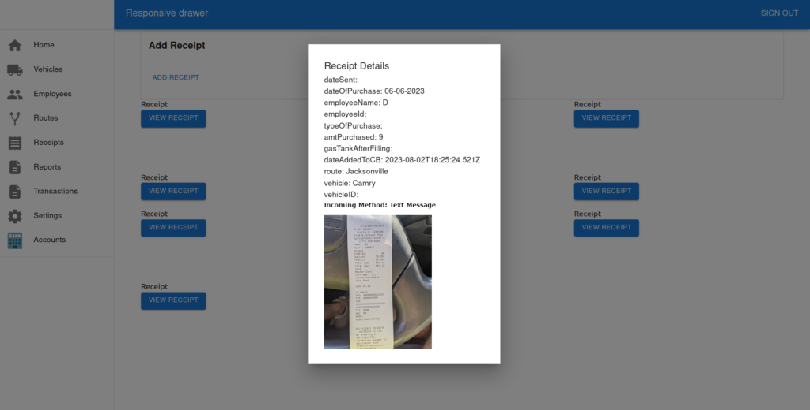

I got tesseract working but the OCR isn't good.

Okay, so all the Node.js implementaions are whack\* from what I've seen so I'm going to have to use OpenCV but in order to use that I need use Golang.

...

I think I'm going to just settle for that grayscale for now and then later do the immaculate one with Golang.

So clean it up with Gocv / opencv bindings for Golang and then read it with Tesseract.

https://gocv.io

I am testing out the OCR and logging out the values but I feel like with node it's not as straight forward as it would be if I were using Bun. Basically, I am tired of running those tsc commands when it could just be done for me and not have to use webpack.

I think I am going to make a test UI only available for Devs and/or Admins which I can test text message chatbot functionality.

Notice incoming method, I want that to also be a link to the text and what the computer interpreted from the text.



I also want the OCR to work on the add receipts page but then I may not be able  
to use it locally but then there'll be a notice which says, you are not connected  
to Internet so you can't use OCR.

The reason for this is there just isn't enough fields.

"

So, the goal would be to like, just like of camera rolling. Just like a 10 images into everyone else like duplicates. So it seems like time, it's like those don't be good. So the new goal, what is it go? The goal is to upload images. Like upload images is now like feel it like dumbly and then you go and back in and then you will like correct it each one of the images and they're all tied to it and then I'll see you can like and have ones that aren't images and just have it people link if you wanted to But there must be good detection as well.  
~

"

So at the top, it'll be like upload images to pre-fill elements or just start from scratch.

"Upload images to pre-fill receipts."

I also really want the already uploaded receipts to be neat, viz. show date uploaded and be sorted.

But if I do all of this, I'm going to be far away from MVP. So I think I'm going to do the text message page first and then do the aforementioned stuff.


Making this happen in the db:

"

What I'm going to do is that, um, I'm gonna put like OCR trapped through comical OCR draft. If you like number one and the IT is gonna be the same for each one, but each entry like everything the entry ID then that like matched to it then whenever you go on there it'll be like the one you Entered into other like OCR, something like that to make keep on going on.

"

Prisma Model:

```
model IncomingTexts {
  id                  String   @id @default(cuid())
  entryId             String   @default(cuid())
  isOcrRobot          Boolean
  isPostSendEdit      Boolean
  isEditale           Boolean
  draft               Int
  dateSent            String
  dateTimeOfGasBuying String
  amtOfGasPurchased   String
  gasTankAfterFilling String
  dateAddedToCB       DateTime @default(now())
  From                String
  Body                String
  MediaUrl            String
  img                 String   @default("")
}
```

entryId, is the value which will be used over and over again for pertinent entries.

right now I am doing the database matching so with the incoming text there's going to be the original one and then that's going to be at the entry ID then you try to match the entry ID to the subsequent ones and that's how you find the relation.
