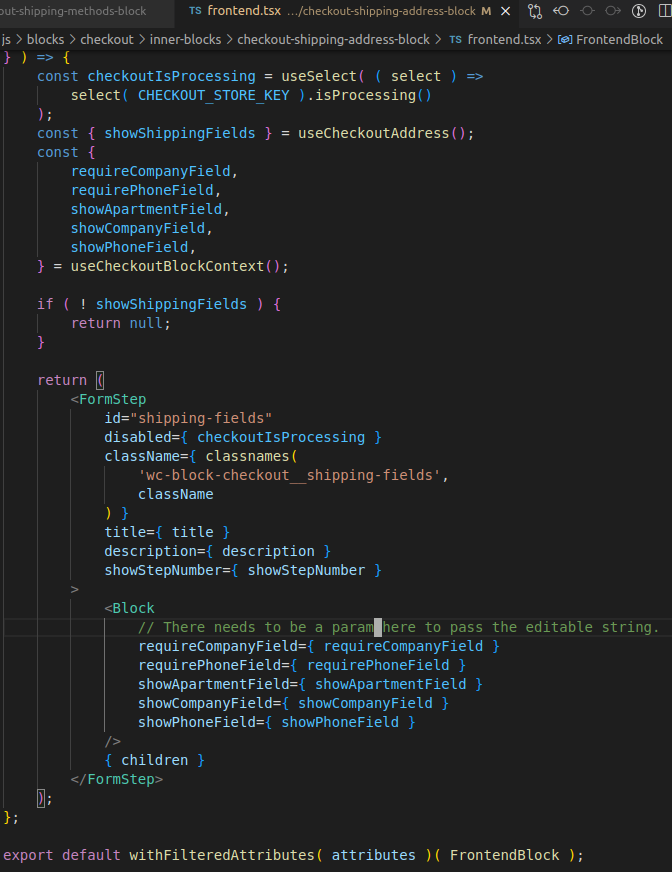
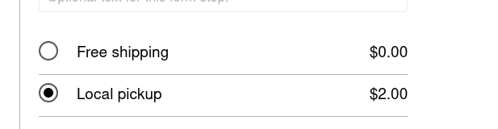
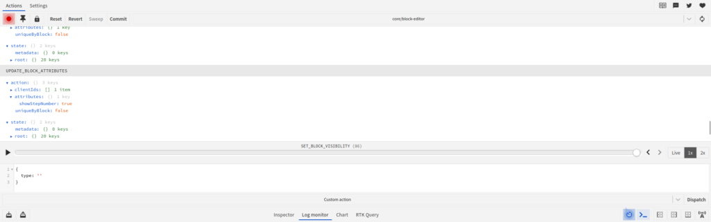

**The goal:** To have it so the Local pickup option is selected then the Shipping Fields will be replaced with a message which says the order will be delivered to the store's HQ. This is going on to be the frontend as well as the edit page. While on the edit page the user will be able to edit the message of where the Local pickup is at.

\- Working on

"The shipping component would be dependent upon some information, that's in another component, and then try to get good at like shifting stuff. And then the thing about it is it won't read from preview cart. It'll read from. What's in the edit inspector thing?"

"I know that if you change, if you like click show step number, then we'll be there, the no change. So, I'm pretty sure the shipping thing is a component. So, I think that you can pass data there, but I think it's gonna be really tough to be with the radio option.

So I might just put that in the inspector view and then update it and then see if I can put that on the front end and then the one string is going to be local pick up and the other strings gonna be there. So there's only two strings that you can write and edit on the inspector view and see if I can pass those two strings there and then also on the first string it's gonna be identified as local underscore pickup, which is gonna be there.

Then once I get that, I want to get that good, then I can work on transferring state and then reacting to different states, to different components to it, and trying to reference it because I don't think it will be that hard."

I may be overthinking this. Thinking back to the impromptu solution I used it was just a couple lines of code. The hard part seems to be editing the string, that's it. Of which I can just view from the shipping-methods block state.

Okay, I notice when I toggle the show step number button it shows up on the frontend, that's good because it's a transfer of data. I wonder if I can see if show step number exist from a different component as well as how does the frontend component of shipping-methods block perceive state in a manner to not show step number on the frontend.

The functionality mentioned directly above is as such in this [file](https://github.com/woocommerce/woocommerce-blocks/blob/trunk/assets/js/blocks/checkout/form-step/form-step-block.tsx):

```
<ToggleControl
  label={__("Show step number", "woo-gutenberg-products-block")}
  checked={showStepNumber}
  onChange={() =>
    setAttributes({
      showStepNumber: !showStepNumber,
    })
  }
/>;
```

The attributes are as such:

```
const { title = '', description = '', showStepNumber = true } = attributes;
```

Apparently it's importing attributes from formStepAttributes. Such as:

```
export default {
	...formStepAttributes( {
		defaultTitle: __( 'Shipping options', 'woo-gutenberg-products-block' ),
		defaultDescription: '',
	} ),
```

form-step/attributes as in this [file](http://assets/js/blocks/checkout/form-step/attributes.ts).

So, let's learn some more about editing attributes.

I have been using [GPT-3](https://beta.openai.com/playground) to get information about WordPress Gutenberg flow lately, as [ChatGPT](https://chat.openai.com/auth/login) has been regularly down.

The inspector control for the edit file is wrapped in the component [FormStepBlock](https://github.com/woocommerce/woocommerce-blocks/blob/trunk/assets/js/blocks/checkout/form-step/form-step-block.tsx).

"

Able to access the attribute of that thing, local pickup string value. Then if I just access that attribute from another file, which I think a camera's, pretty sure I can, then I can just go into the trunk of my word of my WC blocks on my profile, add that, which changes it and then that one will find attribute.

That's another file.

"

"

That I'm still gonna run into I think, is that I'll have the front interview good. They'll be looking good for that but still the not interactive block is gonna be hard to do. So it's gonna be as we talked me to change it or in some sort of I mean maybe I can add out to the editor and have it to speak to different options And then I want to introduce Redux store state and then it can reference that file a JSON file.

But I think the editor is going to be tougher to do and I still it's going. It's I think it's going to require more patients.

"

getBlockAttributes works on ('core/editor') but not on ('core/blocks').

...

Need to re-study how the attributes are shown on the frontend. Also, it may just be adding the attribute's type to the interface before use. I am seeing how the title can be changed in the editor and shown on the front view.

Okay, so the title is from formStepAttribtues.

I'm trying to find where the title is and how it is shown on the frontend and I don't know how yet. There's more stuff going on in the frontend.tsx file to explain the absence of an attribute.



**Side Comment:** I wonder if any of the block.tsx files use attributes or is it just the frontend.tsx files that use attributes.

Ok I got the title to import even through I though it would be a double import but it turned out not to be.

I added localPickupInfo to <Block/> as a prop now I have to add it as a type.

I am trying to figure out this TypeScript error, it is saying, ', 'is not assignable to type 'IntrinsicAttributes '.

So I'm reversing-engineering how the title prop is used on <FormStep />.

So I am going to make a trail similar to how I [document the trail](https://montelogic.com/?p=2058) of certain codebase's functionality. The difference with this is for types and how certain types are assigned within the TypeScript of WC Blocks. This article can be found [here](https://montelogic.com/?p=2274).

I found the trail and I made a commit which had a succesful display of the attribute within typescript. Turn out I was putting the type description than a different than it was supposed to be.

It would be easier if the type it was in was named rather searching certain type for what its saying it's missing at.

....

Okay, now that I got attributes passed to the frontend, it needs to be visible in the editor view. Also, I should note that I have to reduce a lot of the fluff I added in the last commit but that can be done at a later date.

This is going to involve viewing state and hopefully I can avoid adding another store.

For some reason now I am able to save my option for the shipping methods block, I wonder if there is a way to check from other components that the option has been checked.



I'm reading back the console.log from Part 1 and the console.log appears to be showing me only flat\_rate data not for both options. When I choose Local Pickup I should be getting a console.log which logs 'local\_pickup'. I know the data it is retrieving is from a dummy file.

**My problem:**

"I am trying to add state onto a file but I don't want to use Redux and the project already uses Redux, I'd rather the state I am reading to read a file yet know which option it is selecting from the file which can then be viewed from a different component."

**Answer:**

"In that case, you could look into using React's built-in state management. React's state is managed using the setState() method, which allows you to update the component's state based on user interactions. You could use this to keep track of which option is selected from a file and then pass the state to other components using props."

I guess I have to figure out a setState solution from the [dummy file](https://github.com/woocommerce/woocommerce-blocks/blob/trunk/assets/js/previews/shipping-rates.ts).

Before I embark on this, trying to move props to the set state of the shipping methods component onto the shipping address component. I should look how at how the shipping adjust component to wrap state which I kind of already know I. Look at how the shipping address component can derive state and then see if there's any shortcuts that, that will be easier than trying to do this props thing I'm thinking of.

Or at least just take stock of it.

Taking stock on how the [shipping-address](https://github.com/woocommerce/woocommerce-blocks/blob/trunk/assets/js/blocks/checkout/inner-blocks/checkout-shipping-address-block/block.tsx) component takes in state.

I'm thinking useCheckoutAddress() is the main deriver of state but useState is used in this component as well.

What I am working on:

- I am trying to show that the shipping-address fields on the editor page should be changed to show the localPickupString rather than the shipping-address fields. However, I've yet to make a state logic switch that would show the component RadioOption for Local pickup or delivery has changed.

I am going to try the setState solution first and wrap it in a isEditor function, to keep the functionality footprint small.

[Voice Note](https://recorder.google.com/share/b9e73950-a6b2-435e-8181-409d13792667) about this.

I am currently having trouble getting the radio component into the file whilst obeying the TypeScript rules.

So I guess it could be a simple interface with type allocation(?) for adding onto the [file](https://github.com/woocommerce/woocommerce-blocks/blob/trunk/assets/js/blocks/checkout/inner-blocks/checkout-shipping-methods-block/block.tsx).

But the following const works:

```
const options = {
  value: 'value1',
  label: 'Label 1',
  disabled: false
};

<RadioControl
selected={ '' }
onChange={ function ( value: string ): void {
  throw new Error( 'Function not implemented.' );
	} }
// Within this attribute needs to be the component RadioControlOption
options={ [options] }
/>
```

I am packing it in for tonight I am still working on the RadioControl component for the editor. I am trying to get TypeScript wired up with the functionality to fit the file.

Note that the options is being iterated upon and only expects one option.

Now I gotta get the selected value for radio options good.

Then I gotta connect the RadioOptions component I made to the shipping-address block in the editor.

Okay so I have to pass the useState value which was aquired in the shipping-methods block into the shipping-address block. I am currently trying to do this with createContext().

Apparently you have to something like this for the context:

```
export const useCartBlockContext = (): CartBlockContextProps => {
	return useContext( CartBlockContext );
};
```

This [file](https://github.com/woocommerce/woocommerce-blocks/blob/trunk/assets/js/blocks/checkout/block.tsx) appears to be using the Provider well.

"

Okay, so I'm going to go into context.ts. Within the check out folder. And then I'm going to add a value. I guess here. Do I think local pickup? Info can be accessed from different places. Show company field, these can access from different places within the context because this one context.

So I'm going to add like logic there And see if that can work. And if not I'm gonna trapping scratch.

"

I'm taking a look at this code block and I'm trying to find out the difference between the below code block and the above code block?

```
export const CheckoutBlockContext: React.Context< CheckoutBlockContextProps > =
	createContext< CheckoutBlockContextProps >( {
		localPickupInfo: '',
		showCompanyField: false,
		showApartmentField: false,
		showPhoneField: false,
		requireCompanyField: false,
		requirePhoneField: false,
		showOrderNotes: true,
		showPolicyLinks: true,
		showReturnToCart: true,
		cartPageId: 0,
		showRateAfterTaxName: false,
	} );
```

...

I'm thinking what I'm trying to do won't work out but it won't be clean and won't be added to the main repo because it's related to checkout functionality. Nonetheless, I will still try to get it working.

Now, I am just getting an empty object.

The values within useCheckoutBlockContext() appear to be attributes which are passed down rather than stateful things.

I am going to have to wire Redux up for this.

I am going to be referencing setShippingPhone for how this is done. Thankfully, I have already have a [trail](https://montelogic.com/?p=2378) made out.

...

Okay tried the above method, didn't work so now I'm just going to focus on showOrderNotes. I am going to have to add the attribute of isLocalPickupSelected on the editor page and then just go from there.

There's a bunch of providers in this [file](https://github.com/woocommerce/woocommerce-blocks/blob/trunk/assets/js/blocks/checkout/edit.tsx). I'm looking at the aforementioned files and I'm not sure how the props have changed.

...

I could just make an additional attribute which will only be used on the checkout side which will tell if local pickup has been selected. I wonder if setAttributes is asynchronous and can do the functionality I want it to do.

...

It looks like they are all Gutenberg attributes anyways.

I need to spend a lot more time look at this [file](https://github.com/woocommerce/woocommerce-blocks/blob/trunk/assets/js/blocks/checkout/edit.tsx).

Why does showCompanyField work but the one I'm trying to do hasn't worked yet?

... I don't think I've made enough additions to properly function as a Gutenberg attribute.

I'm realizing that this Pull Request isn't that important to my end goal so I am going to be switching back to EC after the 20th.

Back to the question of:

Why does showCompanyField work but the one I'm trying to do hasn't worked yet?

But before I figure that out which I'm pretty sure it has something to do with Attributes, I do not want to over-engineer this thing.

Okay, so I'm going to take a second look at the useContext hook.

I got Context to work, this [tutorial](https://www.youtube.com/watch?v=rbtTb9hLYS8) really helped for getting this setup.

Okay now that I can read that value I can be like, if ValueContext is === true than don't render the shipping address section, only show the billing section. But the section should STILL be there but the fields should be gone and replaced with localPickupString.

But I'm trying to figure out how the shipping-address input/form is conditionally rendered.

So this import statement is important:

```
import { AddressForm } from '@woocommerce/base-components/cart-checkout';
```

So my goal is to hide all of the shipping address fields on the edit page but STILL keep the InspectorControls working for the shipping-address field. And while this functionality is occurring the frontend part of the page will not be adversely affected.

For some reason when I toggle the radio component of shipping-methods I made I cannot console.log from shipping-address

I think the answer to this can be found in the frontend of the component I am working with and how they are re-reloaded or re-rendered when a radio option is selected.

I am working on mastering useContext with mixed results today.

However, I have found this helpful [codesandbox](https://codesandbox.io/s/usecontext-functional-components-forked-6cw4ls).

I am guessing that everything needs to be wrapped in the provider or else it won't re-render.

What's going on in my codebase right now?

I am trying to implement useContext for state detection from shipping-methods to shipping-address block.

I currently have not had both of the component wrapped in a provider for the WC Blocks repo I am contributing to. I also am more importantly working on a Sandbox of useContext to test out functionality which will be put in the WC Blocks repo.

This useContext [sandbox](https://codesandbox.io/s/usecontext-nt82j6) is good but uses JavaScript now I am focusing on TypeScript.

[TypeScript useContext Sandbox 1](https://codesandbox.io/s/usecontext-f6ixxr)

[TypeScript useContext Sandbox 2](https://codesandbox.io/s/usecontextusereducer-5175f?file=/src/utils.ts)

Okay, so I got a [repo](https://github.com/MonteLogic/testing-context) out of the first Sandbox and this repo doesn't produce any TypeScript errors.

So now, I need to adapt that repo to use a radio input rather than a boolean toggle, then apply it to the WC Blocks functionality I am trying to make.

I'm looking at this line:

```
 const handleClick = () => {
    setDarkTheme((prevTheme) => !prevTheme);
  };
```

Looking at the codeblock directly above I am intrigued by how prevTheme is not a parameter of handleClick but it still works. I think this operation within setDarkTheme() is a function.

I'm thinking no that I actually don't NEED it to be a boolean but it may need to be a string because the options for shipping may exceed two in the future.

Okay, so now that I got the functionality I want (see this [repo](https://github.com/MonteLogic/testing-context)) how can I then add it to WC Blocks.

**What is currently happening in the WC Blocks codebase which you are working on?**

Currently happening. I was trying to make a context value and useContext and by wasn't wrapping it in a provider. So I was trying to make my own, but I also recognize that there's other ones that used contact provider but that involved props, but I wasn't sure if those props were needed to tied with attributes.

...

Looking at the testing-context "sandbox" I made I have to figure out where in the project correlates to the WC Blocks repo.

It looks like I need to up a level to place my Provider or else the component won't be re-rendered once the value changes. The file which the Provider should be in is [this one](https://github.com/woocommerce/woocommerce-blocks/blob/trunk/assets/js/blocks/checkout/context.ts).

Checking out [CheckBlockContextProps](https://github.com/woocommerce/woocommerce-blocks/blob/6f637dbbd9a00c2c911c73d6298d232fe7115f23/assets/js/blocks/checkout/context.ts#L26),

...

I think useCheckoutBlockControlsContext may be the context I could use which will make my desired functionality work.

...

Okay,

"

Hey, so I'm going to look at how is local pick up. Info was changed and then do it that way. And then yes, I know that stuff we renders and I'm just going to just look at how tall I actually be works. And how I linked up is local local pickup string, how I link that up and then we change that to the value of the, of The pickup of one of the pickup radio option values.

Then Hopefully I'll do all this link all this up and it'll be idiomatic to the code base. Because set input valve is not a function. I don't know how that's possible because I do it. I link the same way on my sandbox on my local thing and it is no type errors and it works.

So I got to figure out. I don't I don't really know how that happens. So I'm just going to just scrap that idea entirely and then just do what the idiomatic way of the boot conference blocks.

"

...

In the future, when adding to a large codebase strive for idiomacy.

...

I need to get the functionality working like how it is when you check 'show step number' how the DOM immediately renders it.

So I'm going to see if I can get THAT value from outside of that component.

But I have noticed in this component there is redux this is apart of the shipping-methods component.

```
<StoreNoticesContainer
  context={ noticeContexts.SHIPPING_METHODS }
/>
```

I didn't know about [Block contex](https://stackoverflow.com/questions/54824802/get-information-and-attributes-from-other-gutenberg-blocks)t and this [source](https://developer.wordpress.org/block-editor/reference-guides/block-api/block-context/).

Show step number IS being updated through the Redux store, see below.



Following [this tutorial](https://www.youtube.com/watch?v=9fldNvfWW7U).

I am running this console statement to get back an object which is relevant to the dev process.

```
wp.data.select('core/block-editor').getBlocks()
```

Note: Redux saves the state of the attribute of the Redux object asynchronously.

So, now I have to make another attribute for the radio component which will update a shipping-methods attribute but not prompt the user to save page when he leaves and these options will already use the interface I've already setup.

Okay, I'm working on this:

```
import { select, dispatch } from '@wordpress/data';

const blockAttributes = select('core/block-editor').getBlockAttributes(blockId);
const newAttributes = {...blockAttributes, attribute1: newValue, attribute2: newValue2, ...};
dispatch('core/block-editor').updateBlock(blockClientId, newAttributes);
```

I thought I had to get the block id but I think it's called client ID and ChatGPT just wasn't in-time to update the change in documentation.

"

I can see is that if it if it likes says, Like if it says is editor and then it needs to be like its own custom block. Like I can't use the block version because I can't access the attributes. I don't do the edits Through, they're just the block page.

So it needs to be like in the edit page, so I should just like, expand on the block like there and then try that because it's not working. And I don't know if I can do the Redux option but that's just going to be extra work and I'm already "done" with this and I've been done with this for a minute.

"

I moved the block to the edit page, but when I change the radio component which changes an attribute it prompts the user if they want to leave. I do not feel as if this is a robust solution, so I'll be looking into this [file](https://github.com/woocommerce/woocommerce-blocks/blob/trunk/assets/js/base/context/providers/editor-context.tsx) to try to add context logic to do what I am trying to do.

But for this I am going to have to do a [Part 3](https://montelogic.com/?p=2493).
