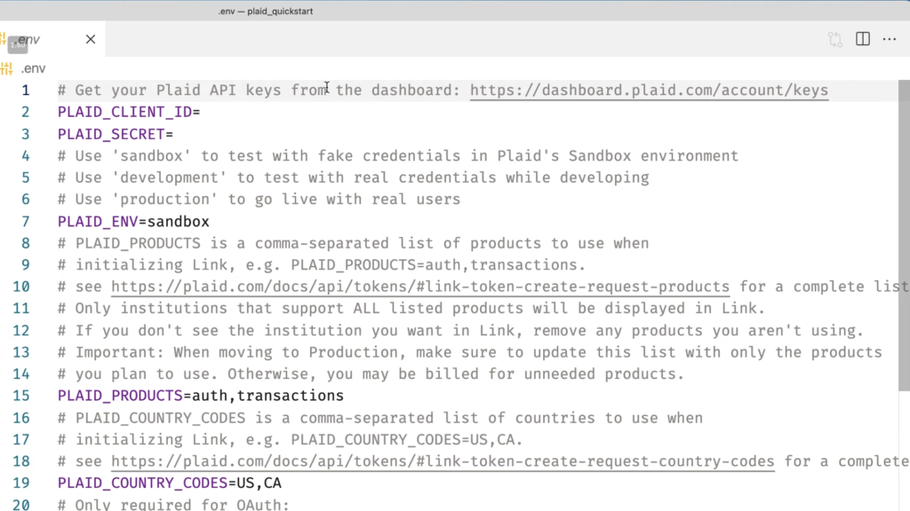
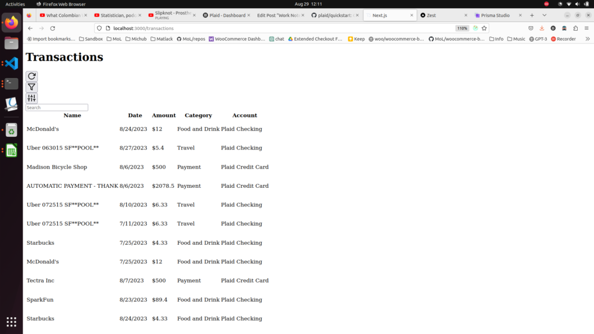

toDo:

\[ \] 524gsg - Change categories both on import and changing db data already saved into the database.

Viewing these examples,

https://github.com/vedkale/zest

https://github.com/spenpeq-cav/finance-tracker-v2

The goal is to have Next.js 13+ functionality and the Plaid API working.

I would also like to rewrite CB into all app dir and switch from Prisma ORM to Planetscale ORM.

I'm looking at the examples and I couldn't get them to run so I think I'm going to make a new branch and then work on adding Plaid into that branch.

...

The zest github repo I linked looks dope.

...

I think I'm just going to fold Zest into Contractor Buddy.

Also, I may just use a dummy bank for adding values and then add to that dummy bank the .csv files if I can't get the development branch of Plaid to respond to transaction updates viz. link a bank account.

I am trying to run CB on my phone but prisma is showing an error on pnpm install so may switch to Planetscale ORM to see if this error persists.

Now, I found out Drizzle does what I want so I think I am going to use Prisma to get to MVP and then rewrite to use Drizzle.

I got the fake stuff to work, so now I gotta get real stuff on my real account and then to production.



This is what my screen is looking like:



I am trying to figure out categories and if Plaid is coming up with the categories or it's just apart of the dummy data.

The code:

```
    const transactions = await getTransactions(sortByStates[sort]);
    const itemIds = await getItemIds();

    var filteredTransactions = filterTransactions(transactions, filter);
    filteredTransactions = searchTransactions(filteredTransactions, search);
```

Okay, so Radix UI isn't loading at all so no CSS is showing or other styling, so I would like to take that plain styling and then add it to the MUI stuff.

But what I would REALLY like to do is to load up dummy date like I create transactions which would be accessed via Plaid API and then it'll be a mockup of what you would see on a typical Contractor's balance sheets/transactions.

What I would like to do is

have a like a color or something for when money is sent via CashApp or money is withdrawn from the ATM.

We need to know if the money which was taken out was for gas or used to pay for a service.

...

I was unable atm to insert dummy data onto the used_good accounts so I'm going to have change it from the transactions which was loaded.

It looks like you can interdict the transactions and change the categories, see [here](https://plaid.com/blog/transactions-categorization-taxonomy/).

I guess I can add transactions to a dummy account with [this](https://plaid.com/docs/sandbox/user-custom/).

It's getting to the end of the month and timecards will be due soon, so I'm going to start reworking the timecard portion.

I am going to focus on adding dummy data, view post on this, [here](https://montelogic.com/?p=4476).
