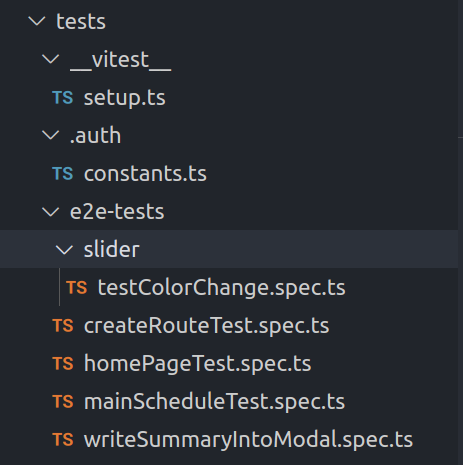

Sat Nov 16 2024 20:42:02 CST

We are using Playwright and Vitest. Next to the folders there is a \_\_snapshots\_\_ folder with labeled photos and the time the snapshot was taken.



So, I'm going to separate this into two parts,

Playwright Testing config within Next.js and  
Vitest Testing config within Next.js

Aside:

I don't want to signin stuff because that's like a lot of work with setting it up, ideally we can just take out the component test from there.  
Hopefully, this method will be less complicated then setting up testing infrastructure

Currently my setup has these test.spec files in a test folder and I don't think that's good because they should be near the component they are trying to test for association's sake and for keeping it up to date as you will see the test more.

So, let's move all of these test to their relevant location but still keep the config folder in the test file.

Step 1: Setup the config and then run a simple test.

Step 2: Create test which are co-located with the component.

My stack uses Clerk, ideally we could run the test elsewhere but I have to run this Clerk sigin in logic before any Vregression test.

```
/**
 *
 * This is the test which works as of:
 * Tue 11 Jun 2024 12:25:11 PM CDT
 *
 */
// I feel like if you run the test right here
// it doesn't hit the global pre-requisite test.
test.describe('app', () => {
  test('sign in and take a screenshot of main/schedule.', async ({ page }) => {
    await clerkSetup({ publishableKey, frontendApiUrl });

    await setupClerkTestingToken({
      page,
      options: { frontendApiUrl: process.env.CLERK_FRONTEND_API_URL },
    });
    await page.goto('/main/schedule');
    await expect(page.locator('h1')).toContainText('Sign in');
    await page.waitForSelector('.cl-signIn-root', { state: 'attached' });
    await page
      .locator('input[name=identifier]')
      .fill(process.env.E2E_CLERK_USER_USERNAME!);
    await page.getByRole('button', { name: 'Continue', exact: true }).click();
    await page
      .locator('input[name=password]')
      .fill(process.env.E2E_CLERK_USER_PASSWORD!);
    await page.getByRole('button', { name: 'Continue', exact: true }).click();
    await page.waitForURL('**/main/schedule');
    // await page.waitForTimeout(2000);

    await page.waitForLoadState('networkidle');
    await page.screenshot({ path: 'screenshot6.png' });
  });
});
```
