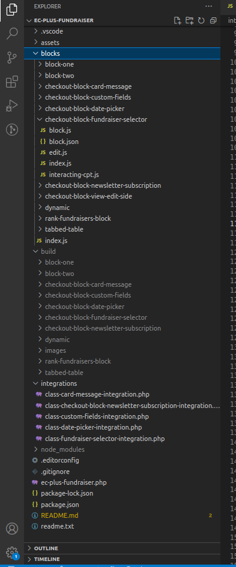

The build process is reliant upon the editorScript param within the block.json

Then it runs the checkoutRegisterBlock and registerBlockType.

Whats in the build folder are blocks. I always prepend it with checkout-block- to know the naming scheme and how the block is shown differently.

I've yet to add the slot fill on the editor side using this folder structure but it'll just be added like update-options.js is added.

I would love to add functionality by adding my own command line tool to propagate these build folder structures. Also, I grow weary of php's lack of ability of knowing whats going on viz. TypeScript can infer types and know if a path is errant.
