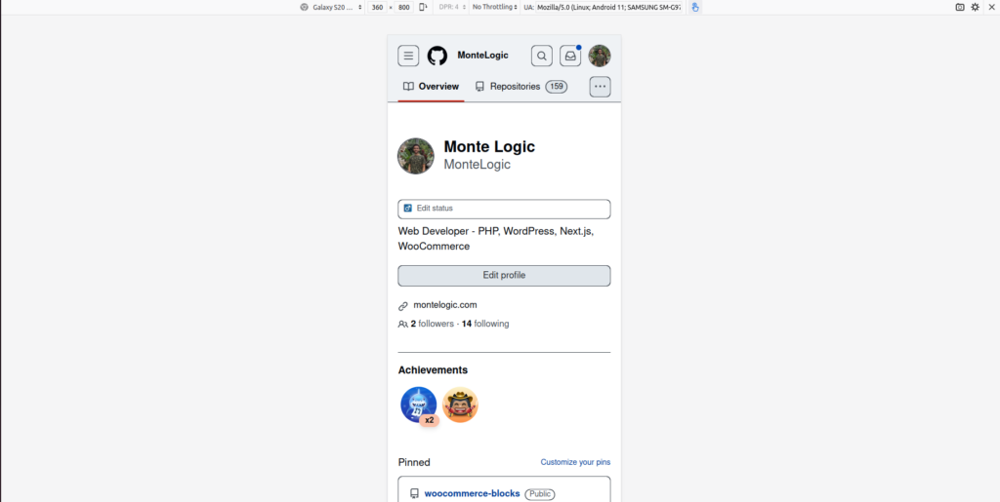
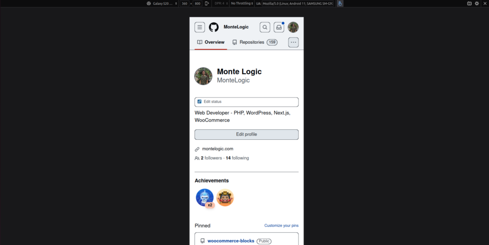

## Download Ubuntu and Install on machine.

Download Ubuntu, install onto my machine preferably a Thinkpad with or other cheap laptop with USB-C and great Linux support.

The installation is a minimal installation.

## Run apt update and apt upgrade

These two commands will bring your repos which you rely on up to date so no\* errant install attempts.

## Download Media and VLC Player

I like to listen to music locally on my machine rather than using a distracting app like YouTube or Spotify.

I prefer VLC because its simple and NO ADS.

## Download and setup Basic CLI tools (wget, neovim)

CLI tools like wget and the CLI text editor which I prefer is Neovim. Notice how I put Neovim and the basic category and not in some complex category because this is how I believe this tool should be treated as a CLI tool not as an IDE.

## Download and Sync VS Code

VS Code is my preferred IDE and when I sign in on my VS Code installation, I am provided with a list of previously downloaded extensions, I then download these extensions.

## GitHub CLI

Download GitHub CLI and authenticate thy self. Then switch default editor to Neovim from the default of Nano. The GitHub CLI or GH CLI is great and offers a lot of great CLI capabilites like editing Gists, Issues and even an extensions marketplace all with very little setup in compairson to other CLI tools.

I then set my default editor to Neovim using.

```
gh config set editor nvim
```

Also, set the default editor of git: git config --global core.editor "vim"

## NPM Packages:

Install TS-Node Globally

Preferred Firefox Theme: [Arc Dark](https://addons.mozilla.org/en-US/firefox/addon/arc-dark-theme-we/?utm_source=addons.mozilla.org&utm_medium=referral&utm_content=search)

It's important to have a black theme as when you are doing web dev from the mobile inspect view there are these large white bars which are too bright and hurt the eyes.



After [Arc Dark](https://addons.mozilla.org/en-US/firefox/addon/arc-dark-theme-we/?utm_source=addons.mozilla.org&utm_medium=referral&utm_content=search) is enabled:



As you can see, way easier on the eyes.

### Adjust Firefox toolbar size

Firefox toolbar size is usually way too small for my T14 Thinkpad, so to fix this size issue, do the following.

In the address bar, input 'about:config' enter and then you'll be prompted about whether or not you want to proceed and change things, of course click yes.

Then search **'devp'** this will bring up the option of, 'layout.css.devPixelsPerPx'. Change this value to a value between 1.0 and 4.0 and voila, the size of the bar has changed.

Note this may bring UI design issues as you are no longer on a 1:1 scale with a typical Firefox desktop.
